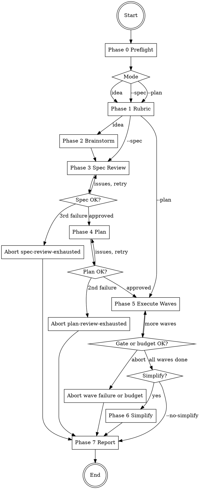

## Platform adaptation

If you are running on **Gemini CLI**, read `references/gemini-tools.md` to translate
tool names and to understand the sequential fallback for Phase 5.

If you are running on **Codex**, read `references/codex-tools.md` for the tool
mapping and the `multi_agent = true` requirement.

<HARD-GATE>
This skill MUST NOT:
- Run `git commit`, `git add`, `git push`, or `git reset --hard` at any point.
  The only allowed git mutation is `git reset --soft INITIAL_SHA` in the HEAD
  checkpoint AND `git stash push` in the gate-failure rollback path.
- Skip any item in the 8-phase checklist below.
- Skip any of the 5-step decision protocol for any decision in Phase 2.
- Edit `rubric.md` after Phase 1 completes.
- Mark a decision as "obvious" and skip the pros/cons table or scoring.
- Continue past the wall-clock budget. Budget exhaustion aborts cleanly.
- Continue past 3 spec-review cycles or 2 plan-review cycles. Exhaustion aborts.
- Modify any file in this skill's source tree (`brainstorm-and-execute/`,
  `~/.claude/skills/brainstorm-and-execute/`, `~/.claude/commands/`).
- Run `visual-qa` or `visual-refine` automatically. Different domain; user
  composes manually if needed.

The four hard invariants are documented in `references/invariants.md` and apply
unconditionally.
</HARD-GATE>

# brainstorm-and-execute

Run an autonomous brainstorm → spec → plan → parallel-execute → simplify
pipeline. Replace every interactive decision point with a deterministic,
auditable, persisted decision protocol. Hand the working tree back to the user
uncommitted, with HEAD preserved.

## Inputs

The skill accepts ONE of:

- A free-text idea (default): `/brainstorm-and-execute add a dark mode toggle`
- `--spec <path>`: resume from an existing spec; skip Phase 2.
- `--plan <path>`: resume from an existing plan; skip Phases 2 through 4.

Optional flags:

- `--budget <minutes>` (default `60`) — wall-clock cap.
- `--max-parallel <N>` (default `4`) — concurrency cap per wave.
- `--no-simplify` — skip Phase 6.
- `--allow-dirty` — proceed when the working tree has uncommitted changes.

## Outputs

For every run:

1. `docs/superpowers/decisions/<prompt-slug>/rubric.md` — frozen at end of Phase 1.
2. `docs/superpowers/decisions/<prompt-slug>/NN-<decision-slug>.md` — one per
   decision in Phase 2.
3. `docs/superpowers/specs/YYYY-MM-DD-<prompt-slug>-design.md` — written in
   Phase 2 (or supplied via `--spec`).
4. `docs/superpowers/plans/YYYY-MM-DD-<prompt-slug>-plan.md` — written in
   Phase 4 (or supplied via `--plan`).
5. `docs/superpowers/runs/YYYY-MM-DD-<prompt-slug>-run.md` — the consolidated
   run report.
6. Working tree changes from Phase 5 (and possibly Phase 6) — uncommitted.
7. Zero commits. Zero stashed changes (other than a possible Phase 6 simplify
   rollback). HEAD == INITIAL_SHA.

## Required reading before you start

Before taking any action, `Read` ALL of these reference files. Do not rely on
memory.

- `references/invariants.md` — the four hard invariants (HEAD preservation,
  gate-between-waves, budget cap, bounded retries).
- `references/decision-template.md` — the per-decision file format.
- `references/rubric-template.md` — the rubric format and the two example rubrics.
- `references/pros-cons-scoring.md` — 0/1/2/3 anchors per criterion.
- `references/plan-schema.md` — the YAML contract for Phase 4 output.
- `references/plan-review-checklist.md` — what the Phase 4 reviewer enforces.
- `references/dag-and-waves.md` — Kahn's algorithm + wave dispatch + failure mapping.
- `references/run-report-template.md` — the Phase 7 output skeleton.

## Checklist

Every item below becomes a `TodoWrite` task at runtime. Items execute in order
and may not be skipped. If an item cannot be completed, abort with the
appropriate `outcome` and write the run report.

```
1. **Phase 0 — Preflight.** Verify git repo. `INITIAL_SHA = git rev-parse HEAD`.
   Check working tree clean (or warn if --allow-dirty). Detect lint/typecheck/test
   commands by scanning package.json / pyproject.toml / Cargo.toml / Makefile.
   Resolve invocation mode. Compute prompt-slug (kebab-case, max 60 chars). Apply
   slug-collision policy: if `docs/superpowers/decisions/<prompt-slug>/` exists,
   append `-N` until free. Create `docs/superpowers/decisions/<prompt-slug>/` and
   `docs/superpowers/runs/`. Start wall-clock timer.

2. **Phase 1 — Context + Rubric.** Read CLAUDE.md, AGENTS.md, GEMINI.md (if any),
   docs/INDEX.md (if any), and `git log --oneline -30`. Synthesize a 3–5 criterion
   weighted rubric per `rubric-template.md`. `simplicity` MUST be present. Persist
   to `decisions/<prompt-slug>/rubric.md`. Freeze the rubric — no edits past this
   point.

3. **Phase 2 — Autonomous Brainstorm** (skip if --spec or --plan). Mirror
   `superpowers:brainstorming`'s checklist but replace every "ask the user" gate
   with the 5-step decision protocol from `decision-template.md`. Decision points
   covered (minimum): scope decomposition; clarifying questions on purpose,
   constraints, success criteria, edge cases; approach selection; per-section
   design choices. Persist each as `decisions/<prompt-slug>/NN-<decision-slug>.md`.
   Output the spec to `docs/superpowers/specs/YYYY-MM-DD-<prompt-slug>-design.md`.
   HEAD checkpoint at the end (soft-reset any subagent commits).

4. **Phase 3 — Spec Review** (skip if --plan). Dispatch `spec-document-reviewer`
   subagent (see superpowers:brainstorming/spec-document-reviewer-prompt.md). Up
   to 3 cycles: if Issues Found, fix and re-dispatch. Exhaustion → abort with
   outcome: spec-review-exhausted.

5. **Phase 4 — Plan with Dependencies.** Dispatch `superpowers:writing-plans`
   skill with the additional contract from `plan-schema.md`: every task must
   declare `id`, `depends_on`, `files`, `acceptance`, `parallel_safe`. Plan
   written to `docs/superpowers/plans/YYYY-MM-DD-<prompt-slug>-plan.md`. Dispatch
   plan-review subagent per `plan-review-checklist.md`. Up to 2 cycles. Exhaustion
   → abort with outcome: plan-review-exhausted.

6. **Phase 5 — Parallel Execute by Wave.** Build DAG and waves per
   `dag-and-waves.md`. For each wave: dispatch parallel subagents (cap at
   --max-parallel), verify changes via `git diff`, run gate (lint+typecheck+test),
   on failure run mapped-retry per `dag-and-waves.md` Failure mapping section,
   second failure aborts. HEAD checkpoint after every wave. Budget check after
   every wave.

7. **Phase 6 — Simplify on Diff** (skip if --no-simplify). Compute
   `git diff INITIAL_SHA..HEAD --name-only`. Invoke `/simplify` scoped to that
   file list. Run gate. On gate failure: `git stash push -m "brainstorm-and-execute
   simplify rollback"`, set outcome: success-without-simplify, continue.

8. **Phase 7 — Final Report + Verification.** Verify HEAD == INITIAL_SHA; if not,
   soft-reset (or set outcome: aborted-invariant-violation if it cannot be
   restored). Write the consolidated report to
   `docs/superpowers/runs/YYYY-MM-DD-<prompt-slug>-run.md` per
   `run-report-template.md`. End.
```

## Flow diagram



## Notes on the no-commit invariant

**Why commits are forbidden.** The user is not watching the autonomous run.
A commit made by a subagent during the run contaminates the user's commit
history with work they did not author and may not approve of. The skill's job
is to produce changes; the user's job is to decide which boundary to commit
them at.

**What the soft-reset does.** `git reset --soft INITIAL_SHA` undoes the commit
boundary while preserving every modified file in the index and working tree.
Nothing is lost; only the commit is unhooked. This is run after every wave
(Phase 5) and one final time in Phase 7.

**What `final_sha == initial_sha` guarantees.** Every run report writes both
SHAs into its frontmatter. They MUST be equal for any non-violation outcome.
A user reading the report can confirm the no-commit invariant held by checking
this single field — no need to diff.

**Known limitation: `git push`.** A soft-reset is local. The HARD-GATE bans
`git push`, but a push that already escaped cannot be undone by this skill. If
this happens, abort with `outcome: aborted-invariant-violation` and surface
the offending SHA.

## Composition with other skills

`brainstorm-and-execute` invokes:

- `superpowers:writing-plans` — Phase 4.
- `superpowers:subagent-driven-development` (referenced by Phase 5 subagent
  prompts).
- `spec-document-reviewer` — Phase 3.
- `/simplify` — Phase 6.

It does NOT invoke `visual-qa` or `visual-refine`. They are different-domain
skills the user composes manually.
