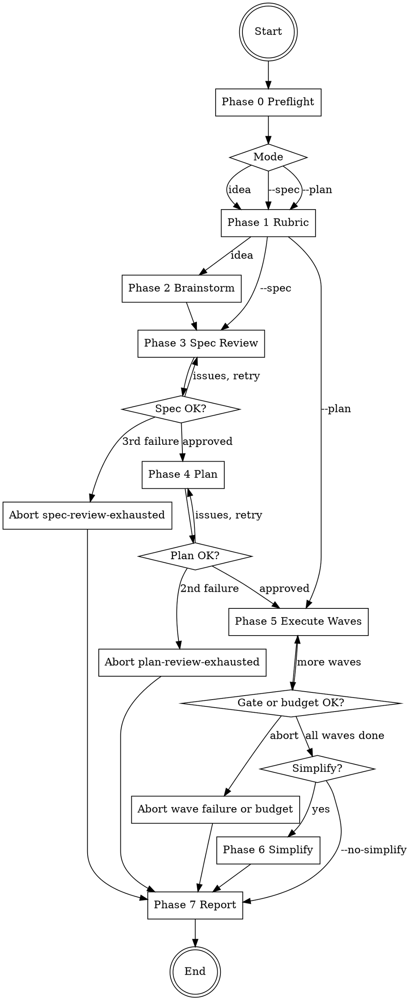

# brainstorm-and-execute Implementation Plan

> **For agentic workers:** REQUIRED SUB-SKILL: Use superpowers:subagent-driven-development (recommended) or superpowers:executing-plans to implement this plan task-by-task. Steps use checkbox (`- [ ]`) syntax for tracking.

**Goal:** Ship the `brainstorm-and-execute` skill — a thin orchestrator that runs an autonomous brainstorm → spec → plan → parallel-execute → simplify pipeline without user intervention, persisting every decision to `docs/superpowers/decisions/<prompt-slug>/`.

**Architecture:** A new top-level directory `brainstorm-and-execute/` (peer of `visual-qa/`, `visual-refine/`) containing one `SKILL.md` (~400 lines) and a `references/` folder with 10 files (templates, schema, algorithm references, platform mappings). One slash-command file at `~/.claude/commands/brainstorm-and-execute.md`. A symlink from `~/.claude/skills/brainstorm-and-execute` to the repo source. A verification script at `scripts/verify-brainstorm-and-execute.sh`. Repo-level doc updates to `docs/INDEX.md`, `README.md`, and `CLAUDE.md` to acknowledge the repo is now multi-domain.

**Tech Stack:** Markdown (skill, references, docs). Bash (verification script). YAML frontmatter parsed by Python (`yaml` module) — same as the existing `verify-visual-skills.sh`. No new runtime deps.

**Spec:** `docs/superpowers/specs/2026-04-25-brainstorm-and-execute-design.md`

---

## Task 1: Create the skill directory and references folder

**Files:**
- Create: `brainstorm-and-execute/` (directory)
- Create: `brainstorm-and-execute/references/` (directory)

- [ ] **Step 1: Create directories**

```bash
mkdir -p brainstorm-and-execute/references
```

- [ ] **Step 2: Verify directories exist**

Run: `test -d brainstorm-and-execute/references && echo OK`
Expected: `OK`

- [ ] **Step 3: Commit (empty placeholder so subsequent tasks can stage files into a tracked tree)**

Skip the commit; directories without files are not tracked by git. Subsequent tasks commit the files that populate this layout.

---

## Task 2: Write `references/invariants.md`

**Files:**
- Create: `brainstorm-and-execute/references/invariants.md`

- [ ] **Step 1: Write the file**

```markdown
# Hard Invariants — brainstorm-and-execute

These four rules are non-negotiable. They are mechanical (no opinion, no user prompt)
and they replace the safety that an interactive user normally provides. They live
here so the `<HARD-GATE>` block in `SKILL.md` can reference them without restating.

## 1. HEAD preservation

`HEAD == INITIAL_SHA` at the start AND at the end of every run. Any commit a
subagent creates during the run is soft-reset away (`git reset --soft INITIAL_SHA`),
which preserves the changes in the working tree but undoes the commit boundary.
The user owns every commit boundary. The skill never commits.

This invariant is checked after every wave (Phase 5) and one final time in Phase 7.
A push that already escaped to a remote cannot be undone by a soft-reset; the
HARD-GATE bans `git push` to prevent this case.

## 2. Gate between waves

Lint + typecheck + test must pass between every wave in Phase 5. The gate commands
are the ones detected in Phase 0 by scanning `package.json`, `pyproject.toml`,
`Cargo.toml`, or `Makefile`. If none are found, the gate degrades to "build must
succeed" only, and this degradation is logged in `rubric.md`.

On gate failure: ONE retry per failing task with the failure output fed back to the
retry subagent. Second failure aborts the run with `outcome: aborted-gate-failure`
and `git stash`-rolls-back the failed wave. Prior waves are preserved in the
working tree.

## 3. Wall-clock budget

Default 60 minutes, configurable via `--budget <minutes>`. Checked after every
wave. Exceeded → clean abort with `outcome: budget-exhausted` and a run report
written.

The budget exists to prevent runaway autonomous runs from silently consuming
hours of compute. It is not a soft target; the skill stops mid-pipeline rather
than overrun it.

## 4. Bounded review retries

- Spec review (Phase 3): max 3 cycles. Exhaustion → `outcome: spec-review-exhausted`.
- Plan review (Phase 4): max 2 cycles. Exhaustion → `outcome: plan-review-exhausted`.

Per-task subagent retry (Phase 5) is bounded at 1 (with the gate failure output fed
back). This matches the proven pattern from `superpowers:subagent-driven-development`.

Review-loop time counts against the wall-clock budget.

## Why these invariants and not others

The invariants are mechanical — they require no judgment and never need a user
prompt. They cover the four most common failure modes of autonomous agents:
unwanted commits, broken builds going un-noticed, runaway loops, and review
loops that spiral. Anything else is a design decision and goes through the
autonomous decision protocol (see `pros-cons-scoring.md`).
```

- [ ] **Step 2: Verify key content**

Run: `grep -c "HEAD preservation\|Gate between waves\|Wall-clock budget\|Bounded review retries" brainstorm-and-execute/references/invariants.md`
Expected: `4`

- [ ] **Step 3: Commit**

```bash
git add brainstorm-and-execute/references/invariants.md
git commit -m "feat(brainstorm-and-execute): add invariants reference"
```

---

## Task 3: Write `references/decision-template.md`

**Files:**
- Create: `brainstorm-and-execute/references/decision-template.md`

- [ ] **Step 1: Write the file**

```markdown
# Decision File Template

Every decision in Phase 2 produces ONE file at:

`docs/superpowers/decisions/<prompt-slug>/<NN>-<decision-slug>.md`

`NN` is a zero-padded sequence number (`01`, `02`, …). `<decision-slug>` is a short
kebab-case label (`error-handling`, `storage-layer`, `test-strategy`). The agent
fills the template; it does NOT improvise the structure.

## Skeleton

````markdown
---
decision_id: NN-<decision-slug>
phase: brainstorm
timestamp: <ISO 8601 UTC>
chosen: <option-label>
rubric_path: ../rubric.md
---

# Decision: <one-sentence question topic>

## Question

<One sentence. Concrete. Closed-form preferred.>

## Options

| Option | Pros | Cons | Evidence from project |
|--------|------|------|----------------------|
| A. <label> | • <pro 1>\n• <pro 2> | • <con 1> | <file/commit/pattern> |
| B. <label> | • <pro 1> | • <con 1>\n• <con 2> | <file/commit/pattern> |
| C. Do nothing / defer | • <pro 1> | • <con 1> | <pattern> |

## Scoring against rubric (<criteria with weights, e.g. correctness×3, alignment×3, simplicity×2>)

| Option | <c1> | <c2> | <c3> | … | **Weighted total** |
|--------|-----:|-----:|-----:|---|-------------------:|
| A      | 2 | 3 | 3 | … | **<sum>** |
| B      | 3 | 1 | 2 | … | **<sum>** |
| C      | 0 | 0 | 3 | … | **<sum>** |

## Chosen: <option-label>

**Rationale (one sentence):** <why this option won given the rubric>.
````

## Filling rules

1. **Question must be one sentence.** If you cannot frame it in one sentence, the
   decision is too big — split it into multiple decisions.
2. **2 to 4 options.** Always include "do nothing / defer" when applicable
   (YAGNI bias).
3. **Pros/cons ≥ 1 bullet each, ≤ 4 bullets each.** More than 4 is a sign the
   option is too vague.
4. **Evidence column cites a real file path, commit SHA, or named pattern.** No
   handwaving. If you cannot cite evidence, the decision is being made on vibes
   and you should re-read `CLAUDE.md` / `AGENTS.md` first.
5. **Score every criterion in the rubric.** No skipping. 0–3 only.
6. **Tie-breaker hierarchy:** higher score on the highest-weighted criterion →
   higher score on `simplicity` → lexicographic option label.
7. **Rationale is one sentence.** If you need more, the scoring is doing the
   wrong work — fix the rubric (which means aborting, since the rubric is frozen).

## What NOT to put in a decision file

- Speculation about future requirements ("if we ever need …").
- Apologies or hedges ("the agent might be wrong here").
- Multiple paragraphs of rationale. The score is the rationale.
- Edits after the fact. Decision files are append-only during the run; mistakes
  get a follow-up file (`05b-<slug>-revisit.md`) referencing the original.
```

- [ ] **Step 2: Verify key content**

Run: `grep -c "decision_id\|Pros\|Cons\|Weighted total\|Tie-breaker" brainstorm-and-execute/references/decision-template.md`
Expected: `5`

- [ ] **Step 3: Commit**

```bash
git add brainstorm-and-execute/references/decision-template.md
git commit -m "feat(brainstorm-and-execute): add decision file template"
```

---

## Task 4: Write `references/rubric-template.md`

**Files:**
- Create: `brainstorm-and-execute/references/rubric-template.md`

- [ ] **Step 1: Write the file**

```markdown
# Rubric Template

Phase 1 synthesizes a rubric from project context and persists it to:

`docs/superpowers/decisions/<prompt-slug>/rubric.md`

The rubric is **frozen** at the end of Phase 1. It cannot be edited mid-run. Every
decision in Phases 2 onward scores against this exact rubric.

## Skeleton

````markdown
---
rubric_id: <prompt-slug>
frozen_at: <ISO 8601 UTC>
sources:
  - CLAUDE.md
  - AGENTS.md
  - docs/INDEX.md
  - git log --oneline -30
---

# Rubric: <prompt-slug>

| Criterion | Weight | Justification (one sentence; cites source) |
|-----------|-------:|--------------------------------------------|
| <c1>      |     N  | <why this matters here, citing a source>   |
| <c2>      |     N  | <why this matters here, citing a source>   |
| simplicity|     N  | <required>                                 |
| <c4>      |     N  | <optional, up to 5 total>                  |

## Tie-breaker hierarchy

1. Higher score on the highest-weighted criterion.
2. Higher score on `simplicity`.
3. Lexicographic option label.

## Gate-command snapshot

| Tool       | Command (detected in Phase 0)        |
|------------|--------------------------------------|
| lint       | <e.g. `npm run lint`>                |
| typecheck  | <e.g. `npx tsc --noEmit`>            |
| test       | <e.g. `npm test`>                    |

If a tool was not detected, write `(none — gate degrades for this tool)`.
````

## Required structure

- 3 to 5 criteria. Fewer than 3 means the rubric is too coarse; more than 5
  produces noisy scoring with too many ties.
- `simplicity` is REQUIRED. It is the deterministic tie-breaker.
- Weights are positive integers in the range 1–3. Higher = more important.
- Every justification cites a real source. "Because it's good practice" is not a
  justification.

## Two example rubrics

### Example 1 — Next.js webapp project

````markdown
| Criterion              | Weight | Justification |
|------------------------|-------:|---------------|
| correctness            |      3 | tests run on every PR (CLAUDE.md §3) |
| alignment-with-patterns|      3 | recent commits all use shadcn/Tailwind (last 30 commits) |
| accessibility          |      2 | repo enforces AAA contrast (design-principles.md) |
| simplicity             |      2 | required tie-breaker |
| performance            |      1 | no perf budget defined; treat as bonus |
````

### Example 2 — CLI tool project

````markdown
| Criterion         | Weight | Justification |
|-------------------|-------:|---------------|
| correctness       |      3 | golden-file tests in `tests/` |
| stability-of-cli  |      3 | breaking changes flagged in CHANGELOG.md |
| simplicity        |      2 | required tie-breaker |
| reversibility     |      1 | semver-major bump is the only revert path |
````

## What NOT to put in the rubric

- "Code quality" as a single criterion. Too vague — scoring will diverge.
- "Maintainability." Same problem.
- Criteria that cannot be scored 0–3 against a concrete option. If you cannot
  give an example of a 0 and a 3, the criterion is not operational.
```

- [ ] **Step 2: Verify key content**

Run: `grep -c "rubric_id\|frozen_at\|simplicity\|Tie-breaker\|Gate-command snapshot" brainstorm-and-execute/references/rubric-template.md`
Expected: `5`

- [ ] **Step 3: Commit**

```bash
git add brainstorm-and-execute/references/rubric-template.md
git commit -m "feat(brainstorm-and-execute): add rubric template"
```

---

## Task 5: Write `references/pros-cons-scoring.md`

**Files:**
- Create: `brainstorm-and-execute/references/pros-cons-scoring.md`

- [ ] **Step 1: Write the file**

```markdown
# Pros/Cons Scoring Anchors

Scoring 0–3 against a criterion is the difference between a deterministic
decision and a vibes-based one. This file gives concrete anchors so two runs
of the same prompt produce comparable scores.

The scoring is per-criterion, per-option. Multiply by the criterion's weight,
sum across criteria, and the highest weighted total wins.

## Anchors per criterion

### correctness

| Score | Anchor |
|-------|--------|
| 0 | Option produces incorrect output for at least one realistic input. |
| 1 | Option is correct only with strict caller discipline (typed inputs, validated upstream). |
| 2 | Option is correct under documented preconditions; preconditions are easy to satisfy. |
| 3 | Option is correct by construction (e.g., type system enforces it; impossible to misuse). |

### alignment-with-patterns

| Score | Anchor |
|-------|--------|
| 0 | Option contradicts a documented pattern in CLAUDE.md, AGENTS.md, or recent commits. |
| 1 | Option introduces a new pattern not seen in the codebase. |
| 2 | Option matches an existing pattern in adjacent code. |
| 3 | Option matches the dominant pattern in the codebase, used in 5+ places. |

### simplicity

| Score | Anchor |
|-------|--------|
| 0 | Adds a new abstraction layer, dependency, or configuration knob. |
| 1 | Adds one new file or module. |
| 2 | Modifies existing files in place; no new files. |
| 3 | Smallest possible change; "do nothing" is a special case scoring 3. |

### reversibility

| Score | Anchor |
|-------|--------|
| 0 | Migration / data change / external system contract change. Cannot be undone without coordination. |
| 1 | Touches public API; revert requires a follow-up release. |
| 2 | Internal refactor; revert is one PR. |
| 3 | Local change; revert is `git checkout`. |

### performance

| Score | Anchor |
|-------|--------|
| 0 | Measurable regression (>10%) on a hot path. |
| 1 | Slightly slower; not on a hot path. |
| 2 | No measurable change. |
| 3 | Measurable improvement. |

### accessibility

| Score | Anchor |
|-------|--------|
| 0 | Introduces an A11Y regression (missing label, keyboard trap, contrast below AA). |
| 1 | Maintains AA but does not improve. |
| 2 | Maintains AAA. |
| 3 | Improves a11y posture beyond baseline (better labels, focus management, screen-reader hints). |

### stability-of-cli

| Score | Anchor |
|-------|--------|
| 0 | Breaks an existing flag or output format. |
| 1 | Adds a flag with a default that changes behavior. |
| 2 | Adds an opt-in flag; defaults unchanged. |
| 3 | Documentation-only change. |

## Adding a new criterion

If a project's rubric (Phase 1) introduces a criterion not listed above, the
agent MUST write inline anchors for it in the decision file (in a `## Scoring
anchors for <criterion>` section before the scoring table). The same 0/1/2/3
discipline applies.

## What "comparable scores" guarantees

The anchors do not eliminate stochasticity. They guarantee that two reasonable
agents looking at the same option and the same anchors land within ±1 on each
criterion — which is enough for the weighted sum to converge on the same winner
in most cases, and for ties to be handled deterministically by the tie-breaker
hierarchy.
```

- [ ] **Step 2: Verify key content**

Run: `grep -c "correctness\|simplicity\|reversibility\|alignment-with-patterns\|accessibility" brainstorm-and-execute/references/pros-cons-scoring.md`
Expected: `5`

- [ ] **Step 3: Commit**

```bash
git add brainstorm-and-execute/references/pros-cons-scoring.md
git commit -m "feat(brainstorm-and-execute): add pros-cons scoring anchors"
```

---

## Task 6: Write `references/plan-schema.md`

**Files:**
- Create: `brainstorm-and-execute/references/plan-schema.md`

- [ ] **Step 1: Write the file**

```markdown
# Plan Schema — Phase 4 Output Contract

Phase 4 dispatches `superpowers:writing-plans` with an additional contract:
every task in the produced plan MUST conform to the schema below. The plan
sits at:

`docs/superpowers/plans/YYYY-MM-DD-<prompt-slug>-plan.md`

The plan-review subagent (Phase 4) validates against this schema before the
plan is accepted.

## YAML schema

The plan file is markdown but contains a YAML code block named `tasks:` that
holds the task list. The orchestrator parses this block.

````yaml
plan_id: <prompt-slug>
generated_at: <ISO 8601 UTC>
spec_path: docs/superpowers/specs/YYYY-MM-DD-<prompt-slug>-design.md
tasks:
  - id: t01                       # required, unique within plan, kebab-case or t<N>
    title: <imperative sentence>  # required
    depends_on: []                # required, list of task ids; [] for roots
    files:                        # required, non-empty
      - <repo-root-relative path>
    acceptance:                   # required, non-empty
      - <one criterion per line>
    parallel_safe: true           # required; false means MUST run alone in a wave
    notes: <optional free text>
````

## Field rules

- **`id`**: unique within the plan. Convention: `t01`, `t02`, … OR a kebab-case
  label (`add-theme-provider`). Mixing styles within one plan is allowed but
  discouraged.
- **`title`**: imperative voice. Bad: "Theme provider". Good: "Add theme provider
  to root layout".
- **`depends_on`**: list of `id`s that MUST complete before this task can start.
  Empty list `[]` means root (wave 0). Cycles are forbidden (the plan-review
  subagent rejects them).
- **`files`**: repo-root-relative paths the task is allowed to create or modify.
  At runtime, the executor enforces that the subagent does not touch files
  outside this list. Non-empty.
- **`acceptance`**: at least one observable criterion. "Function returns X for
  input Y", "Test `tests/foo.test.ts::name` passes", "Page renders without
  console errors". No vague "should work".
- **`parallel_safe`**: `true` if the task can run concurrently with other tasks
  in the same wave. `false` forces the orchestrator to put this task in a wave
  by itself (its `depends_on` still controls when the wave starts). Use `false`
  for tasks that touch global state (e.g., a one-time migration).

## DAG and waves

The orchestrator builds a DAG from `depends_on` and computes waves via Kahn's
algorithm:

- **Wave 0**: all tasks with `depends_on: []`.
- **Wave N**: all tasks whose every `depends_on` entry is in waves 0..N-1.

A task with `parallel_safe: false` is placed in its OWN wave (alone), even if
it shares a numerical layer with other parallel-safe tasks.

## Files-overlap rule (the load-bearing one)

Two tasks in the SAME wave MUST NOT have any path in common in their `files:`
lists. "In common" means exact string match after normalizing to repo-root-relative
form. Same-directory or same-package is allowed.

This rule is what makes parallel execution sound. If two tasks declare the same
file, they have shared state, and parallel execution will produce nondeterministic
output. The plan-review subagent rejects such plans.

If two tasks legitimately need to modify the same file, either:
- Merge them into one task, OR
- Add a `depends_on` between them so they fall into different waves.

## Minimal example

````yaml
plan_id: add-dark-mode
generated_at: 2026-04-25T15:00:00Z
spec_path: docs/superpowers/specs/2026-04-25-add-dark-mode-design.md
tasks:
  - id: t01
    title: Add ThemeProvider to root layout
    depends_on: []
    files: [src/app/layout.tsx]
    acceptance:
      - ThemeProvider wraps {children}
      - useTheme() returns 'light' or 'dark'
    parallel_safe: true

  - id: t02
    title: Add toggle button to settings page
    depends_on: [t01]
    files: [src/app/settings/page.tsx]
    acceptance:
      - Button toggles theme on click
      - Button has aria-label
    parallel_safe: true

  - id: t03
    title: Update header colors to use theme tokens
    depends_on: [t01]
    files: [src/components/header.tsx]
    acceptance:
      - No hardcoded color literals remain
    parallel_safe: true
````

Wave 0: `[t01]`. Wave 1: `[t02, t03]` (parallel — no `files` overlap).

## Anti-examples (rejected by plan-review)

````yaml
# REJECTED: cycle (t01 depends on t02, t02 depends on t01)
- id: t01
  depends_on: [t02]
- id: t02
  depends_on: [t01]
````

````yaml
# REJECTED: files overlap in same wave
- id: t01
  depends_on: []
  files: [src/app/layout.tsx]
- id: t02
  depends_on: []
  files: [src/app/layout.tsx]   # same file, same wave → overlap
````

````yaml
# REJECTED: empty acceptance
- id: t01
  depends_on: []
  files: [src/foo.ts]
  acceptance: []                # empty
````
```

- [ ] **Step 2: Verify key content**

Run: `grep -c "depends_on\|parallel_safe\|files-overlap\|Kahn\|acceptance" brainstorm-and-execute/references/plan-schema.md`
Expected: At least `5`

- [ ] **Step 3: Commit**

```bash
git add brainstorm-and-execute/references/plan-schema.md
git commit -m "feat(brainstorm-and-execute): add plan schema reference"
```

---

## Task 7: Write `references/plan-review-checklist.md`

**Files:**
- Create: `brainstorm-and-execute/references/plan-review-checklist.md`

- [ ] **Step 1: Write the file**

```markdown
# Plan-Review Checklist (Phase 4)

The plan-review subagent dispatched in Phase 4 verifies that the plan produced by
`superpowers:writing-plans` conforms to `plan-schema.md`. This file is the
checklist that subagent runs through.

## Dispatch context

**Subagent type:** `general-purpose`
**Inputs the orchestrator provides:**
- Path to the plan file.
- Path to `references/plan-schema.md`.
- Path to the spec file (for context, not validation).

## Checklist (the subagent runs through this in order)

1. **Plan file exists and is readable.** If not, return `Issues Found` with the
   path that failed.
2. **YAML `tasks:` block parses.** Use a YAML parser (Python `yaml.safe_load` or
   equivalent). On parse error, return the line number.
3. **At least one task is present.** Empty `tasks: []` → return `Issues Found`
   with note "empty plan; either spec is trivial or planner failed".
4. **Each task has all required fields.** `id`, `title`, `depends_on`, `files`,
   `acceptance`, `parallel_safe`. Missing field → return the task `id` and the
   missing field name.
5. **`id` values are unique.** Build a set; if duplicates, return both task
   indices.
6. **`depends_on` references are valid.** Every entry must match an existing
   `id`. Return offending task `id` and unknown reference.
7. **No cycles in the DAG.** Run DFS from each root; if any back-edge appears,
   return the cycle as a list of `id`s.
8. **`files` lists are non-empty and string entries.** Empty `files: []` →
   return task `id`. Non-string entry → return type and value.
9. **`acceptance` lists are non-empty.** Empty → return task `id`.
10. **No `files` overlap within waves.** Compute waves via Kahn's algorithm. For
    each wave, build a set of every file across the wave's tasks. If any file
    appears more than once, return the wave number, the duplicated path, and
    the colliding task `id`s.
11. **`parallel_safe: false` tasks are in their own wave.** If a task with
    `parallel_safe: false` shares a wave with any other task, return the wave
    number and the offending task `id`. (The orchestrator handles this at
    runtime, but plan-review should still flag it as a hint that the plan is
    confusing.)

## Output format

The reviewer returns one of two responses:

### Approved

```
## Plan Review

**Status:** Approved

**Wave plan:**
- Wave 0: [t01]
- Wave 1: [t02, t03]
- Wave 2: [t04]
```

### Issues Found

```
## Plan Review

**Status:** Issues Found

**Issues:**
- [Task t02]: missing field `acceptance` (rule 4)
- [Wave 1]: files overlap on `src/app/layout.tsx` between t02 and t03 (rule 10)
```

## Calibration

Be strict. The whole point of the schema is to make Phase 5 sound. A "minor"
schema violation (e.g., missing `parallel_safe: true`) will not be tolerated by
the runtime DAG builder; better to flag it now than to abort mid-execution.

Do NOT comment on:
- Task ordering (the DAG is the ordering).
- Task granularity (that's the planner's call).
- Whether acceptance criteria are "good enough" (that's the planner's call too;
  you check non-empty, not quality).
```

- [ ] **Step 2: Verify key content**

Run: `grep -c "Approved\|Issues Found\|files overlap\|parallel_safe\|Kahn" brainstorm-and-execute/references/plan-review-checklist.md`
Expected: At least `5`

- [ ] **Step 3: Commit**

```bash
git add brainstorm-and-execute/references/plan-review-checklist.md
git commit -m "feat(brainstorm-and-execute): add plan-review checklist"
```

---

## Task 8: Write `references/dag-and-waves.md`

**Files:**
- Create: `brainstorm-and-execute/references/dag-and-waves.md`

- [ ] **Step 1: Write the file**

```markdown
# DAG Construction and Wave Dispatch (Phase 5)

The Phase 5 executor reads the validated plan, builds a DAG, computes waves,
dispatches each wave's tasks as parallel subagents, runs the gate, handles
failures, and checkpoints HEAD. This file is the algorithmic reference.

## DAG construction

Input: parsed YAML `tasks:` list from the plan.

Steps:

1. Build adjacency map `task_id → list of task_ids that depend on it`.
2. Build reverse map `task_id → list of task_ids it depends on` (= `depends_on`).
3. Validate no cycles via DFS:
   ```
   for each task_id not yet visited:
       run DFS marking nodes as in-progress / done
       if you ever revisit an in-progress node → cycle (abort)
   ```
4. Compute waves via Kahn's algorithm:
   ```
   waves = []
   ready = set of task_ids with empty depends_on
   while ready non-empty:
       wave = sorted(ready)             # deterministic order within wave
       waves.append(wave)
       remove wave's task_ids from the dependency graph
       ready = task_ids whose depends_on is now empty
   ```
5. Force `parallel_safe: false` tasks alone:
   ```
   for each wave in waves:
       for each task in wave with parallel_safe: false:
           split: extract task into its own wave that runs immediately before
                  the original wave's remaining tasks
   ```

Output: `waves: list[list[task_id]]`, ordered.

## Wave dispatch loop

For each wave in order:

```
1. Cap concurrency:
   if len(wave) > --max-parallel:
       split wave into sub-batches of size --max-parallel
       sub-batches run sequentially within the wave
   else:
       single sub-batch = the whole wave

2. For each sub-batch:
   a. Dispatch all tasks in the sub-batch as parallel subagents
      (single message, multiple Agent tool calls).
   b. Collect results.
   c. Verify each task's claimed-changed files actually changed:
      diff = `git diff --name-only`
      for each task t in sub-batch:
          if diff ∩ t.files == ∅:
              treat t as failed
      Reject any modified file outside the union of sub-batch task files lists.

3. Run the gate (lint + typecheck + test, detected in Phase 0).

4. If gate fails:
   a. Map failing files to tasks (see "Failure mapping" below).
   b. Dispatch retry subagent(s) with the gate failure output as context.
   c. Re-run gate. If it still fails:
      - `git stash push -m "brainstorm-and-execute wave-N rollback"`
      - Abort with outcome: aborted-gate-failure
      - Run report includes the failing wave and the gate output

5. HEAD checkpoint:
   commits_since = `git log INITIAL_SHA..HEAD --oneline`
   if commits_since:
       `git reset --soft INITIAL_SHA`
       log "soft-reset N commits made by subagents in wave M" to run report

6. Budget check:
   elapsed = now - start_time
   if elapsed > budget:
       abort with outcome: budget-exhausted
       run report includes "stopped before wave N+1"
```

## Failure mapping

When the gate fails, the orchestrator tries to map failing file paths in the
gate output back to tasks:

- Parse the gate output for file paths (regex against typical formats:
  `path/to/file.ts:123:5`, `FAIL path/to/file.test.ts`, etc.).
- For each failing path P, find tasks T such that P ∈ T.files.

Three cases:

| Case | Recovery |
|------|----------|
| Single task identified | Dispatch ONE retry subagent for that task with the failure output. |
| Multiple tasks identified | Dispatch retry subagents for each in parallel (same as wave dispatch). |
| No task identified (cross-cutting failure) | Dispatch ONE retry subagent for the WHOLE wave. Allowed-modification scope = union of all wave task `files`. Subagent receives an instruction to coordinate. |

After retry: re-run gate. Second failure aborts the run.

## Edge cases

| Case | Handling |
|------|----------|
| Empty plan | log `outcome: no-tasks-needed`, skip to Phase 7 |
| Single-task plan | one wave with one task; identical mechanics |
| All-sequential plan (every task depends on the previous) | identical to `superpowers:executing-plans` running serially |
| Subagent claims success but file unchanged | treat as failure, retry |
| Subagent modifies file outside `files` list | wave rolled back, retry with re-instruction |
| Subagent commits despite prohibition | soft-reset in HEAD checkpoint, logged in run report |
| Two tasks unexpectedly conflict on file content | gate fails, retry; if retry can't resolve, abort wave |

## Why this is sound

- The plan-review's no-`files`-overlap-within-wave check guarantees that
  parallel-running tasks have disjoint write sets.
- Disjoint write sets + no shared mutable state = parallel execution is
  observationally equivalent to any serial order.
- The gate runs on the union of writes, so any cross-cutting break is caught
  before the next wave starts.
- The HEAD checkpoint after every wave means a misbehaving subagent in wave N
  cannot poison wave N+1.
```

- [ ] **Step 2: Verify key content**

Run: `grep -c "Kahn\|adjacency\|HEAD checkpoint\|gate fails\|cross-cutting" brainstorm-and-execute/references/dag-and-waves.md`
Expected: At least `5`

- [ ] **Step 3: Commit**

```bash
git add brainstorm-and-execute/references/dag-and-waves.md
git commit -m "feat(brainstorm-and-execute): add DAG and waves reference"
```

---

## Task 9: Write `references/run-report-template.md`

**Files:**
- Create: `brainstorm-and-execute/references/run-report-template.md`

- [ ] **Step 1: Write the file**

```markdown
# Run Report Template (Phase 7 Output)

Phase 7 writes the consolidated run report to:

`docs/superpowers/runs/YYYY-MM-DD-<prompt-slug>-run.md`

This is the FIRST file the user reads after an autonomous run. It must answer:
"what was the outcome, what changed, what should I do next?" without scrolling
through the transcript.

## Skeleton

````markdown
---
run_id: <prompt-slug>
date: <ISO 8601 UTC>
outcome: <success | success-without-simplify | aborted-gate-failure | budget-exhausted | spec-review-exhausted | plan-review-exhausted | aborted-invariant-violation | no-tasks-needed>
elapsed_seconds: <integer>
initial_sha: <SHA>
final_sha: <SHA>           # MUST equal initial_sha for any non-violation outcome
---

# Run report: <prompt-slug>

## Outcome: <outcome>

<One-sentence summary>

## Artifacts

- Spec: `docs/superpowers/specs/YYYY-MM-DD-<prompt-slug>-design.md`
- Plan: `docs/superpowers/plans/YYYY-MM-DD-<prompt-slug>-plan.md`
- Decisions: `docs/superpowers/decisions/<prompt-slug>/`
- Rubric: `docs/superpowers/decisions/<prompt-slug>/rubric.md`

## Phase summary

| Phase | Status | Elapsed (s) | Notes |
|-------|--------|------------:|-------|
| 0. Preflight   | done | N | gate cmds: lint=…, typecheck=…, test=… |
| 1. Rubric      | done | N | 4 criteria, sources: CLAUDE.md, AGENTS.md |
| 2. Brainstorm  | done | N | 7 decisions persisted |
| 3. Spec review | done | N | approved on cycle 1 |
| 4. Plan        | done | N | 9 tasks, 4 waves |
| 5. Execute     | done | N | see wave table below |
| 6. Simplify    | done | N | gate passed; kept |
| 7. Final       | done | N | HEAD verified |

## Execution waves

| Wave | Tasks | Subagents | Retries | Gate | HEAD checkpoint |
|------|-------|----------:|--------:|------|-----------------|
| 0    | t01   | 1 | 0 | pass | clean |
| 1    | t02, t03 | 2 | 0 | pass | clean |
| 2    | t04, t05 | 2 | 1 | pass on retry | soft-reset 1 commit (t05) |
| 3    | t06   | 1 | 0 | pass | clean |

## Simplify pass

- Files reviewed: <list from `git diff INITIAL_SHA..HEAD --name-only` at Phase 6 start>
- Gate after simplify: pass | fail (rolled back)
- Outcome: kept | stashed (`stash@{0}: brainstorm-and-execute simplify rollback`)

## Final state

```
git diff --stat INITIAL_SHA..HEAD
<output>
```

- Files changed: N
- Insertions: +N
- Deletions: -N
- HEAD == INITIAL_SHA: true | false (with explanation if false)

## Recommended next action

<One sentence: e.g. "Review the diff and commit when satisfied" or "Inspect
decision 03-error-handling.md — the rubric was thin on observability">
````

## Filling rules

1. **`outcome` is REQUIRED** and must be one of the eight listed values.
2. **`final_sha` MUST equal `initial_sha`** for any outcome that isn't
   `aborted-invariant-violation`. This is the no-commit invariant.
3. **Phase summary always has all 8 rows**, even if a phase was skipped (mark
   it `skipped` with a one-word reason like `no-spec-flag`).
4. **Execution waves table is omitted only when `outcome == no-tasks-needed`.**
5. **Simplify pass section is omitted only when `--no-simplify` was passed.**
   In that case write `## Simplify pass\n\nSkipped (--no-simplify).`
6. **Recommended next action is one sentence.** Not three. The user wants a
   single signal, not a paragraph.

## Why the report exists

The user wasn't watching. The report is what they read first. Every other
artifact (decisions, spec, plan) is a drill-down from this top-level summary.
A report that requires the user to open three other files to understand what
happened has failed.
```

- [ ] **Step 2: Verify key content**

Run: `grep -c "outcome\|elapsed_seconds\|initial_sha\|Execution waves\|Simplify pass" brainstorm-and-execute/references/run-report-template.md`
Expected: At least `5`

- [ ] **Step 3: Commit**

```bash
git add brainstorm-and-execute/references/run-report-template.md
git commit -m "feat(brainstorm-and-execute): add run-report template"
```

---

## Task 10: Write `references/gemini-tools.md`

**Files:**
- Create: `brainstorm-and-execute/references/gemini-tools.md`

- [ ] **Step 1: Write the file**

```markdown
# Gemini CLI Tool Mapping — brainstorm-and-execute

Skills use Claude Code tool names. When you encounter these in
`brainstorm-and-execute/SKILL.md`, use the Gemini CLI equivalent:

| Skill references | Gemini CLI equivalent |
|---|---|
| `Read` | `read_file` |
| `Write` | `write_file` |
| `Edit` | `replace` |
| `Bash` | `run_shell_command` |
| `Grep` | `grep_search` |
| `Glob` | `glob` |
| `TodoWrite` | `write_todos` |
| `Skill` | `activate_skill` (requires Superpowers) |
| `WebSearch` | `google_web_search` |
| `WebFetch` | `web_fetch` |
| `Task` (subagent) | **No equivalent — fall back to single-session execution** |

## Phase 5 fallback (subagent-free)

Gemini CLI has no parallel-subagent primitive. The orchestrator falls back to
sequential per-task execution, with the DAG still respected for ordering:

- For each wave (in order), execute its tasks ONE AT A TIME in the main session.
- The plan-review's no-`files`-overlap-within-wave rule still applies; ordering
  within a wave does not matter for correctness, only for wall-clock time.
- The gate (lint + typecheck + test) runs after each wave completes, identical
  to the parallel mode.
- Per-task retries are still bounded at 1.

The result is functionally equivalent to the Claude Code mode but slower.
Wall-clock time scales with `total_tasks` instead of `number_of_waves`.

## Phase 3 and Phase 4 review-loop fallback

The spec-review and plan-review subagents are also unavailable on Gemini CLI.
Two options:

1. **Inline review** (default): the main session re-reads the spec/plan against
   the relevant checklist (`plan-review-checklist.md` or the spec-review
   reference from superpowers). Same Approved/Issues Found output format.
   Counts against the same retry budget.
2. **Skip review** (NOT recommended): pass `--no-review` (not yet implemented;
   this is a documented v2 feature). Speeds up runs at the cost of catching
   bad specs/plans late.

## Decision protocol unchanged

The five-step autonomous decision protocol (frame → options → pros/cons → score
→ persist) is platform-independent. It runs identically on Gemini CLI.
```

- [ ] **Step 2: Verify key content**

Run: `grep -c "read_file\|run_shell_command\|activate_skill\|sequential\|no equivalent" brainstorm-and-execute/references/gemini-tools.md`
Expected: At least `4`

- [ ] **Step 3: Commit**

```bash
git add brainstorm-and-execute/references/gemini-tools.md
git commit -m "feat(brainstorm-and-execute): add Gemini CLI tool mapping"
```

---

## Task 11: Write `references/codex-tools.md`

**Files:**
- Create: `brainstorm-and-execute/references/codex-tools.md`

- [ ] **Step 1: Write the file**

> Note to implementer: the block below uses **quad-backtick** outer fences because the file content contains a triple-backtick `toml` block. Copy the inner content (between the outer ` ```` ` markers).

````markdown
# Codex Tool Mapping — brainstorm-and-execute

Skills use Claude Code tool names. When you encounter these in
`brainstorm-and-execute/SKILL.md`, use the Codex equivalent:

| Skill references | Codex equivalent |
|---|---|
| `Task` (subagent) | `spawn_agent` (requires `multi_agent = true`) |
| Multiple `Task` calls in one message | Multiple `spawn_agent` calls (parallel) |
| Task result | `wait` |
| Task completes | `close_agent` to free the slot |
| `TodoWrite` | `update_plan` |
| `Skill` (entry point) | Follow the skill file instructions directly |
| `Read`, `Write`, `Edit` | Native file tools |
| `Bash` | Native shell tool |

## Config requirement for Phase 5

Phase 5 (parallel wave execution) requires multi-agent support. Add to
`~/.codex/config.toml`:

```toml
[features]
multi_agent = true
```

Without this flag, the skill falls back to sequential execution (each task its
own wave). The gate-between-waves invariant still holds — sequential mode just
means one task per wave.

## Phase 3 and Phase 4 review subagents

`spec-document-reviewer` and the plan-review subagent both run as `spawn_agent`
calls. They count against the same wall-clock budget as Phase 5 work.

## Decision protocol unchanged

The five-step autonomous decision protocol is platform-independent. It runs
identically on Codex.
````

- [ ] **Step 2: Verify key content**

Run: `grep -c "spawn_agent\|multi_agent\|update_plan\|sequential\|wait" brainstorm-and-execute/references/codex-tools.md`
Expected: At least `4`

- [ ] **Step 3: Commit**

```bash
git add brainstorm-and-execute/references/codex-tools.md
git commit -m "feat(brainstorm-and-execute): add Codex tool mapping"
```

---

## Task 12: Write `brainstorm-and-execute/SKILL.md` (the orchestrator)

**Files:**
- Create: `brainstorm-and-execute/SKILL.md`

- [ ] **Step 1: Write the file**

> Note to implementer: the block below uses **quad-backtick** outer fences because the file content itself contains triple-backtick blocks (`digraph`, fenced shell snippets). Copy the inner content (between the outer ` ```` ` markers), not the outer markers themselves.

````markdown
---
name: brainstorm-and-execute
description: Use when you need to take a high-level idea (or an existing spec / plan) all the way through brainstorm → spec → plan → parallel-execute → simplify, autonomously, without user intervention. Persists every decision to docs/superpowers/decisions/<prompt-slug>/ for audit. NEVER commits.
---

## Platform adaptation

If you are running on **Gemini CLI**, read `references/gemini-tools.md` to translate
tool names and to understand the sequential fallback for Phase 5.

If you are running on **Codex**, read `references/codex-tools.md` for the tool
mapping and the `multi_agent = true` requirement.

<HARD-GATE>
This skill MUST NOT:
- Run `git commit`, `git add`, `git push`, or `git reset --hard` at any point.
  The only allowed git mutation is `git reset --soft INITIAL_SHA` in the HEAD
  checkpoint AND `git stash push` in the gate-failure rollback path.
- Skip any item in the 8-phase checklist below.
- Skip any of the 5-step decision protocol for any decision in Phase 2.
- Edit `rubric.md` after Phase 1 completes.
- Mark a decision as "obvious" and skip the pros/cons table or scoring.
- Continue past the wall-clock budget. Budget exhaustion aborts cleanly.
- Continue past 3 spec-review cycles or 2 plan-review cycles. Exhaustion aborts.
- Modify any file in this skill's source tree (`brainstorm-and-execute/`,
  `~/.claude/skills/brainstorm-and-execute/`, `~/.claude/commands/`).
- Run `visual-qa` or `visual-refine` automatically. Different domain; user
  composes manually if needed.

The four hard invariants are documented in `references/invariants.md` and apply
unconditionally.
</HARD-GATE>

# brainstorm-and-execute

Run an autonomous brainstorm → spec → plan → parallel-execute → simplify
pipeline. Replace every interactive decision point with a deterministic,
auditable, persisted decision protocol. Hand the working tree back to the user
uncommitted, with HEAD preserved.

## Inputs

The skill accepts ONE of:

- A free-text idea (default): `/brainstorm-and-execute add a dark mode toggle`
- `--spec <path>`: resume from an existing spec; skip Phase 2.
- `--plan <path>`: resume from an existing plan; skip Phases 2 through 4.

Optional flags:

- `--budget <minutes>` (default `60`) — wall-clock cap.
- `--max-parallel <N>` (default `4`) — concurrency cap per wave.
- `--no-simplify` — skip Phase 6.
- `--allow-dirty` — proceed when the working tree has uncommitted changes.

## Outputs

For every run:

1. `docs/superpowers/decisions/<prompt-slug>/rubric.md` — frozen at end of Phase 1.
2. `docs/superpowers/decisions/<prompt-slug>/NN-<decision-slug>.md` — one per
   decision in Phase 2.
3. `docs/superpowers/specs/YYYY-MM-DD-<prompt-slug>-design.md` — written in
   Phase 2 (or supplied via `--spec`).
4. `docs/superpowers/plans/YYYY-MM-DD-<prompt-slug>-plan.md` — written in
   Phase 4 (or supplied via `--plan`).
5. `docs/superpowers/runs/YYYY-MM-DD-<prompt-slug>-run.md` — the consolidated
   run report.
6. Working tree changes from Phase 5 (and possibly Phase 6) — uncommitted.
7. Zero commits. Zero stashed changes (other than a possible Phase 6 simplify
   rollback). HEAD == INITIAL_SHA.

## Required reading before you start

Before taking any action, `Read` ALL of these reference files. Do not rely on
memory.

- `references/invariants.md` — the four hard invariants (HEAD preservation,
  gate-between-waves, budget cap, bounded retries).
- `references/decision-template.md` — the per-decision file format.
- `references/rubric-template.md` — the rubric format and the two example rubrics.
- `references/pros-cons-scoring.md` — 0/1/2/3 anchors per criterion.
- `references/plan-schema.md` — the YAML contract for Phase 4 output.
- `references/plan-review-checklist.md` — what the Phase 4 reviewer enforces.
- `references/dag-and-waves.md` — Kahn's algorithm + wave dispatch + failure mapping.
- `references/run-report-template.md` — the Phase 7 output skeleton.

## Checklist

Every item below becomes a `TodoWrite` task at runtime. Items execute in order
and may not be skipped. If an item cannot be completed, abort with the
appropriate `outcome` and write the run report.

```
1. **Phase 0 — Preflight.** Verify git repo. `INITIAL_SHA = git rev-parse HEAD`.
   Check working tree clean (or warn if --allow-dirty). Detect lint/typecheck/test
   commands by scanning package.json / pyproject.toml / Cargo.toml / Makefile.
   Resolve invocation mode. Compute prompt-slug (kebab-case, max 60 chars). Apply
   slug-collision policy: if `docs/superpowers/decisions/<prompt-slug>/` exists,
   append `-N` until free. Create `docs/superpowers/decisions/<prompt-slug>/` and
   `docs/superpowers/runs/`. Start wall-clock timer.

2. **Phase 1 — Context + Rubric.** Read CLAUDE.md, AGENTS.md, GEMINI.md (if any),
   docs/INDEX.md (if any), and `git log --oneline -30`. Synthesize a 3–5 criterion
   weighted rubric per `rubric-template.md`. `simplicity` MUST be present. Persist
   to `decisions/<prompt-slug>/rubric.md`. Freeze the rubric — no edits past this
   point.

3. **Phase 2 — Autonomous Brainstorm** (skip if --spec or --plan). Mirror
   `superpowers:brainstorming`'s checklist but replace every "ask the user" gate
   with the 5-step decision protocol from `decision-template.md`. Decision points
   covered (minimum): scope decomposition; clarifying questions on purpose,
   constraints, success criteria, edge cases; approach selection; per-section
   design choices. Persist each as `decisions/<prompt-slug>/NN-<decision-slug>.md`.
   Output the spec to `docs/superpowers/specs/YYYY-MM-DD-<prompt-slug>-design.md`.
   HEAD checkpoint at the end (soft-reset any subagent commits).

4. **Phase 3 — Spec Review** (skip if --plan). Dispatch `spec-document-reviewer`
   subagent (see superpowers:brainstorming/spec-document-reviewer-prompt.md). Up
   to 3 cycles: if Issues Found, fix and re-dispatch. Exhaustion → abort with
   outcome: spec-review-exhausted.

5. **Phase 4 — Plan with Dependencies.** Dispatch `superpowers:writing-plans`
   skill with the additional contract from `plan-schema.md`: every task must
   declare `id`, `depends_on`, `files`, `acceptance`, `parallel_safe`. Plan
   written to `docs/superpowers/plans/YYYY-MM-DD-<prompt-slug>-plan.md`. Dispatch
   plan-review subagent per `plan-review-checklist.md`. Up to 2 cycles. Exhaustion
   → abort with outcome: plan-review-exhausted.

6. **Phase 5 — Parallel Execute by Wave.** Build DAG and waves per
   `dag-and-waves.md`. For each wave: dispatch parallel subagents (cap at
   --max-parallel), verify changes via `git diff`, run gate (lint+typecheck+test),
   on failure run mapped-retry per `dag-and-waves.md` Failure mapping section,
   second failure aborts. HEAD checkpoint after every wave. Budget check after
   every wave.

7. **Phase 6 — Simplify on Diff** (skip if --no-simplify). Compute
   `git diff INITIAL_SHA..HEAD --name-only`. Invoke `/simplify` scoped to that
   file list. Run gate. On gate failure: `git stash push -m "brainstorm-and-execute
   simplify rollback"`, set outcome: success-without-simplify, continue.

8. **Phase 7 — Final Report + Verification.** Verify HEAD == INITIAL_SHA; if not,
   soft-reset (or set outcome: aborted-invariant-violation if it cannot be
   restored). Write the consolidated report to
   `docs/superpowers/runs/YYYY-MM-DD-<prompt-slug>-run.md` per
   `run-report-template.md`. End.
```

## Flow diagram



## Notes on the no-commit invariant

**Why commits are forbidden.** The user is not watching the autonomous run.
A commit made by a subagent during the run contaminates the user's commit
history with work they did not author and may not approve of. The skill's job
is to produce changes; the user's job is to decide which boundary to commit
them at.

**What the soft-reset does.** `git reset --soft INITIAL_SHA` undoes the commit
boundary while preserving every modified file in the index and working tree.
Nothing is lost; only the commit is unhooked. This is run after every wave
(Phase 5) and one final time in Phase 7.

**What `final_sha == initial_sha` guarantees.** Every run report writes both
SHAs into its frontmatter. They MUST be equal for any non-violation outcome.
A user reading the report can confirm the no-commit invariant held by checking
this single field — no need to diff.

**Known limitation: `git push`.** A soft-reset is local. The HARD-GATE bans
`git push`, but a push that already escaped cannot be undone by this skill. If
this happens, abort with `outcome: aborted-invariant-violation` and surface
the offending SHA.

## Composition with other skills

`brainstorm-and-execute` invokes:

- `superpowers:writing-plans` — Phase 4.
- `superpowers:subagent-driven-development` (referenced by Phase 5 subagent
  prompts).
- `spec-document-reviewer` — Phase 3.
- `/simplify` — Phase 6.

It does NOT invoke `visual-qa` or `visual-refine`. They are different-domain
skills the user composes manually.
````

- [ ] **Step 2: Verify key content**

Run: `grep -c "HARD-GATE\|INITIAL_SHA\|Phase 0\|Phase 7\|digraph" brainstorm-and-execute/SKILL.md`
Expected: At least `5`

- [ ] **Step 3: Verify all referenced files exist**

```bash
for f in invariants decision-template rubric-template pros-cons-scoring plan-schema plan-review-checklist dag-and-waves run-report-template gemini-tools codex-tools; do
  test -f "brainstorm-and-execute/references/${f}.md" || echo "MISSING: ${f}.md"
done
```

Expected: no `MISSING:` lines.

- [ ] **Step 4: Commit**

```bash
git add brainstorm-and-execute/SKILL.md
git commit -m "feat(brainstorm-and-execute): add SKILL.md orchestrator"
```

---

## Task 13: Write the slash-command file

**Files:**
- Create: `~/.claude/commands/brainstorm-and-execute.md`

- [ ] **Step 1: Write the file**

```bash
mkdir -p ~/.claude/commands
```

Then write `~/.claude/commands/brainstorm-and-execute.md`:

```markdown
# brainstorm-and-execute

Invoke the user-global `brainstorm-and-execute` skill. The skill runs an
autonomous brainstorm → spec → plan → parallel-execute → simplify pipeline
without user intervention, persisting every decision to
`docs/superpowers/decisions/<prompt-slug>/`.

Args:
- Free-text idea (default)         — full pipeline
- `--spec <path>`                  — resume from existing spec
- `--plan <path>`                  — resume from existing plan
- `--budget <minutes>` (default 60)
- `--max-parallel <N>` (default 4)
- `--no-simplify`                  — skip the final /simplify pass
- `--allow-dirty`                  — proceed on a dirty working tree

The skill lives at `~/.claude/skills/brainstorm-and-execute/SKILL.md`. All
phases, gates, and invariants are defined there.
```

- [ ] **Step 2: Verify the file exists**

Run: `test -f ~/.claude/commands/brainstorm-and-execute.md && echo OK`
Expected: `OK`

- [ ] **Step 3: No commit needed (file is outside the repo).** Continue.

---

## Task 14: Symlink the skill to `~/.claude/skills/`

**Files:**
- Create: `~/.claude/skills/brainstorm-and-execute` → `~/projects/skills/brainstorm-and-execute`

- [ ] **Step 1: Create the symlink (defensively)**

`-snf` will replace an existing symlink, but it errors out if the target path is a real directory containing files. Check first; if a real directory exists at the install path, abort and surface to the user — do NOT delete it (it may be the user's existing skill content).

```bash
mkdir -p ~/.claude/skills
target=~/.claude/skills/brainstorm-and-execute
if [ -e "$target" ] && [ ! -L "$target" ]; then
    echo "ABORT: $target exists as a real directory/file (not a symlink). Investigate and remove manually before re-running."
    exit 1
fi
ln -snf ~/projects/skills/brainstorm-and-execute "$target"
```

(`-snf` = symbolic, no-deref-target, force-replace existing symlink. Safe to re-run when the existing entry is already a symlink.)

- [ ] **Step 2: Verify the symlink**

Run: `test -L ~/.claude/skills/brainstorm-and-execute && readlink ~/.claude/skills/brainstorm-and-execute`
Expected: prints `/home/alexandrecamillo/projects/skills/brainstorm-and-execute` (or the equivalent absolute path).

- [ ] **Step 3: Verify the symlink resolves to a real SKILL.md**

Run: `test -f ~/.claude/skills/brainstorm-and-execute/SKILL.md && echo OK`
Expected: `OK`

- [ ] **Step 4: No commit needed (symlink is outside the repo).** Continue.

---

## Task 15: Write the verification script

**Files:**
- Create: `scripts/verify-brainstorm-and-execute.sh`

- [ ] **Step 1: Create the scripts directory if needed**

```bash
mkdir -p scripts
```

- [ ] **Step 2: Write the script**

```bash
#!/usr/bin/env bash
# scripts/verify-brainstorm-and-execute.sh
# Static integrity checks for the brainstorm-and-execute skill.
# Exits 0 on pass with "Result: OK"; nonzero on any failure with "Result: FAIL".

set -u

SKILL_DIR="$(cd "$(dirname "$0")/.." && pwd)/brainstorm-and-execute"
REF_DIR="$SKILL_DIR/references"
SKILL_FILE="$SKILL_DIR/SKILL.md"

failures=0
fail() {
    echo "FAIL: $1"
    failures=$((failures + 1))
}

# 1. SKILL.md exists
[ -f "$SKILL_FILE" ] || fail "missing SKILL.md at $SKILL_FILE"

# 2. SKILL.md has frontmatter with name and description
if [ -f "$SKILL_FILE" ]; then
    python3 - <<PYEOF || fail "frontmatter parse failed"
import sys, yaml
text = open("$SKILL_FILE").read()
if not text.startswith("---"):
    sys.exit(1)
end = text.find("---", 3)
if end < 0:
    sys.exit(1)
fm = yaml.safe_load(text[3:end])
if not fm or "name" not in fm or "description" not in fm:
    sys.exit(1)
PYEOF
fi

# 3. <HARD-GATE> block present
grep -q "<HARD-GATE>" "$SKILL_FILE" 2>/dev/null || fail "missing <HARD-GATE> block in SKILL.md"

# 4. digraph block present
grep -q "digraph" "$SKILL_FILE" 2>/dev/null || fail "missing digraph block in SKILL.md"

# 5. 8-phase checklist (Phase 0 .. Phase 7)
for phase in "Phase 0" "Phase 1" "Phase 2" "Phase 3" "Phase 4" "Phase 5" "Phase 6" "Phase 7"; do
    grep -q "$phase" "$SKILL_FILE" 2>/dev/null || fail "checklist missing $phase"
done

# 6. Every reference file mentioned in SKILL.md exists
mentioned=$(grep -oE "references/[a-z-]+\.md" "$SKILL_FILE" 2>/dev/null | sort -u)
for ref in $mentioned; do
    [ -f "$SKILL_DIR/$ref" ] || fail "SKILL.md references $ref but file is missing"
done

# 7. No orphan reference files
if [ -d "$REF_DIR" ]; then
    for f in "$REF_DIR"/*.md; do
        [ -f "$f" ] || continue
        base="references/$(basename "$f")"
        grep -q "$base" "$SKILL_FILE" 2>/dev/null || fail "orphan reference: $base is in references/ but never mentioned in SKILL.md"
    done
fi

# 8. SKILL.md mentions every required artifact path
for path in "docs/superpowers/decisions" "docs/superpowers/specs" "docs/superpowers/plans" "docs/superpowers/runs"; do
    grep -q "$path" "$SKILL_FILE" 2>/dev/null || fail "SKILL.md never mentions $path"
done

# 9. Templates that declare frontmatter parse cleanly
for tpl in decision-template rubric-template run-report-template; do
    f="$REF_DIR/$tpl.md"
    [ -f "$f" ] || continue
    # Templates contain example frontmatter inside fenced blocks; we just check
    # that the file is non-empty, well-formed UTF-8, and contains the literal "---"
    # frontmatter delimiter at least twice.
    delim_count=$(grep -c "^---$" "$f" 2>/dev/null || echo 0)
    if [ "$delim_count" -lt 2 ]; then
        fail "$tpl.md does not contain a frontmatter delimiter pair"
    fi
done

if [ "$failures" -eq 0 ]; then
    echo "Result: OK"
    exit 0
else
    echo "Result: FAIL ($failures check(s) failed)"
    exit 1
fi
```

- [ ] **Step 3: Make the script executable**

```bash
chmod +x scripts/verify-brainstorm-and-execute.sh
```

- [ ] **Step 4: Run the script — it MUST pass**

Run: `./scripts/verify-brainstorm-and-execute.sh`
Expected last line: `Result: OK`
Expected exit code: `0`

- [ ] **Step 5: Commit**

```bash
git add scripts/verify-brainstorm-and-execute.sh
git commit -m "test(scripts): add verify-brainstorm-and-execute static check"
```

---

## Task 16: Update `docs/INDEX.md` to include the new skill

**Files:**
- Modify: `docs/INDEX.md`

- [ ] **Step 1: Read current `docs/INDEX.md`**

Run: `cat docs/INDEX.md` to see current state.

- [ ] **Step 2: Append a Skills section**

Edit `docs/INDEX.md` to append after the existing content:

```markdown

## Skills

- [brainstorm-and-execute SKILL.md](../brainstorm-and-execute/SKILL.md) — autonomous brainstorm → spec → plan → parallel-execute → simplify orchestrator
- [brainstorm-and-execute invariants](../brainstorm-and-execute/references/invariants.md) — the four hard invariants
- [brainstorm-and-execute decision template](../brainstorm-and-execute/references/decision-template.md) — per-decision file format
- [brainstorm-and-execute plan schema](../brainstorm-and-execute/references/plan-schema.md) — Phase 4 output contract
- [brainstorm-and-execute DAG + waves](../brainstorm-and-execute/references/dag-and-waves.md) — Phase 5 algorithm reference
```

- [ ] **Step 3: Verify the update**

Run: `grep -c "brainstorm-and-execute" docs/INDEX.md`
Expected: at least `5`

- [ ] **Step 4: Commit**

```bash
git add docs/INDEX.md
git commit -m "docs(docs): index brainstorm-and-execute skill and references"
```

---

## Task 16b: Add the new commit scope to git conventions

**Files:**
- Modify: `docs/git/conventions.md`

Every `feat(brainstorm-and-execute): ...` and `test(brainstorm-and-execute): ...` commit in this PR uses a scope not currently listed in `docs/git/conventions.md`. The convention's intent ("component being changed") covers it, but adding the scope to the allowlist prevents future reviewers from flagging it as off-style.

- [ ] **Step 1: Read the current scopes table**

Run: `grep -n "Scopes" docs/git/conventions.md` to locate the table heading. The table's last row is currently `install`.

- [ ] **Step 2: Append the new scope row**

Edit `docs/git/conventions.md` to add a new row at the end of the Scopes table, immediately after the `install` row:

```markdown
| `brainstorm-and-execute` | Changes to the `brainstorm-and-execute/` skill |
```

- [ ] **Step 3: Verify**

Run: `grep -c "brainstorm-and-execute" docs/git/conventions.md`
Expected: at least `1`

- [ ] **Step 4: Commit**

```bash
git add docs/git/conventions.md
git commit -m "docs(docs): allowlist brainstorm-and-execute commit scope"
```

---

## Task 17: Update `README.md` with the new skill section

**Files:**
- Modify: `README.md`

- [ ] **Step 1: Read the current `README.md` heading and skill-set sections**

Run: `head -10 README.md` to see the framing line. Look for the line "A growing collection of composable skills for Claude Code, Gemini CLI, and Codex." It already names the repo as multi-platform but is silent on multi-domain. The framing is fine; no edit needed there. Verify by re-reading.

- [ ] **Step 2: Locate the insertion point**

Find the end of the `### UI & UX — visual-qa and visual-refine` section. The new section will go AFTER it, BEFORE the `## Contributing` section. Use `grep -n "^## Contributing" README.md` to find the line number.

- [ ] **Step 3: Insert a new section**

Edit `README.md` and insert the following block immediately before the `## Contributing` line.

> Note to implementer: the block below uses **quad-backtick** outer fences because the inserted content itself contains triple-backtick `bash` and `markdown` blocks. Copy the inner content (between the outer ` ```` ` markers), not the outer markers themselves.

````markdown
### Autonomous orchestration — `brainstorm-and-execute`

A skill that takes a high-level idea (or an existing spec / plan) all the way through brainstorm → spec → plan → parallel-execute → `/simplify`, autonomously, without user intervention. Every interactive decision in `superpowers:brainstorming` is replaced with a deterministic, auditable, persisted decision protocol scored against a per-run rubric synthesized from the project's `CLAUDE.md` / `AGENTS.md` / recent commit history.

#### How it works

You point your coding agent at an idea: `/brainstorm-and-execute add a dark mode toggle to settings`. The skill freezes a 3–5 criterion weighted rubric from project context, then walks the brainstorming flow autonomously — every decision generates a pros/cons table, scores each option 0–3 against every rubric criterion, picks the winner by weighted sum (with `simplicity` as the deterministic tie-breaker), and persists the decision file. Phase 3 dispatches `spec-document-reviewer` (max 3 cycles). Phase 4 dispatches `superpowers:writing-plans` with an extra contract: every task declares `depends_on`, `files`, and `acceptance`. Phase 5 builds a DAG and dispatches each topological wave as parallel subagents (capped at `--max-parallel`), running the lint+typecheck+test gate between waves and soft-resetting any subagent commits. Phase 6 invokes `/simplify` scoped to the diff since `INITIAL_SHA`; if simplify breaks the gate, the simplify diff is stashed and the executor's clean output is preserved. Phase 7 verifies HEAD is unchanged and writes a consolidated run report.

The whole flow is guarded by four hard invariants: HEAD == INITIAL_SHA at start AND end (no commits, ever), gate-must-pass between waves, wall-clock budget cap (default 60min), and bounded review retries (3 spec / 2 plan). The user owns every commit boundary. Failure modes (`budget-exhausted`, `aborted-gate-failure`, `spec-review-exhausted`, `plan-review-exhausted`, `aborted-invariant-violation`, `success-without-simplify`, `no-tasks-needed`) are first-class outcomes in the run report.

#### Installation

The skill is user-global, same pattern as `visual-qa` / `visual-refine`:

```bash
# 1. Symlink the skill into your user-global skills directory
ln -snf ~/projects/skills/brainstorm-and-execute ~/.claude/skills/brainstorm-and-execute

# 2. Drop a slash-command wrapper at ~/.claude/commands/brainstorm-and-execute.md
# (see "Slash command wrapper" below for the canonical contents)
mkdir -p ~/.claude/commands
```

**Slash command wrapper**

Write the following to `~/.claude/commands/brainstorm-and-execute.md`:

```markdown
# brainstorm-and-execute

Invoke the user-global `brainstorm-and-execute` skill. The skill lives at
`~/.claude/skills/brainstorm-and-execute/SKILL.md`. All phases, gates, and
invariants are defined there.

Args:
- Free-text idea (default)         — full pipeline
- `--spec <path>`                  — resume from existing spec
- `--plan <path>`                  — resume from existing plan
- `--budget <minutes>` (default 60)
- `--max-parallel <N>` (default 4)
- `--no-simplify`                  — skip the final /simplify pass
- `--allow-dirty`                  — proceed on a dirty working tree
```

**Optional: project-local slash-command**

If you want `/brainstorm-and-execute` to work inside a specific project without the user-global file, drop the same wrapper into the project's `.claude/commands/brainstorm-and-execute.md`.

**Verify installation**

```bash
./scripts/verify-brainstorm-and-execute.sh
```

Expected last line: `Result: OK`.

#### What the skill writes

Per-run artifacts land in your project's `docs/superpowers/`:

- `decisions/<prompt-slug>/rubric.md` — frozen at end of Phase 1.
- `decisions/<prompt-slug>/NN-<decision-slug>.md` — one per decision in Phase 2.
- `specs/YYYY-MM-DD-<prompt-slug>-design.md` — written by Phase 2.
- `plans/YYYY-MM-DD-<prompt-slug>-plan.md` — written by Phase 4.
- `runs/YYYY-MM-DD-<prompt-slug>-run.md` — the consolidated run report.

Plus working-tree changes from Phase 5 (and possibly Phase 6), uncommitted, with HEAD preserved.

````

- [ ] **Step 4: Verify**

Run: `grep -c "brainstorm-and-execute" README.md`
Expected: at least `8`

- [ ] **Step 5: Commit**

```bash
git add README.md
git commit -m "docs(install): document brainstorm-and-execute in README"
```

---

## Task 18: Update `CLAUDE.md` to acknowledge the repo is multi-domain

**Files:**
- Modify: `CLAUDE.md`

- [ ] **Step 1: Read the current `CLAUDE.md`**

Run: `head -40 CLAUDE.md`

- [ ] **Step 2: Replace the "Visual Skills" framing line**

The file currently opens with `# Visual Skills — Contributor Guidelines`. Edit it to:

```markdown
# Skills — Contributor Guidelines
```

- [ ] **Step 3: Update the "If You Are an AI Agent" paragraph**

Find the line:
```
This repository contains two tightly-tuned skills (`visual-qa` and `visual-refine`) whose wording, structure, and hard-gates have been deliberately chosen to shape agent behavior.
```

Replace with:
```
This repository contains tightly-tuned skills whose wording, structure, and hard-gates have been deliberately chosen to shape agent behavior. The visual skills (`visual-qa`, `visual-refine`) and the autonomous orchestration skill (`brainstorm-and-execute`) all follow the same conventions.
```

- [ ] **Step 4: Append `brainstorm-and-execute` red-flag regions**

Find the `### Red-flag regions (do not touch without eval evidence)` section. Append the following bullets to the existing list (do NOT remove existing bullets):

```markdown
- The `<HARD-GATE>` block in `brainstorm-and-execute/SKILL.md`.
- The 8-phase checklist in `brainstorm-and-execute/SKILL.md`.
- The 5-step decision protocol in `brainstorm-and-execute/references/decision-template.md`.
- The four hard invariants in `brainstorm-and-execute/references/invariants.md`.
- The plan-review checklist in `brainstorm-and-execute/references/plan-review-checklist.md` (specifically the no-`files`-overlap-within-wave rule).
- The Phase 5 wave-dispatch + gate + HEAD-checkpoint sequence in `brainstorm-and-execute/references/dag-and-waves.md`.
```

- [ ] **Step 5: Append a verification clause to the "General" section**

Find the `## General` section. Add a new bullet to the existing list:

```markdown
- For changes to `brainstorm-and-execute`, run `scripts/verify-brainstorm-and-execute.sh` and show the `Result:` line in the PR.
```

- [ ] **Step 6: Verify the edits**

Run: `grep -c "brainstorm-and-execute" CLAUDE.md`
Expected: at least `7`

Run: `grep -c "Skills — Contributor Guidelines" CLAUDE.md`
Expected: `1`

- [ ] **Step 7: Commit**

```bash
git add CLAUDE.md
git commit -m "docs(platform): acknowledge brainstorm-and-execute in contributor guidelines"
```

---

## Task 19: End-to-end smoke test (Layer 2 from spec)

**Files:**
- Read-only: the entire repo + the newly installed skill

- [ ] **Step 1: Pick a tiny real task**

Concrete candidate from the spec: "Add a `--version` flag to `scripts/verify-brainstorm-and-execute.sh` that prints the script's purpose and exits 0."

(Alternative if you prefer a non-self-referential candidate: pick any tiny improvement to a comment or message in `scripts/verify-visual-skills.sh`.)

- [ ] **Step 2: Verify the no-commit invariant pre-condition**

Run: `git status` to confirm a clean working tree (or pass `--allow-dirty` if intentional).

- [ ] **Step 3: Capture INITIAL_SHA**

Run: `git rev-parse HEAD` and note the SHA.

- [ ] **Step 4: Invoke the skill**

In Claude Code:

```
/brainstorm-and-execute add a --version flag to scripts/verify-brainstorm-and-execute.sh that prints the script's purpose and exits 0
```

The skill should run autonomously through Phases 0–7. Watch for: rubric synthesis at Phase 1, decision files appearing in `docs/superpowers/decisions/<slug>/`, spec at `docs/superpowers/specs/`, plan at `docs/superpowers/plans/`, wave-dispatch evidence in the conversation, and the final report at `docs/superpowers/runs/`.

- [ ] **Step 5: Verify the run report**

Run: `ls docs/superpowers/runs/` and open the latest file. Verify:
- Frontmatter has `outcome: success` (or a documented success variant).
- `final_sha` equals `initial_sha` from Step 3.
- Execution waves table is present and shows at least one wave.

- [ ] **Step 6: Verify the no-commit invariant held**

Run: `git rev-parse HEAD` — must equal the SHA from Step 3.

- [ ] **Step 7: Verify the feature actually works**

Run: `./scripts/verify-brainstorm-and-execute.sh --version`
Expected: prints the script's purpose and exits 0.

Run: `./scripts/verify-brainstorm-and-execute.sh`
Expected: still prints `Result: OK` (the new flag did not break the default path).

- [ ] **Step 8: Verify the rubric is sane**

Run: `cat docs/superpowers/decisions/*/rubric.md` and confirm:
- 3–5 weighted criteria.
- `simplicity` is present.
- Every justification cites a real source (CLAUDE.md, AGENTS.md, or a commit).

- [ ] **Step 9: Verify at least 2 decision files exist with the full protocol**

Run: `ls docs/superpowers/decisions/*/[0-9][0-9]-*.md | wc -l`
Expected: at least `2`.

Open one and confirm the structure matches `decision-template.md`: question, options table with pros/cons + evidence column, scoring table with weighted total, chosen + rationale.

- [ ] **Step 10: Decide whether to commit the smoke-test artifacts**

The smoke test produced files under `docs/superpowers/decisions/`, `specs/`, `plans/`, `runs/` AND the working-tree changes from the skill's execution (the `--version` flag in the verifier). Two paths:

  - **Path A — keep the smoke-test artifacts.** Commit them as evidence in the PR. This makes the PR larger but provides concrete proof the skill works.
  - **Path B — discard the smoke-test artifacts but keep the verifier improvement.** `git checkout` the docs/superpowers/* paths added by the skill; commit only the `--version` change to the verifier (with a separate commit message). The PR description references the smoke test in prose; the artifacts can be re-attached later if needed.

The brainstormed-execute spec said to attach the decision log to the PR, so prefer **Path A**. Commit the smoke-test artifacts:

```bash
git add docs/superpowers/decisions/ docs/superpowers/specs/ docs/superpowers/plans/ docs/superpowers/runs/ scripts/verify-brainstorm-and-execute.sh
git commit -m "test(brainstorm-and-execute): smoke test — add --version flag"
```

---

## Task 20: Adversarial / failure-mode tests (Layer 3 from spec)

**Files:**
- Read-only

Run at least TWO of the six failure modes documented in the spec. Pick the two cheapest to engineer.

- [ ] **Step 1: Budget exhaustion test**

Invoke:
```
/brainstorm-and-execute --budget 1 add a comment to README.md explaining the visual-qa pattern
```

Expected: the run aborts with `outcome: budget-exhausted` in the run report. Verify HEAD is unchanged.

- [ ] **Step 2: Plan-review exhaustion test**

Construct a minimal broken plan with a cycle and pass it via `--plan`.

> Note to implementer: the bash block below uses **quad-backtick** outer fences because the heredoc contents include a triple-backtick `yaml` block. Copy the inner shell command (between the outer ` ```` ` markers).

````bash
mkdir -p /tmp/be-test
cat > /tmp/be-test/broken-plan.md <<'EOF'
# Broken plan

```yaml
plan_id: broken
generated_at: 2026-04-25T00:00:00Z
spec_path: /tmp/none.md
tasks:
  - id: t01
    title: A
    depends_on: [t02]
    files: [a.txt]
    acceptance: [x]
    parallel_safe: true
  - id: t02
    title: B
    depends_on: [t01]
    files: [b.txt]
    acceptance: [x]
    parallel_safe: true
```
EOF
````

Then invoke:
```
/brainstorm-and-execute --plan /tmp/be-test/broken-plan.md
```

Expected: outcome `plan-review-exhausted` after 2 cycles. HEAD unchanged.

- [ ] **Step 3: Document results**

Add a paragraph to the PR description summarizing both adversarial test runs: which outcomes were observed, where the run reports landed.

(No commit for this task; the evidence goes in the PR description.)

---

## Task 21: Open the PR

**Files:**
- N/A — uses `gh pr create`

- [ ] **Step 1: Verify all checks**

Run sequentially:
```bash
./scripts/verify-brainstorm-and-execute.sh   # must say Result: OK
test -f scripts/verify-visual-skills.sh && ./scripts/verify-visual-skills.sh   # if present in this checkout, must still pass; the script may live only in the parent project's checkout (the README documents this)
git status                                    # must be clean
git log --oneline -25                         # all expected commits present
```

- [ ] **Step 2: Push branch**

```bash
git push -u origin "$(git branch --show-current)"
```

- [ ] **Step 3: Create the PR with the required disclosures**

```bash
gh pr create --title "feat: add brainstorm-and-execute autonomous orchestration skill" --body "$(cat <<'EOF'
## Summary

- Adds `brainstorm-and-execute`, a thin orchestrator skill that runs an autonomous brainstorm → spec → plan → parallel-execute → simplify pipeline without user intervention.
- Composes existing superpowers skills (`spec-document-reviewer`, `writing-plans`, `subagent-driven-development`, `dispatching-parallel-agents`, `/simplify`) plus a custom autonomous-decision layer that persists every decision to `docs/superpowers/decisions/<prompt-slug>/`.
- Four hard invariants (HEAD preservation, gate-between-waves, budget cap, bounded review retries) replace the safety that an interactive user normally provides. The user owns every commit boundary; the skill never commits.
- Repo framing in `CLAUDE.md` and `README.md` updated to acknowledge that the repo now hosts skills outside the visual domain.

## Real problem solved

Manual execution of `superpowers:brainstorming` → `writing-plans` → `executing-plans` → `/simplify` requires the user to be present at every gate. For ideas that are well-bounded and low-stakes, the gates add wall-clock time without adding judgment. This skill takes that path autonomously while keeping every decision auditable via the persisted decision log.

## Existing-PR search

Searched open and closed PRs in this repo for `brainstorm-and-execute`, `autonomous`, `orchestrator`. No prior attempts found.

## Verification

- `./scripts/verify-brainstorm-and-execute.sh` → Result: OK
- Layer 2 smoke test: see commit "test(brainstorm-and-execute): smoke test — add --version flag" and the run report at `docs/superpowers/runs/...`. Outcome: `success`. HEAD == INITIAL_SHA confirmed.
- Layer 3 failure modes verified: `budget-exhausted` and `plan-review-exhausted`. See PR description for the run-report paths.

## Test plan

- [ ] Reviewer can run `./scripts/verify-brainstorm-and-execute.sh` and see `Result: OK`.
- [ ] Reviewer can open `brainstorm-and-execute/SKILL.md` and confirm the `<HARD-GATE>`, 8-phase checklist, and digraph all line up.
- [ ] Reviewer can open the smoke-test decision files under `docs/superpowers/decisions/` and confirm the 5-step protocol was followed.
- [ ] Reviewer can run the symlink check: `test -L ~/.claude/skills/brainstorm-and-execute && readlink ~/.claude/skills/brainstorm-and-execute`.

🤖 Generated with [Claude Code](https://claude.com/claude-code)
EOF
)"
```

- [ ] **Step 4: Return the PR URL**

The `gh pr create` output ends with the PR URL. Surface it to the user.

---

## Summary

When all 21 tasks are done, the repo will contain:

- `brainstorm-and-execute/SKILL.md` (orchestrator)
- `brainstorm-and-execute/references/` (10 files)
- `scripts/verify-brainstorm-and-execute.sh`
- Updates to `docs/INDEX.md`, `README.md`, `CLAUDE.md`
- Smoke-test artifacts under `docs/superpowers/decisions/`, `specs/`, `plans/`, `runs/`
- A `--version` flag on the new verifier

Outside the repo:

- `~/.claude/commands/brainstorm-and-execute.md`
- `~/.claude/skills/brainstorm-and-execute` (symlink)

The PR will surface a single, contained feature — the new skill plus the doc updates that announce it. No bundled unrelated changes.
