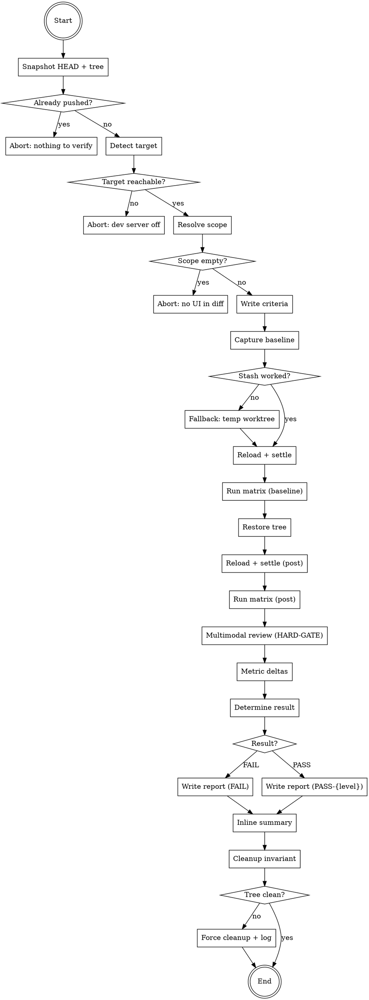

# visual-verify — design spec

## Purpose

A user-global Claude Code skill the agent runs **AFTER** making a UI change and **BEFORE** declaring the work "verified" or creating a commit that includes it. The skill captures a real baseline (via `git stash`) of the surfaces the change affects, executes a fixed `viewport × DPR × state` matrix, performs an obligatory multimodal review of every captured PNG, computes metric-level deltas baseline-vs-post, evaluates user-supplied measurable criteria, and produces a structured report that ends in either `FAIL` or `PASS-{strong,medium,weak}` — with the confidence level explicitly tied to which conditions of the strong-criteria set were met.

The skill exists because the existing `visual-qa` skill is an audit (read-only, scoped against an absolute 9-dimension rubric) and the existing `verification-before-completion` skill is generic (no UI-specific protocol). Neither serves as the post-change gate that catches "I shipped a regression after declaring verified" — exactly the failure mode the agent has hit repeatedly during the companion project's recent UI iterations.

## Non-goals

- Replacing `visual-qa`. `visual-qa` audits the app against an absolute rubric on demand; `visual-verify` checks that one specific change did not regress affected surfaces. They coexist.
- Replacing unit / contract tests. The skill does not run vitest, lint, or typecheck. Those gates remain orthogonal.
- Auto-triggering. The skill is invoked as a slash-command. Reinforcement of "you must invoke it on UI changes" lives in the project's `CLAUDE.md`, not in a hook.
- Automatic visual-regression baselining across runs (Chromatic / Argos style). Each invocation captures its own baseline from `git stash`; nothing is persisted between runs by default.
- Pixel-diff tooling (pixelmatch / looks-same). The skill relies on multimodal review + JSON metric deltas. No new runtime dependencies.
- Cross-machine equivalence. The skill explicitly declares "agent window XxY at DPR Z" in every report; the user's hardware DPI scaling is acknowledged as out-of-band and only reachable via `PASS-strong` ↑ user-side confirmation, not by emulation.

## Architecture overview

The skill is a thin orchestrator. It composes:

- The existing `visual-qa/references/recording-playbook.md` capture primitives (CDP `Page.captureScreenshot`, `Emulation.setDeviceMetricsOverride`, `Input.dispatch*`) — referenced, not duplicated.
- The agent's built-in `Read` tool for multimodal review of every PNG.
- `git stash` / `git diff` / `git rev-parse` for baseline capture and cleanup invariants.

The conceptual shape mirrors `visual-qa`: thin orchestrator gated by `<HARD-GATE>` + checklist + `digraph`. Unlike `visual-qa`, this skill **may run while the working tree is dirty** (that's the whole point — the change is in the tree) and **may end with HEAD modified** (the user commits after the run; the skill itself does not commit, but does not preserve `HEAD == initial_sha` as `visual-qa` does, since the user's normal workflow follows the run).

### Where things live

- Skill source: `~/projects/skills/visual-verify/`
  - `SKILL.md` — main orchestrator file
  - `references/baseline-capture.md` — stash protocol + fallback
  - `references/viewport-matrix.md` — matrix definition + capture loop
  - `references/multimodal-review.md` — review template + HARD-GATE expansion
  - `references/report-schema.md` — YAML frontmatter + body schema with example
  - `references/codex-tools.md` — tool mapping for Codex
  - `references/gemini-tools.md` — tool mapping for Gemini CLI
- User-global install: `~/.claude/skills/visual-verify/` → symlinked from `~/projects/skills/visual-verify/`
- Slash command: `~/.claude/commands/visual-verify.md` (thin wrapper)
- Project-local wrapper template: documented in the skills repo README, same pattern as `/visual-qa`
- Per-run artifacts (in the user's project):
  - Default: `/tmp/visual-verify-<slug>-<timestamp>/` for PNGs and `/tmp/visual-verify-<slug>-<timestamp>.md` for the report.
  - With `--persist`: report moved to `docs/qa/<YYYY-MM-DD>-visual-verify-<slug>.md`. PNGs stay in `/tmp/` (path quoted in the report).

### Invocation contract

- `/visual-verify` — auto-derive scope from `git diff`, run default 3×3×3 matrix.
- `/visual-verify "empty state"` — free-text scope hint, used for slug; auto-derived scope still computed.
- `/visual-verify --scope empty-state,sidebar` — override auto-derived scope explicitly.
- `/visual-verify --scope-add titlebar` — add to auto-derived scope.
- `/visual-verify --full` — 5×5×5 matrix instead of 3×3×3.
- `/visual-verify --persist` — copy final report to `docs/qa/`.

Args may be combined.

## Decisions log

The eight design decisions made during brainstorming, with the alternatives rejected, ordered as they were resolved:

### D1 — Trigger model (slash-command only, no hook)

**Chosen:** (a) Slash-command manual invocation, reinforced by strict rules in the project's `CLAUDE.md`.

**Rejected:**
- Hook-based auto-trigger on UI file changes — hook scope and timing too brittle, and the user prefers the explicit invocation model.
- Composition with `verification-before-completion` (extending the existing generic skill) — the visual contract is too specific to share a checklist; visual-verify needs its own.
- Reference-only (no slash-command) — would require `Skill` tool invocation by name from CLAUDE.md text; less ergonomic than a slash-command.

### D2 — Baseline capture (git stash with fallback)

**Chosen:** (a) `git stash push --include-untracked` to capture pre-change state, with (d) fallback when stash is a no-op (clean tree, change already committed).

**Rejected:**
- Proactive pre-change capture (b) — depends on the agent remembering to capture before mutating; defeats the purpose.
- No baseline, criteria-only (c) — misses regressions in surfaces the agent did not list as criteria. Exactly the failure mode the skill exists to prevent.

### D3 — Matrix shape (fixed 3×3×3 default + `--full` opt-in to 5×5×5)

**Chosen:** (c) Fixed 3-dimensional matrix as default for predictable cost; `--full` flag promotes to 5-dimensional for higher-stakes changes.

**Rejected:**
- Pure fixed-only (a) — overkill for trivial CSS-class renames.
- Diff-derived adaptive (b) — heuristic over which dimensions matter is exactly the agent's blind spot the skill exists to compensate for.
- Per-run agent decides (d) — non-deterministic; the same change generates different matrices in different runs.

### D4 — Analysis method (deltas JSON + multimodal review obligatory on every PNG)

**Chosen:** (d) JSON deltas as a mechanical floor + multimodal review of every PNG, BOTH required. Multimodal review is in the `<HARD-GATE>`.

**Rejected:**
- Multimodal-only (a) — vibe descriptions creep in without numerical anchors.
- Pixel diff + multimodal (b) — adds runtime dependency and threshold-tuning that drifts; complexity not justified.
- Multimodal only on pixel-diff hits (c) — same threshold-drift problem; misses subtle regressions that pixel diff considers acceptable.

User explicitly hardened this: multimodal review is per-PNG, detailed and concrete, in the HARD-GATE, no exceptions.

### D5 — Output format (`/tmp/` ephemeral default + `--persist` to archive)

**Chosen:** (d) Default writes to `/tmp/visual-verify-<slug>-<timestamp>.md`. `--persist` flag moves the report to `docs/qa/` (PNGs stay in `/tmp/`, paths quoted).

**Rejected:**
- Persistent file always (a, c) — clutters the repo for routine UI tweaks.
- Inline-only no file (b) — loses the per-run audit trail the agent might want to revisit.

### D6 — Result classification (PASS/FAIL binary + confidence level on PASS)

**Chosen:** (d) Binary PASS or FAIL. Every PASS declares a confidence level (`strong`, `medium`, `weak`) tied to which of four conditions held. FAIL has no level.

**Rejected:**
- Pure binary (a) — too coarse; doesn't expose coverage gaps to the user.
- Tri-state PASS / NEEDS-REVIEW / FAIL (b) — escape hatch; agent will gravitate to NEEDS-REVIEW.
- Confidence-only no PASS/FAIL (c) — diluted gate; agent always has an out.

The four strong-criteria conditions:
1. Full matrix executed (no skipped combos).
2. `baseline_method == stash` (real, not fallback).
3. Zero unexplained deltas in surfaces outside the change scope.
4. Every written criterion PASS.

PASS-strong = all four hold. PASS-medium = three of four. PASS-weak = two of four. One or zero of four → FAIL by construction.

### D7 — Scope derivation (auto from diff + `--scope` override + `--scope-add` extend)

**Chosen:** (c) Auto-derive scope from `git diff` against a path → surface mapping table. `--scope` overrides the auto-derived list; `--scope-add` unions onto it.

**Rejected:**
- Manual-only (a) — agent's blind spot for ripples; the whole skill exists to compensate.
- Auto-only (b) — heuristic mistakes are unfixable without escape valves.
- Always-include canonical-list (d) — fixed cost discourages routine use; ~135 PNGs for a one-line CSS change is disproportionate.

### D8 — Cross-hardware gap (declare premises, don't emulate)

**Chosen:** (c) Every report declares the agent's actual capture conditions (`agent_window_size`, `agent_window_dpr`) in `premises:`. PASS-strong is reachable within those premises; an additional `user_hardware_verified` field makes it explicit when the user has separately confirmed.

**Rejected:**
- Cap at medium without user screenshot (a) — too punitive; many runs are inherently agent-only and that's fine.
- Emulate user's DPI/viewport (b) — Windows DPI scaling is not faithfully reproducible via `Emulation.setDeviceMetricsOverride`; emulation creates false confidence.
- Combined automation (d) — over-engineering for now.

## SKILL.md HARD-GATE (verbatim — required behavior)

```
<HARD-GATE>
This skill MUST NOT:

- Declare PASS without a baseline capture present (either git-stash captured
  or fallback reconstructed from a temp worktree at HEAD~N) AND a post-change
  capture for the SAME (surface × viewport × dpr × state) tuples. A unilateral
  post-only capture is FAIL by construction.

- Declare PASS without written measurable criteria captured BEFORE the
  change (in the report's `criteria:` frontmatter). "Looked good" is not
  a criterion. Each criterion MUST be a measurable assertion ("title
  font-size ≤ 50px at any DPR", "branch label ellipsizes when text-width
  > card-width", "no horizontal scrollbar at viewport ≥ 800px").

- Skip multimodal review for ANY captured PNG. Every PNG in the matrix —
  baseline AND post — must be read via the Read tool and described in
  concrete terms in the report ("title occupies 18% of viewport height,
  wraps to 2 lines, no overflow"). Vibe descriptions ("looks fine") are
  forbidden. The report's per-surface section must contain at least one
  multimodal-review block per (viewport × dpr × state) capture.

- Use `setProperty`, `setState`, or any direct-DOM/React shortcut to
  mutate state during capture. State mutation MUST go through the
  user-facing path (mouse drag for sliders, click for toggles, keyboard
  for shortcuts). Programmatic shortcuts test code paths the user never
  uses and produce false positives.

- Skip the dev-server reload between baseline (pre-stash) and post
  (post-stash-pop) captures. Stale CSS-module hashes from before the
  stash silently produce baselines that match the post-stash state.

- Declare confidence `strong` if any of the four conditions failed:
  full matrix completed, baseline_method == stash (not fallback),
  zero unexplained deltas, every written criterion PASS.

- Declare confidence `strong` without explicitly stating in the report
  the viewport, DPR, and surface list under which the verification was
  performed. The premises ARE the strength.

- Run on a working tree where `git log @{u}..HEAD` is empty AND the
  working tree is clean. In that state there is nothing left to verify.
  Abort with an instructive message.

- Edit a written criterion mid-run because the post capture failed it.
  Criteria are written BEFORE capture; if a criterion is wrong, FAIL
  the run, surface to the user, write new criteria, and re-run.

- Skip the cleanup step. The skill MUST `git stash pop` (or destroy
  the temp worktree from fallback) before exiting, EVEN on FAIL. The
  user's working tree must end with the change applied — no leftover
  stash, no leftover worktree.

- Pause for user confirmation, approval, or interactive review during
  the run. Cost or duration warnings are informational only. The skill
  produces a report; the user reads it after the run.
</HARD-GATE>
```

## Checklist (verbatim — each item becomes a TodoWrite at runtime)

```
1.  Snapshot HEAD + working-tree state. INITIAL_SHA = git rev-parse HEAD.
    Record dirty-or-clean. Abort if `git log @{u}..HEAD` empty AND tree
    clean (HARD-GATE 8: nothing to verify).

2.  Detect target. Probe http://localhost:9222/json/version. If
    unreachable, abort with explicit instruction to start dev server.

3.  Resolve scope.
    a. If --scope provided, use as-is.
    b. Else compute auto-derived scope from `git diff` (staged +
       unstaged) using the path-to-surface heuristic in
       references/baseline-capture.md.
    c. If --scope-add provided, union onto auto-derived.
    d. If final scope is empty, abort: "no UI surfaces in diff;
       visual-verify not applicable".

4.  Write criteria. BEFORE any capture: write one or more measurable
    criteria per scoped surface to the report's frontmatter under
    `criteria:`. Each criterion: id, surface, assertion, measurement.
    The skill MUST NOT proceed past this step until at least one
    criterion is written for each scoped surface (HARD-GATE 2).

5.  Capture baseline. Per references/baseline-capture.md:
    a. git stash push --include-untracked --message
       "visual-verify-baseline-${TS}".
    b. If stash is a no-op (clean tree + change is committed), enter
       fallback: create temp worktree at HEAD~1 (the commit IMMEDIATELY
       before HEAD — the canonical "pre-change" state for a single-
       commit fix). The fallback does NOT walk further back; if HEAD~1
       is not the right baseline (multi-commit feature already pushed
       and squashed), the agent must abort and instruct the user to
       supply the baseline ref explicitly via a future flag (out of
       scope for v1). Set `baseline_method: fallback` in the report.
       Confidence cap = medium.
    c. CDP Page.reload({ ignoreCache: true }) on the running app.
       Wait for Page.loadEventFired + 2× requestAnimationFrame settle.
    d. Run the matrix (3×3×3 default, 5×5×5 with --full). For each
       (surface × viewport × dpr × state) tuple:
         - Emulation.setDeviceMetricsOverride { width, height,
           deviceScaleFactor }.
         - Drive state via user-facing path only (mouse, keyboard).
         - Page.captureScreenshot → /tmp/.../baseline/...
         - Capture metrics JSON for each surface (font-size,
           offsetWidth, scrollWidth, top, left, dimensions of bounding
           rect, color string for primary text).

6.  Restore working tree. git stash pop, or destroy temp worktree
    (fallback). CDP Page.reload({ ignoreCache: true }) again. Same
    settle wait as step 5c.

7.  Capture post-change. Run the IDENTICAL matrix from step 5d. Same
    surface × viewport × dpr × state tuples, same naming convention,
    PNGs to /tmp/.../post/, parallel metrics JSON.

8.  Multimodal review of every PNG (HARD-GATE 3). For each tuple:
    a. Read the baseline PNG via the Read tool. Write a concrete
       description (template in references/multimodal-review.md):
       what fills the frame, text wraps, overflow, alignment, chrome
       positioning. No vibe descriptions.
    b. Read the post PNG. Same template.
    c. List observable deltas baseline → post.
    d. Mark each criterion from step 4 PASS/FAIL with PNG path
       evidence.

9.  Compute metrics deltas. Diff the baseline vs post metrics JSON
    arrays. Surface every numerical delta in the report. Cross-
    reference each metric delta with the multimodal description: do
    visual change and metric change tell the same story? Discrepancy
    → FAIL.

    Note for the digraph: the single "Determine result" node in the
    flow chart subsumes Steps 9 AND 10. Both checks happen inside
    the same evaluation phase — the digraph collapses them so the
    plan should not split them into two separate nodes.

10. Determine result.
    - FAIL if: any criterion FAIL, OR any non-target surface had an
      unexplained visual delta, OR multimodal review found a regression
      not present in baseline, OR JSON-vs-visual divergence in any
      tuple.
    - PASS-strong: full matrix ran AND baseline_method == stash AND
      zero unexplained deltas AND every criterion PASS.
    - PASS-medium: any one of the four strong conditions missed.
    - PASS-weak: any two of the four strong conditions missed.
    - More than two strong conditions missed → FAIL.

11. Write report. Default /tmp/visual-verify-<slug>-<TS>.md per
    references/report-schema.md. With --persist, copy to
    docs/qa/<YYYY-MM-DD>-visual-verify-<slug>.md and stage that file
    for commit (skill does not commit; user does).

12. Print inline summary. Five-line markdown block in the conversation.
    Always declares: result (PASS-{strong|medium|weak} or FAIL),
    matrix mode, agent window + DPR, criteria PASS count, report path.

13. Cleanup invariant (HARD-GATE 9). Verify working tree contains the
    user's change AND no leftover artifacts (no `visual-verify-*`
    stash entries, no temp worktrees from fallback). If discrepancy,
    log to report and clean. EVEN ON FAIL.
```

## `digraph` flow (verbatim)



## Report schema

The report is a YAML-frontmatter markdown file. Schema:

### Frontmatter (required fields)

```yaml
---
schema_version: 1
slug: <kebab-case derived from --scope or git-diff>
generated_at: <ISO 8601 UTC>
duration_seconds: <integer>

initial_sha: <git rev-parse HEAD at start>
final_sha: <git rev-parse HEAD at end>
working_tree_dirty_at_start: <bool>
baseline_method: stash | fallback | unavailable

scope:
  derived_from_diff: <bool>
  surfaces: [<list of surface ids>]
  scope_overrides:
    explicit: [<list, from --scope>]
    additions: [<list, from --scope-add>]

matrix:
  mode: default | full
  viewports: [[w, h], ...]
  dprs: [<floats>]
  states_per_surface:
    <surface-id>: [<state-id>, ...]
  total_captures: <integer>

criteria:
  - surface: <surface-id>
    id: <kebab-case>
    assertion: <human-readable>
    measurement: <how to mechanically check>

result: PASS | FAIL
confidence: strong | medium | weak    # only on PASS
confidence_reason: <multi-line>

premises:
  agent_window_size: [w, h]
  agent_window_dpr: <float>
  os_dpi_scale: <known | not-tested>
  user_hardware_verified: <bool>

criteria_results:
  passed: [<surface.id>, ...]
  failed: [<surface.id>, ...]

unexplained_deltas: [<short description>, ...]
unreachable_states: [<surface.state-id>, ...]
low_quality_frames: [<path>, ...]
---
```

### Body sections

- `## Summary` — one-paragraph human-readable verdict with confidence.
- `## Per-surface review` — one block per scoped surface, with one sub-block per criterion containing baseline metrics + multimodal review, post metrics + multimodal review, and the criterion verdict.
- `## Unexplained deltas` — empty or list with location, observed delta, assessment.
- `## Confidence breakdown` — checklist of the four strong conditions with met/missed annotations.
- `## Cleanup verification` — final_sha vs initial_sha, stash state, worktree state.

A full example lives in `references/report-schema.md` (to be written during implementation).

### Inline summary (printed in conversation after Step 12)

Five-line block. PASS form:

```
visual-verify ▸ <slug> ▸ PASS-<level>
matrix: <mode> · <total_captures> captures · agent window <w>×<h> DPR <dpr>
criteria: <pass>/<total> PASS (<surface.id>, ...)
unexplained deltas: <count>
report: <path>
```

FAIL form lists the failed criteria and any visual regressions instead of the unexplained-deltas line.

PASS-weak form replaces the criteria line with a "→ user-side screenshot needed before claiming verified" instruction.

## CLAUDE.md rule (project-side reinforcement, verbatim)

The following section MUST be added to `~/projects/companion/CLAUDE.md` (and to any other project that adopts the skill, mutatis mutandis on path patterns) between "Feature catalog rule" and "Quick reference":

```markdown
## Visual-verify rule (STRICT — non-negotiable)

For ANY change that modifies one or more files matching the patterns
below, the agent MUST run `/visual-verify` BEFORE declaring the work
"verified", "fixed", "done", or before creating commits that include
the change. There is no judgment call — if the diff matches a
pattern, the skill runs.

### Patterns that trigger the rule

- `apps/desktop/src/renderer/src/**/*.{tsx,ts,css,module.css}`
- `apps/desktop/src/renderer/src/styles/**/*.css`
- `apps/desktop/src/renderer/index.html`
- Any file in `docs/design/` that the agent claims to be implementing.

### Exemptions (the rule does NOT apply)

- Changes that touch only test files (`apps/desktop/test/**`).
- Changes that touch only type signatures with no rendered impact
  (`*.d.ts` adjustments, function signature reorders that don't
  change a render call).
- Changes that ONLY remove dead code that was already unrendered.
- Documentation-only changes (`docs/**` excluding `docs/design/`).
- Changes inside `.archived/` or `.worktrees/`.

The agent MUST be conservative about exemptions: when in doubt,
the rule applies. Skipping `/visual-verify` because "the change
is too small to break anything" is exactly how regressions like
the empty-state hero blowing up at slider=20 ship.

### What "running /visual-verify" means in practice

1. The agent invokes the skill via the slash-command after staging
   the change but BEFORE running `git commit`.
2. The skill executes its full checklist (Steps 1–13). The agent
   does not skip any step.
3. The skill produces a report. The agent reads the report's
   `result` and `confidence` fields:
   - `PASS-strong` → may proceed to commit and may declare
     "verified" in the conversation.
   - `PASS-medium` → may proceed to commit; in the conversation
     MUST quote the premises field of the report and explicitly
     state "verified within the matrix shown; user-hardware
     confirmation pending".
   - `PASS-weak` → MUST NOT declare "verified" in the conversation.
     MUST ask the user for a screenshot from their hardware before
     claiming verification.
   - `FAIL` → MUST NOT commit. MUST address the failure (re-fix or
     update the criteria with explicit user approval) and re-run.

### Banned behaviors

- Declaring "verified live via CDP" in the conversation without
  having run `/visual-verify`.
- Quoting CDP-driven metric snapshots (e.g. `getComputedStyle`
  output) as proof of correctness without the matching report.
- Editing criteria mid-run because they failed. Criteria are
  written BEFORE the capture; if a criterion turns out to be
  wrong, FAIL the run, discuss with the user, write new criteria,
  and re-run.

### Why this rule exists

The agent has shipped multiple visible regressions by claiming
"verified" based on single-snapshot CDP probes that bypassed
React state, used a fixed viewport at default DPR, and were
reviewed in vibe mode rather than via multimodal description
against written criteria. See:
- 2026-04-28 `image-78` empty-state at high font slider.
- 2026-04-28 `image-79` titlebar / chat-tab overflow.
- 2026-04-28 `image-80` "Pick a workspace" oversized after
  three rounds of "verified" claims.

Each of these would have FAILed a `visual-verify` run with the
right criteria written upfront. The skill is the cheap, agent-
readable safety net. Skipping it is forbidden.
```

## Edge cases & failure modes

| ID | Symptom | Mandatory behavior | Confidence cap |
|---|---|---|---|
| EC-1 | Dev server unreachable on :9222 | Abort step 2 with instruction to start dev server | n/a |
| EC-2 | `git stash` is a no-op (tree clean, change committed) | Fallback to temp worktree at `HEAD~N`; mark `baseline_method: fallback` | medium |
| EC-3 | Change already pushed (`@{u}..HEAD` empty + tree clean) | Abort step 1 (HARD-GATE 8) | n/a |
| EC-4 | `git stash pop` produces conflicts | Mark FAIL, leave conflict markers in place, instruct user to resolve. **Explicit exception to HARD-GATE 9 cleanup invariant**: when stash pop conflicts, the user's manual resolution IS the cleanup. The skill stops touching the working tree and surfaces the conflict. | n/a |
| EC-5 | Surface state unreachable (e.g., requires auth) | Add to `unreachable_states:`; do NOT FAIL but cap confidence | medium |
| EC-6 | Capture lands mid-transition | Wait 2× rAF + transitionend; recapture once; if still dirty, list in `low_quality_frames:` | n/a |
| EC-7 | JSON metrics and multimodal description disagree | FAIL; describe the divergence in the report | n/a |
| EC-8 | Intentional change trips a criterion (criterion was wrong) | FAIL; do NOT edit criterion mid-run; surface to user, re-run with new criteria | n/a |
| EC-9 | Multimodal review finds visual regression no criterion covers | Add to `unexplained_deltas:`; FAIL | n/a |
| EC-10 | Auto-derived scope ends up empty | Abort step 3 ("no UI surfaces in diff") | n/a |
| EC-11 | Run exceeds soft time budget (~5 min on `--full`) | No timeout; print elapsed time per minute on conversation; user may Esc | n/a |
| EC-12 | Working tree dirty after FAIL | Step 13 cleanup runs anyway; if leftover stash or worktree, force-clean and log | n/a |

## Acceptance criteria

The skill is considered complete and ready when:

1. `~/projects/skills/visual-verify/SKILL.md` exists, contains the verbatim `<HARD-GATE>` from this spec, the verbatim Checklist, the verbatim `digraph`, and references each `references/*.md` file by name.
2. Six reference files exist (`baseline-capture.md`, `viewport-matrix.md`, `multimodal-review.md`, `report-schema.md`, `codex-tools.md`, `gemini-tools.md`). Each is non-empty and addresses the topic in its name.
3. `~/.claude/skills/visual-verify` is a symlink to `~/projects/skills/visual-verify`.
4. `~/.claude/commands/visual-verify.md` exists, is a thin wrapper that forwards args.
5. `~/projects/companion/CLAUDE.md` contains the verbatim "Visual-verify rule (STRICT)" section from this spec, in the documented location.
6. The existing `~/projects/skills/scripts/verify-visual-skills.sh` is **extended in place** to also cover `visual-verify` — the script reports OK for the new skill: SKILL.md frontmatter parses; HARD-GATE marker present; digraph marker present; all referenced `references/*.md` files exist. No new script file is added — the existing script gains visual-verify in its skill list.
7. `~/projects/skills/README.md` documents the skill and its installation, mirroring the `visual-qa` / `visual-refine` pattern.
8. Manual smoke test: invoking `/visual-verify` against the running companion app on a working tree with a small UI tweak (e.g., a one-line CSS edit) produces a report at `/tmp/visual-verify-*.md` whose schema matches `references/report-schema.md`, whose checklist completed end-to-end without HARD-GATE violations, and whose final declaration matches the actual rendered state.

## Out of scope (will NOT be implemented in this work)

- Hooks for auto-trigger (rejected in D1).
- Pixel-diff tooling (rejected in D4).
- Persistent visual-regression baselining across runs.
- Cross-machine emulation of user DPI (rejected in D8).
- Slash-command for "capture user-hardware screenshots" (the manual flow `pnpm qa:capture` discussed earlier — separate concern).
- Integration tests for the skill itself (the skill is integration; the smoke test in acceptance #8 is the validation).
