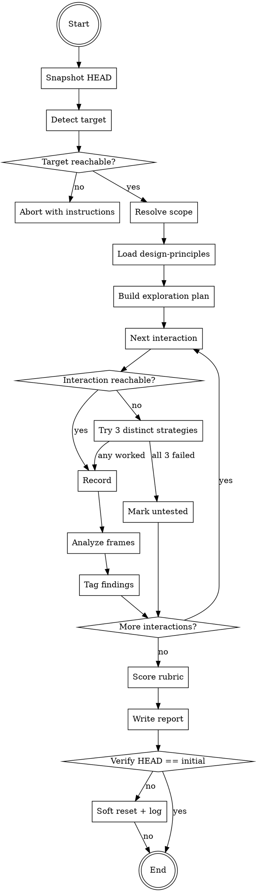

<HARD-GATE>
This skill MUST NOT:
- Run `git commit`, `git add`, `git push`, `git stash`, or `git reset` except the single soft-reset described in step 11 below.
- Modify any file outside `/tmp/` and the final report file under `docs/qa/`.
- Declare an interaction `untested` without having attempted at least 3 documented strategies from distinct categories.
- Write the final report if the target app was never reachable.
- Skip any item in the checklist below.
</HARD-GATE>

# Visual QA

Audit a running app's visual and UX quality against a concrete rubric. Produce a structured, parser-friendly report. Never modify source code. Never commit.

## Inputs

The skill accepts a single free-text scope argument. There are no flags in v1. The scope narrows what is audited and becomes the slug for report/frame paths.

Examples:

- `visual-qa` — no scope, audit the full app surface that is currently reachable.
- `visual-qa tela de login` — audit the login screen only.
- `visual-qa fluxo de registro` — audit the end-to-end registration flow.
- `visual-qa settings > notifications` — audit a nested surface.

If the scope is ambiguous or does not map to any reachable route/component/flow, stop and ask the user exactly one clarifying question before proceeding.

## Outputs

1. A single report file at `docs/qa/YYYY-MM-DD-visual-qa-<scope-slug>.md` conforming to the schema in `references/report-schema.md`.
2. A frames directory at `/tmp/visual-qa-<scope-slug>-<timestamp>/` with PNGs and any assembled GIF/MP4.
3. Zero commits, zero staged changes, zero modified source files. Working tree byte-identical to start.

## Required reading before you start

Before taking any action, `Read` all four reference files. Do not rely on memory.

- `references/design-principles.md` — the 9-dimension rubric + blacklist used as active grading criterion.
- `references/recording-playbook.md` — CDP and adb capture patterns, FPS table, DOM snapshot recipes.
- `references/exploration-checklist.md` — mandatory interaction categories and the exhaustion rule for untested cases.
- `references/report-schema.md` — authoritative report schema (frontmatter fields, hard rules, full example).

## Checklist

Every item below becomes a TodoWrite task at runtime. The items must be executed in order and no item may be skipped. If an item cannot be completed, stop and report the obstruction rather than moving on.

```
1. **Snapshot HEAD.** `INITIAL_SHA=$(git rev-parse HEAD)`. Keep in conversation memory.
2. **Detect target.** Probe for Chromium CDP on `http://localhost:9222/json/version` and for an Android emulator via `adb devices`. If neither responds, abort with a message instructing the user how to start the target. Do not assume.
3. **Resolve scope.** If the scope string maps cleanly to a route, component, or flow, proceed. If ambiguous, ask the user one clarifying question and wait. No scope = full app.
4. **Load design principles.** `Read` `references/design-principles.md`. The rubric from Part 2 of that file becomes the active grading criterion for the rest of the run.
5. **Build exploration plan.** Using `references/exploration-checklist.md`, generate the list of mandatory interactions for this scope: first-impression pass, primary actions, all states (loading/empty/error/success), hover/focus/active on every interactive element, edge cases (long text, rapid clicks, viewport 1440→900→390), consistency sweep vs adjacent screens.
6. **Record.** Following `references/recording-playbook.md`, capture each planned interaction with FPS chosen by action type. All frames land in `/tmp/visual-qa-<scope-slug>-<timestamp>/`. Capture DOM snapshots at decision moments.
7. **Analyze frame-by-frame.** `Read` key PNGs. For every finding, record: tag (`VISUAL_ISSUE`, `FRICTION`, `INCONSISTENCY`, `CONFUSION`, `HIERARCHY_WEAK`, `MOTION_JANK`, `A11Y`, `DESIGN_SYSTEM`), severity (`critical`/`major`/`minor`), dimension (one of the 9 rubric dimensions), evidence (frame file name and, when relevant, DOM snapshot).
8. **Score the rubric.** Assign 0–3 to each of the 9 dimensions for the scoped surface. Apply the hard rules from Part 2 of `design-principles.md`: any 0 → at least one `critical` issue; any 1 → at least one `major` issue; average below 2.0 → automatic `critical` global issue `I-000`.
9. **Exhaust untested cases.** For any interaction that could not be reached naturally, attempt at least 3 distinct strategies to force it (DevTools `evaluate_script`, request interception, console stubbing, `Network.emulateNetworkConditions`, storage manipulation, feature-flag overrides). Only after 3 documented failures may the interaction be marked `untested`, with the strategies and reasons listed.
10. **Write report.** Produce the YAML-frontmatter markdown file per Section 6 at `docs/qa/YYYY-MM-DD-visual-qa-<scope-slug>.md`. No other writes.
11. **Verify no-commit invariant.** `git rev-parse HEAD`. If it differs from `INITIAL_SHA`, `git reset --soft $INITIAL_SHA` and log `commit-undone` in the report's narrative section. Verify once more.
```

## Flow diagram



## Notes on the no-commit invariant

**Why commits are forbidden.** `visual-qa` is a read-only audit. Commits during the audit would contaminate the baseline the user is inspecting and mix QA artifacts into their workflow. The skill's job is to report, not to act. Any code change the audit might inspire belongs to a separate, explicit follow-up task — never to this run.

**What the soft-reset does.** `git reset --soft $INITIAL_SHA` undoes the commit boundary while preserving every modified file in the index and working tree. Nothing is lost; we just unhook the commit. The working tree remains exactly as it was immediately before the stray commit, so the user can continue whatever work they had in flight without noticing any disturbance.

**What `final_sha == initial_sha` guarantees.** Every report writes both SHAs into its frontmatter. They MUST be equal; `visual-refine` treats a mismatch as a malformed report. This gives downstream consumers a single field to check to confirm the audit left the repository untouched at the commit level — no need to diff trees or re-run checks.

**Known limitation: `git push`.** A soft-reset is local. If a subagent ran `git push` between committing and the checkpoint, the remote still has the commit. The skill bans `git push` in the HARD-GATE above, but it cannot undo a push that already happened. If this occurs, stop immediately and surface the situation to the user with the offending SHA — do not attempt to rewrite remote history.
