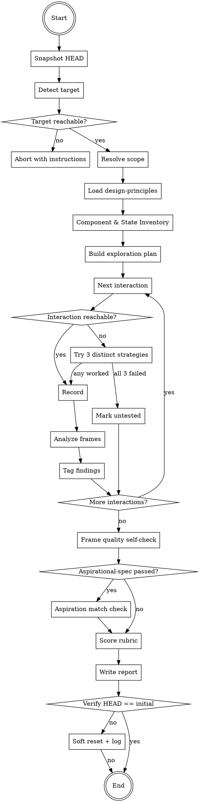

## Platform adaptation

If you are running on **Gemini CLI**, read `references/gemini-tools.md` to translate
tool names used in this skill to their Gemini equivalents before starting.

If you are running on **Codex**, read `references/codex-tools.md` for the same mapping.

<HARD-GATE>
This skill MUST NOT:
- Run `git commit`, `git add`, `git push`, `git stash`, or `git reset` except the single soft-reset described in step 11 below.
- Modify any file outside `/tmp/` and the final report file under `docs/qa/`.
- Declare an interaction `untested` without having attempted at least 3 documented strategies from distinct categories.
- Write the final report if the target app was never reachable.
- Skip any item in the checklist below.
- Skip Step 4.5 (Component & State Inventory). The inventory is the recording floor; no run is valid without it.
- Capture fewer than exactly 5 frames per transition (start, ~25%, ~50%, ~75%, end). A transition may be recorded as `instant` ONLY after the auditor has verified frames `start`, `mid` (frame 3), and `end` are byte-equal — never as a shortcut.
- Write the final report if `inventory_coverage.complete == false` without enumerating every gap in `missing_states`, `missing_transitions`, `instant_transitions`, or `low_quality_frames`.
- The skill MUST NOT pause for user confirmation, approval, review, or any
  other interactive input. Cost or duration warnings are informational only
  and do not block execution.
</HARD-GATE>

# Visual QA

Audit a running app's visual and UX quality against a concrete rubric. Produce a structured, parser-friendly report. Never modify source code. Never commit.

## Inputs

The skill accepts a single free-text scope argument and an optional `--aspirational-spec <path>` flag. The scope narrows what is audited and becomes the slug for report/frame paths.

Examples:

- `visual-qa` — no scope, audit the full app surface that is currently reachable.
- `visual-qa tela de login` — audit the login screen only.
- `visual-qa fluxo de registro` — audit the end-to-end registration flow.
- `visual-qa settings > notifications` — audit a nested surface.
- `visual-qa "all app features" --aspirational-spec docs/qa/2026-04-26-visual-refine-all-app-features-aspirational-spec.md` — audit and additionally check each captured component against the linked aspirational-spec mockups (Step 7.5 activates).

If the scope is ambiguous or does not map to any reachable route/component/flow, stop and ask the user exactly one clarifying question before proceeding.

The `--aspirational-spec` flag is optional. When absent, Step 7.5 is skipped and the `aspiration_match` frontmatter field is omitted. When present, the path must point to a markdown file with one section per component (the format produced by `visual-refine` Phase 1.5).

## Outputs

1. A single report file at `docs/qa/YYYY-MM-DD-visual-qa-<scope-slug>.md` conforming to the schema in `references/report-schema.md`.
2. A frames directory at `/tmp/visual-qa-<scope-slug>-<timestamp>/` with PNGs and any assembled GIF/MP4.
3. Zero commits, zero staged changes, zero modified source files. Working tree byte-identical to start.

## Required reading before you start

Before taking any action, `Read` all four reference files. Do not rely on memory.

- `references/design-principles.md` — the 9-dimension rubric + blacklist used as active grading criterion.
- `references/recording-playbook.md` — CDP and adb capture patterns, FPS table, DOM snapshot recipes.
- `references/exploration-checklist.md` — mandatory interaction categories and the exhaustion rule for untested cases.
- `references/report-schema.md` — authoritative report schema (frontmatter fields, hard rules, full example).

## Checklist

Every item below becomes a TodoWrite task at runtime. The items must be executed in order and no item may be skipped. If an item cannot be completed, stop and report the obstruction rather than moving on.

```
1. **Snapshot HEAD.** `INITIAL_SHA=$(git rev-parse HEAD)`. Keep in conversation memory.
2. **Detect target.** Probe for Chromium CDP on `http://localhost:9222/json/version` and for an Android emulator via `adb devices`. If neither responds, abort with a message instructing the user how to start the target. Do not assume.
3. **Resolve scope.** If the scope string maps cleanly to a route, component, or flow, proceed. If ambiguous, ask the user one clarifying question and wait. No scope = full app.
4. **Load design principles.** `Read` `references/design-principles.md`. The rubric from Part 2 of that file becomes the active grading criterion for the rest of the run.
4.5. **Component & State Inventory.** Run a DOM walk over the scoped surface root following `references/recording-playbook.md` "Component & state enumeration" recipe. Enumerate components by combining: CSS-module class names (treating each module as a candidate component identity, canonicalized by stripping the `_<hash>` suffix), ARIA roles, and structural HTML patterns. For each component, derive states by inspecting pseudo-classes (`:hover`, `:focus`, `:active`, `:disabled`, `:checked`), attribute states (`[aria-expanded]`, `[data-state]`, `[aria-pressed]`), variant class fragments (`.collapsed`, `.expanded`, `.working`, `.error`), and component-model implicit states (a chat-tab can be idle/working/error/streaming whether or not the DOM exposes it now). For each ordered pair of states that can transition, register the transition with an `expected_animated: yes/no` flag (default `yes` for `expand`/`collapse`/`open`/`close`/`enter`/`exit` keywords; `no` otherwise — but the field is always required). Persist the result as `inventory:` in the report frontmatter (auto-generated; no user confirmation). Example:

       inventory:
         components:
           - id: sidebar
             states: [expanded, collapsed]
             transitions:
               - from: expanded
                 to: collapsed
                 expected_animated: yes
           - id: sidebar-row
             states: [default, hover, active, menu-open]
             transitions:
               - from: default
                 to: hover
                 expected_animated: yes
               - from: default
                 to: menu-open
                 expected_animated: yes
           - id: topbar
             states: [home, workspace-selected]
             transitions:
               - from: home
                 to: workspace-selected
                 expected_animated: no

   The full inventory is the recording plan's source of truth.
5. **Build exploration plan.** The plan is **derived from the inventory**: one frame per (component, state); five frames per transition (start, ~25%, ~50%, ~75%, end). The inventory is the **floor** of coverage. `references/exploration-checklist.md` survives as the **complementary upper-bound** for cross-cutting concerns the inventory does not capture: viewport-resize sweeps at 1440 / 900 / 390, rapid-click stress, long-text overflow, first-impression sweep, consistency sweep vs adjacent screens. Read both, but treat the inventory as authoritative for component coverage; the checklist as authoritative for cross-cutting interaction categories.
6. **Record.** Following `references/recording-playbook.md`, capture each planned interaction with FPS chosen by action type. All frames land in `/tmp/visual-qa-<scope-slug>-<timestamp>/`. Naming convention is mandatory:
   - Resting states: `<component-id>-<state>.png` (e.g., `sidebar-expanded.png`, `sidebar-row-hover.png`).
   - Transitions: exactly 5 frames named `<component-id>-<from>-<to>-<NofM>.png` where `M=5` and `N` ranges 1–5 (e.g., `sidebar-expanded-collapsed-1of5.png` … `sidebar-expanded-collapsed-5of5.png`). Capture either by playing the transition at native speed and sampling at the named offsets, or — for animations declared via the Web Animations API — by pausing the animation, stepping `currentTime` to `[0, 0.25*d, 0.50*d, 0.75*d, d]` and capturing each frame deterministically.
   - DOM snapshots: `<component-id>-<state>.dom.html` per resting state.
6.5. **Frame quality self-check.** Before writing the report, validate:
   - Every (component, state) in the inventory has at least one frame with `file_size >= 8 KB` (8192 bytes). Frames below the floor are listed under `low_quality_frames` with the measured size.
   - Every transition has 5 sequenced frames AND the mid frame (frame 3 of 5) is byte-distinct from `start` and `end` (verified via SHA-256 hash). If `start`, `mid`, and `end` hash equal, the transition is recorded under `instant_transitions`.
   - Every (component, state) has a DOM snapshot file accompanying it. Missing snapshots count as missing states.
   - Persist results as `inventory_coverage` in the frontmatter (always present when `inventory` is present):

           inventory_coverage:
             complete: false
             missing_states:
               - {component: topbar, state: workspace-selected}
             missing_transitions:
               - {component: sidebar, from: expanded, to: collapsed}
             instant_transitions:
               - {component: theme-grid, from: default, to: selected}
             low_quality_frames:
               - {path: sidebar-row-hover.png, reason: file_size=4KB}

     `complete: true` requires every gap array to be empty.
7. **Analyze frame-by-frame.** `Read` key PNGs. For every finding, record: tag (`VISUAL_ISSUE`, `FRICTION`, `INCONSISTENCY`, `CONFUSION`, `HIERARCHY_WEAK`, `MOTION_JANK`, `A11Y`, `DESIGN_SYSTEM`), severity (`critical`/`major`/`minor`), dimension (one of the 9 rubric dimensions), evidence (frame file name and, when relevant, DOM snapshot). **Inventory-derived findings are automatic, not subjective**: every entry in `inventory_coverage.instant_transitions` whose source inventory transition has `expected_animated: yes` is promoted to a `motion` issue (tag `MOTION_JANK`, severity `major` minimum) with the inventory's `expected_animated` flag acting as the violated contract. The auditor does not get a vote here; the inventory dictates.
7.5. **Aspiration match check (conditional).** Runs **only** when the skill was invoked with `--aspirational-spec <path>`. Read the linked spec markdown. For **every** component listed in the spec, the auditor reads the linked HTML mockup file and the captured frame(s) for that component, compares them, and emits:

        aspiration_match:
          - component: topbar
            match: yes
            notes: "Padding, branch chip hierarchy, status pill match mockup intent."
          - component: settings-appearance
            match: no
            notes: "Density cards lack multi-row wireframe content shown in mockup; sliders missing endpoint A icons; section dividers absent."

    Rules: (a) **default to `match: no` in case of doubt** — yes is reserved for high-confidence equivalence, not "close enough"; (b) the `notes` field MUST enumerate **concrete deltas** (specific spacing, component composition, missing affordances, present anti-patterns) — never vague phrasing like "looks different" or "feels off"; (c) skip no component listed in the spec — every component must produce an entry. The frontmatter field is **absent** in standalone visual-qa runs (no `--aspirational-spec`).
8. **Score the rubric.** Assign 0–3 to each of the 9 dimensions for the scoped surface. Apply the hard rules from Part 2 of `design-principles.md`: any 0 → at least one `critical` issue; any 1 → at least one `major` issue; average below 2.0 → automatic `critical` global issue `I-000`.
9. **Exhaust untested cases.** For any interaction that could not be reached naturally, attempt at least 3 distinct strategies to force it (DevTools `evaluate_script`, request interception, console stubbing, `Network.emulateNetworkConditions`, storage manipulation, feature-flag overrides). Only after 3 documented failures may the interaction be marked `untested`, with the strategies and reasons listed.
10. **Write report.** Produce the YAML-frontmatter markdown file per the schema in `references/report-schema.md` at `docs/qa/YYYY-MM-DD-visual-qa-<scope-slug>.md`. No other writes. Do not write the report if `inventory_coverage.complete == false` and the gap arrays are all empty (that combination is malformed).
11. **Verify no-commit invariant.** `git rev-parse HEAD`. If it differs from `INITIAL_SHA`, `git reset --soft $INITIAL_SHA` and log `commit-undone` in the report's narrative section. Verify once more.
```

## Flow diagram


```dot
digraph visual_qa {
    "Start" [shape=doublecircle];
    "Snapshot HEAD" [shape=box];
    "Detect target" [shape=box];
    "Target reachable?" [shape=diamond];
    "Abort with instructions" [shape=box];
    "Resolve scope" [shape=box];
    "Load design-principles" [shape=box];
    "Component & State Inventory" [shape=box];
    "Build exploration plan" [shape=box];
    "Next interaction" [shape=box];
    "Record" [shape=box];
    "Frame quality self-check" [shape=box];
    "Analyze frames" [shape=box];
    "Interaction reachable?" [shape=diamond];
    "Try 3 distinct strategies" [shape=box];
    "Mark untested" [shape=box];
    "Tag findings" [shape=box];
    "More interactions?" [shape=diamond];
    "Aspirational-spec passed?" [shape=diamond];
    "Aspiration match check" [shape=box];
    "Score rubric" [shape=box];
    "Write report" [shape=box];
    "Verify HEAD == initial" [shape=diamond];
    "Soft reset + log" [shape=box];
    "End" [shape=doublecircle];

    "Start" -> "Snapshot HEAD" -> "Detect target" -> "Target reachable?";
    "Target reachable?" -> "Abort with instructions" [label="no"];
    "Target reachable?" -> "Resolve scope" [label="yes"];
    "Resolve scope" -> "Load design-principles" -> "Component & State Inventory" -> "Build exploration plan" -> "Next interaction";
    "Next interaction" -> "Interaction reachable?";
    "Interaction reachable?" -> "Record" [label="yes"];
    "Interaction reachable?" -> "Try 3 distinct strategies" [label="no"];
    "Try 3 distinct strategies" -> "Record" [label="any worked"];
    "Try 3 distinct strategies" -> "Mark untested" [label="all 3 failed"];
    "Record" -> "Analyze frames" -> "Tag findings" -> "More interactions?";
    "Mark untested" -> "More interactions?";
    "More interactions?" -> "Next interaction" [label="yes"];
    "More interactions?" -> "Frame quality self-check" [label="no"];
    "Frame quality self-check" -> "Aspirational-spec passed?";
    "Aspirational-spec passed?" -> "Aspiration match check" [label="yes"];
    "Aspirational-spec passed?" -> "Score rubric" [label="no"];
    "Aspiration match check" -> "Score rubric";
    "Score rubric" -> "Write report" -> "Verify HEAD == initial";
    "Verify HEAD == initial" -> "End" [label="yes"];
    "Verify HEAD == initial" -> "Soft reset + log" -> "End" [label="no"];
}
```

## Notes on the no-commit invariant

**Why commits are forbidden.** `visual-qa` is a read-only audit. Commits during the audit would contaminate the baseline the user is inspecting and mix QA artifacts into their workflow. The skill's job is to report, not to act. Any code change the audit might inspire belongs to a separate, explicit follow-up task — never to this run.

**What the soft-reset does.** `git reset --soft $INITIAL_SHA` undoes the commit boundary while preserving every modified file in the index and working tree. Nothing is lost; we just unhook the commit. The working tree remains exactly as it was immediately before the stray commit, so the user can continue whatever work they had in flight without noticing any disturbance.

**What `final_sha == initial_sha` guarantees.** Every report writes both SHAs into its frontmatter. They MUST be equal; `visual-refine` treats a mismatch as a malformed report. This gives downstream consumers a single field to check to confirm the audit left the repository untouched at the commit level — no need to diff trees or re-run checks.

**Known limitation: `git push`.** A soft-reset is local. If a subagent ran `git push` between committing and the checkpoint, the remote still has the commit. The skill bans `git push` in the HARD-GATE above, but it cannot undo a push that already happened. If this occurs, stop immediately and surface the situation to the user with the offending SHA — do not attempt to rewrite remote history.
