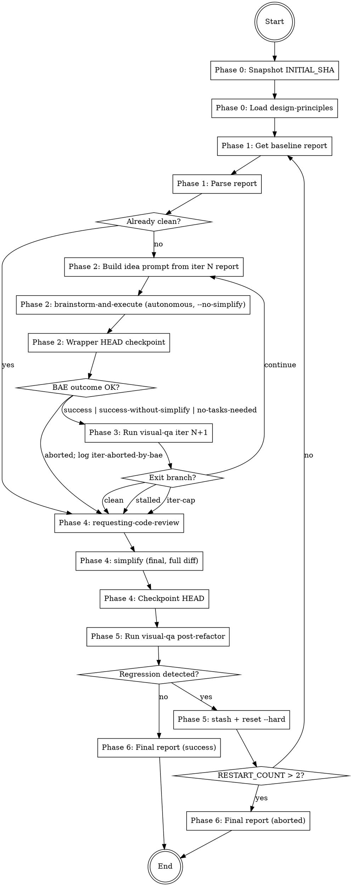

## Platform adaptation

If you are running on **Gemini CLI**, read `references/gemini-tools.md` to translate
tool names used in this skill to their Gemini equivalents before starting.

If you are running on **Codex**, read `references/codex-tools.md` for the same mapping.

<HARD-GATE>
This skill MUST NOT:
- Run `git commit`, `git add`, `git push`, `git commit --amend` during any phase.
- Declare `done` without a final `visual-qa` run that finds zero `critical` and zero `major` issues.
- Skip phases or reorder them.
- Exceed MAX_ITER = 5 loop iterations without transitioning to the documented abort path.
- Exceed MAX_RESTARTS = 2 regression restarts.
- Proceed past Phase 0 if `git rev-parse HEAD` cannot be read.
- Invoke `brainstorm-and-execute` without `--no-simplify`. Per-iteration simplify is forbidden; the only simplify pass runs in Phase 4 (final refactor) on the full cross-iteration diff.
- Invoke `brainstorm-and-execute` with `--spec` or `--plan` flags. `visual-refine` always passes a free-text idea so that the autonomous brainstorm phase runs and produces the spec from the visual-qa issue list. The whole point of this composition is to delegate spec generation, not just plan/execute.
</HARD-GATE>

# Visual Refine

Transform the scoped UI surface from its current state to one that scores at least 2 (ideally 3) on every rubric dimension of `references/design-principles.md`, via autonomous (spec → plan → execute) iterations, followed by refactor and anti-regression verification. Per-iteration spec generation is delegated to `brainstorm-and-execute` so each iteration is one autonomous run instead of four manual phases. Leave the final working tree to the user; never commit.

## Inputs

- Free-text scope argument (conceptually required; if omitted, scope is "full app"). Examples: `visual-refine`, `visual-refine tela de login`, `visual-refine fluxo de registro`.
- Optional flag `--report <path>`: when provided and the file exists, `visual-refine` uses it as the initial baseline for Phase 1 instead of running `visual-qa` fresh.
- Optional flag `--iter-budget <minutes>` (default `30`): forwarded to each per-iteration `brainstorm-and-execute` invocation as its `--budget`. The total wall-clock cap for a full `visual-refine` run is therefore `MAX_ITER × iter-budget` plus visual-qa runtime.

## Outputs

- A consolidated report at `docs/qa/YYYY-MM-DD-visual-refine-<scope-slug>.md`.
- All intermediate `visual-qa` iter reports kept in `docs/qa/`.
- Per-iteration `brainstorm-and-execute` artifacts: one rubric (`docs/superpowers/decisions/<bae-slug>/rubric.md`), one set of decision files (`docs/superpowers/decisions/<bae-slug>/NN-*.md`), one autonomously-generated spec (`docs/superpowers/specs/<bae-slug>-design.md`), one plan (`docs/superpowers/plans/<bae-slug>-plan.md`), and one run report (`docs/superpowers/runs/<bae-slug>-run.md`).
- Working tree with modifications applied, HEAD identical to `INITIAL_SHA`, no commits, no staged files beyond what was already staged at Phase 0.

## Required reading before you start

- `references/design-principles.md` — the 9-dimension rubric used to grade scope quality.
- `references/loop-mechanics.md` — checkpoint pattern, stall detection, regression restart, and issue-identity matching rules.
- `references/spec-template.md` — historical skeleton kept as advisory reading; in this version of the skill, `brainstorm-and-execute` writes the spec autonomously and is not required to follow this template. Read it only to understand what dimensions a good iter spec covers.
- `~/.claude/skills/visual-qa/references/report-schema.md` — authoritative schema for parsing visual-qa reports.
- `~/.claude/skills/brainstorm-and-execute/SKILL.md` — the autonomous orchestrator invoked once per iteration. Read its `<HARD-GATE>` and the four hard invariants in its `references/invariants.md` so you understand what `brainstorm-and-execute` enforces on its own.

## Phase 0 — Setup

- [ ] 1. Snapshot `INITIAL_SHA=$(git rev-parse HEAD)` and `INITIAL_STATUS=$(git status --porcelain)`.
- [ ] 2. If working tree is dirty, prompt the user: "stash pre-existing changes or include them in scope?". If the skill is running non-interactively (no user at the prompt) or the user does not respond within the first message exchange, auto-stash immediately with message `visual-refine-pre-<timestamp>`. No timeout wait-loop.
- [ ] 3. `Read` `references/design-principles.md`.

## Phase 1 — Initial QA

- [ ] 4. Obtain the baseline report: if `--report <path>` was passed and the file exists, use it; otherwise invoke `visual-qa <scope>` via the `Skill` tool and wait for the report.
- [ ] 5. Parse report frontmatter. Validate schema. Extract issue list. If zero `critical` and zero `major` issues already, jump to Phase 4.

## Phase 2 — Iteration N: autonomous spec + execute

- [ ] 6. Build the prompt for `brainstorm-and-execute`. The prompt is a free-text idea (NOT a `--spec` path) that gives `brainstorm-and-execute` enough context to autonomously brainstorm, score decisions, and write its own spec. Construct it as:

    ```
    Resolve the visual-qa issues listed in <absolute-path-to-iter-N-report>
    for scope "<scope-slug>", iteration <N> of visual-refine. The report's
    YAML frontmatter contains the issue list with dimension, tag, severity,
    and rubric_target. Group fixes by dimension where sensible. Honor the
    9-dimension rubric in ~/.claude/skills/visual-refine/references/design-principles.md
    when scoring tradeoffs. Lessons from previous attempt (if any):
    <quoted diagnostic note from regression restart, or "none">.
    ```

    Save this prompt verbatim into the eventual final report so the user can audit what brainstorm-and-execute was asked to do.

- [ ] 7. Invoke `brainstorm-and-execute` via the `Skill` tool (or `/brainstorm-and-execute` slash command) with the prompt from step 6 plus these flags:
       - `--no-simplify` (HARD-GATE requirement; final refactor runs in Phase 4)
       - `--budget <iter-budget>` (default 30 minutes per iteration; configurable via `--iter-budget`)
       - Do NOT pass `--spec` or `--plan`. The autonomous brainstorm phase MUST run so that `brainstorm-and-execute` produces the iter spec from the visual-qa issue list itself, runs its own spec-review (3 cycles) and plan-review (2 cycles), and dispatches parallel-wave execution.
       Wait for the run to complete. Read its run report at `docs/superpowers/runs/YYYY-MM-DD-<bae-slug>-run.md` and capture the `outcome` field. Acceptable outcomes for this phase: `success`, `success-without-simplify`, `no-tasks-needed`. Any other outcome (`aborted-gate-failure`, `budget-exhausted`, `spec-review-exhausted`, `plan-review-exhausted`, `aborted-invariant-violation`) → log `iter-aborted-by-bae:<outcome>` in the eventual final report and break out of the loop early to Phase 4. Then verify the wrapper invariant: `git rev-parse HEAD` must equal `INITIAL_SHA` (it should, because `brainstorm-and-execute` enforces this internally). If it does not, `git reset --soft "$INITIAL_SHA"` and log `commit-undone-phase-2-iter<N>` in the final report. This wrapper checkpoint is defense-in-depth; the inner skill already enforces the invariant.

## Phase 3 — QA loop

- [ ] 8. Invoke `visual-qa <scope>` via the `Skill` tool. The report is written with suffix `-iter<N+1>`.
- [ ] 9. Compare iter `N` vs iter `N+1` and evaluate branches in this exact order:
  - If iter `N+1` has zero `critical` and zero `major` → exit loop, go to Phase 4.
  - Else if `N+1 >= 2` and `avg_rubric` did not improve versus iter `N` → increment `STALLED_COUNT`; if `STALLED_COUNT >= 2`, exit loop to Phase 4 and document `loop-stalled` in the final report. (The stall check requires at least two iterations of history; it never fires at `N=1`.)
  - Else if iteration number reaches `MAX_ITER = 5` → exit loop to Phase 4 and document `iter-cap-hit`.
  - Else → `N += 1`, return to Phase 2 with the new report as baseline.

## Phase 4 — Final refactor

- [ ] 10. Invoke `requesting-code-review` skill against the full uncommitted diff versus `INITIAL_SHA`.
- [ ] 11. Address review feedback inline (no new spec). These are technical refinements, not design changes.
- [ ] 12. Invoke the `simplify` skill on the uncommitted diff. Apply simplifications in place. This is the only simplify pass in the run — `brainstorm-and-execute` was invoked with `--no-simplify` per iteration precisely so the final simplify can operate on the entire cross-iteration diff in one pass. Then checkpoint: `git reset --soft $INITIAL_SHA` if HEAD changed. Log if so.

## Phase 5 — Anti-regression verification

- [ ] 13. Invoke `visual-qa <scope>` one final time; report suffix `-post-refactor`.
- [ ] 14. Diff issue ids against the last green iter report from Phase 3:
  - If the post-refactor report introduces no new issue ids → done, go to Phase 6.
  - Otherwise regression detected:
    - a. Write diagnostic note to `/tmp/visual-refine-regression-<timestamp>.md` listing new issue ids and evidence.
    - b. `git stash push --include-untracked --message "visual-refine-regression-<scope-slug>-<timestamp>"`.
    - c. `git reset --hard $INITIAL_SHA`.
    - d. `RESTART_COUNT += 1`. If `RESTART_COUNT > 2`, abort and write final report with status `aborted-regression-loop`, listing preserved stashes.
    - e. Otherwise restart from Phase 1, injecting the diagnostic note into the next spec's "lessons from previous attempt" section.

## Phase 6 — Final report

- [ ] 15. Write `docs/qa/YYYY-MM-DD-visual-refine-<scope-slug>.md` listing: all iter reports, every per-iteration `brainstorm-and-execute` run-report path and its `outcome`, issues resolved, issues remaining (if caps hit), commits undone (if any), regressions detected (if any), stashes preserved (if any).
- [ ] 16. Final verify: `git rev-parse HEAD` must equal `INITIAL_SHA`. If not, write critical alert into the report and tell the user what to inspect.
- [ ] 17. Exit. The user decides when to commit the resulting changes.

## Flow diagram



## How this composes with other superpowers skills

| Phase | Skill invoked | Purpose |
|---|---|---|
| `visual-refine` Phase 2 | `brainstorm-and-execute` (autonomous; `--no-simplify --budget`; no `--spec`/`--plan`) | Autonomous brainstorm → spec → spec-review → plan → plan-review → parallel-wave execute → final HEAD checkpoint, all in one call. Spec is generated from the visual-qa issue list, not supplied by visual-refine. |
| `visual-refine` Phase 4 | `requesting-code-review` | Review uncommitted diff (full cross-iteration) |
| `visual-refine` Phase 4 | `simplify` | Clean up uncommitted diff (final pass; per-iteration simplify is suppressed via `brainstorm-and-execute --no-simplify`) |
| `visual-refine` Phases 1, 3, 5 | `visual-qa` (skill) | Audit the scoped surface |

`brainstorm-and-execute` internally invokes its own brainstorm protocol (decision files + rubric synthesis), `spec-document-reviewer`, `superpowers:writing-plans`, and `superpowers:subagent-driven-development`. `visual-refine` no longer dispatches any of those directly — every per-iteration brainstorm → spec → plan → execute concern is encapsulated by `brainstorm-and-execute`'s own gates and invariants. visual-refine's contribution is the visual-qa issue list, the wrapper around looping/regression, and the final cross-iteration refactor.

Both skills reference `verification-before-completion` implicitly through their final invariants.

## On the relationship between the two skills' invariants

`brainstorm-and-execute` enforces its own four hard invariants (HEAD == INITIAL_SHA, gate-between-waves, wall-clock budget, bounded review retries). `visual-refine` adds three more on top (no commits across the FULL run, MAX_ITER cap, MAX_RESTARTS cap). The two skills' invariants compose cleanly:

- The per-iteration `brainstorm-and-execute` HEAD invariant guarantees that each iteration starts and ends at the same SHA. `visual-refine`'s wrapper checkpoint at step 7 is therefore expected to be a no-op; if it ever fires, something inside `brainstorm-and-execute` failed its own invariant and that should be logged.
- The per-iteration budget (`--budget`) caps the wall-clock cost of one iteration. `MAX_ITER` caps the number of iterations. The product is the worst-case total budget.
- `brainstorm-and-execute`'s internal review retries (3 spec, 2 plan) operate WITHIN one iteration. `MAX_RESTARTS` caps how many times the entire `visual-refine` run restarts after an anti-regression failure. Different scopes; no conflict.

The HARD-GATE forbids invoking `brainstorm-and-execute` with `--spec` or `--plan` (which would skip the autonomous brainstorm phase that produces the iter spec from the visual-qa issue list) and without `--no-simplify` (which would simplify per-iteration and contaminate the final cross-iteration simplify pass).
