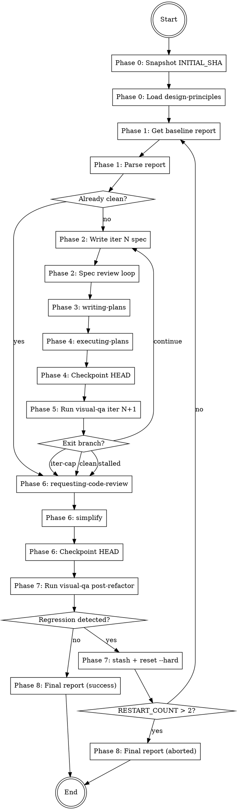

## Platform adaptation

If you are running on **Gemini CLI**, read `references/gemini-tools.md` to translate
tool names used in this skill to their Gemini equivalents before starting.

If you are running on **Codex**, read `references/codex-tools.md` for the same mapping.

<HARD-GATE>
This skill MUST NOT:
- Run `git commit`, `git add`, `git push`, `git commit --amend` during any phase.
- Declare `done` without a final `visual-qa` run that finds zero `critical` and zero `major` issues.
- Skip phases or reorder them.
- Exceed MAX_ITER = 5 loop iterations without transitioning to the documented abort path.
- Exceed MAX_RESTARTS = 2 regression restarts.
- Proceed past Phase 0 if `git rev-parse HEAD` cannot be read.
</HARD-GATE>

# Visual Refine

Transform the scoped UI surface from its current state to one that scores at least 2 (ideally 3) on every rubric dimension of `references/design-principles.md`, via spec → plan → execute → verify cycles, followed by refactor and anti-regression verification. Leave the final working tree to the user; never commit.

## Inputs

- Free-text scope argument (conceptually required; if omitted, scope is "full app"). Examples: `visual-refine`, `visual-refine tela de login`, `visual-refine fluxo de registro`.
- Optional flag `--report <path>`: when provided and the file exists, `visual-refine` uses it as the initial baseline for Phase 1 instead of running `visual-qa` fresh.

## Outputs

- A consolidated report at `docs/qa/YYYY-MM-DD-visual-refine-<scope-slug>.md`.
- All intermediate `visual-qa` iter reports kept in `docs/qa/`.
- Working tree with modifications applied, HEAD identical to `INITIAL_SHA`, no commits, no staged files beyond what was already staged at Phase 0.

## Required reading before you start

- `references/design-principles.md` — the 9-dimension rubric used to grade scope quality.
- `references/loop-mechanics.md` — checkpoint pattern, stall detection, regression restart, and issue-identity matching rules.
- `references/spec-template.md` — skeleton used to generate the iteration spec in Phase 2.
- `~/.claude/skills/visual-qa/references/report-schema.md` — authoritative schema for parsing visual-qa reports (both skills share this; visual-refine validates incoming reports against it).

## Phase 0 — Setup

- [ ] 1. Snapshot `INITIAL_SHA=$(git rev-parse HEAD)` and `INITIAL_STATUS=$(git status --porcelain)`.
- [ ] 2. If working tree is dirty, prompt the user: "stash pre-existing changes or include them in scope?". If the skill is running non-interactively (no user at the prompt) or the user does not respond within the first message exchange, auto-stash immediately with message `visual-refine-pre-<timestamp>`. No timeout wait-loop.
- [ ] 3. `Read` `references/design-principles.md`.

## Phase 1 — Initial QA

- [ ] 4. Obtain the baseline report: if `--report <path>` was passed and the file exists, use it; otherwise invoke `visual-qa <scope>` via the `Skill` tool and wait for the report.
- [ ] 5. Parse report frontmatter. Validate schema. Extract issue list. If zero `critical` and zero `major` issues already, jump to Phase 6.

## Phase 2 — Spec (per iteration N)

- [ ] 6. Write iteration spec to `docs/superpowers/specs/YYYY-MM-DD-visual-refine-<scope-slug>-iter<N>.md` using `references/spec-template.md`. Group issues by `dimension` where sensible. Each spec section references specific `I-NNN` ids and their `rubric_target`.
- [ ] 7. Dispatch `spec-document-reviewer` subagent. Fix feedback, re-dispatch. Max 3 iterations; on overflow, log and continue.

## Phase 3 — Plan

- [ ] 8. Invoke the `writing-plans` skill, instructing it to produce a **sequential-with-checkpoints** plan (no parallel dispatch in v1, by user decision).

## Phase 4 — Execute

- [ ] 9. Invoke the `executing-plans` skill. Use `subagent-driven-development` patterns internally but keep task dispatch sequential. After each task, run project lint/typecheck if available.
- [ ] 10. Checkpoint: `git rev-parse HEAD`. If changed, `git reset --soft $INITIAL_SHA` and log `commit-undone-phase-4` in the final report.

## Phase 5 — QA loop

- [ ] 11. Invoke `visual-qa <scope>` via the `Skill` tool. The report is written with suffix `-iter<N+1>`.
- [ ] 12. Compare iter `N` vs iter `N+1` and evaluate branches in this exact order:
  - If iter `N+1` has zero `critical` and zero `major` → exit loop, go to Phase 6.
  - Else if `N+1 >= 2` and `avg_rubric` did not improve versus iter `N` → increment `STALLED_COUNT`; if `STALLED_COUNT >= 2`, exit loop to Phase 6 and document `loop-stalled` in the final report. (The stall check requires at least two iterations of history; it never fires at `N=1`.)
  - Else if iteration number reaches `MAX_ITER = 5` → exit loop to Phase 6 and document `iter-cap-hit`.
  - Else → `N += 1`, return to Phase 2 with the new report as baseline.

## Phase 6 — Refactor

- [ ] 13. Invoke `requesting-code-review` skill against the full uncommitted diff versus `INITIAL_SHA`.
- [ ] 14. Address review feedback inline (no new spec). These are technical refinements, not design changes.
- [ ] 15. Invoke the `simplify` skill on the uncommitted diff. Apply simplifications in place.
- [ ] 16. Checkpoint: `git reset --soft $INITIAL_SHA` if HEAD changed. Log if so.

## Phase 7 — Anti-regression verification

- [ ] 17. Invoke `visual-qa <scope>` one final time; report suffix `-post-refactor`.
- [ ] 18. Diff issue ids against the last green iter report from Phase 5:
  - If the post-refactor report introduces no new issue ids → done, go to Phase 8.
  - Otherwise regression detected:
    - a. Write diagnostic note to `/tmp/visual-refine-regression-<timestamp>.md` listing new issue ids and evidence.
    - b. `git stash push --include-untracked --message "visual-refine-regression-<scope-slug>-<timestamp>"`.
    - c. `git reset --hard $INITIAL_SHA`.
    - d. `RESTART_COUNT += 1`. If `RESTART_COUNT > 2`, abort and write final report with status `aborted-regression-loop`, listing preserved stashes.
    - e. Otherwise restart from Phase 1, injecting the diagnostic note into the next spec's "lessons from previous attempt" section.

## Phase 8 — Final report

- [ ] 19. Write `docs/qa/YYYY-MM-DD-visual-refine-<scope-slug>.md` listing: all iter reports, issues resolved, issues remaining (if caps hit), commits undone (if any), regressions detected (if any), stashes preserved (if any).
- [ ] 20. Final verify: `git rev-parse HEAD` must equal `INITIAL_SHA`. If not, write critical alert into the report and tell the user what to inspect.
- [ ] 21. Exit. The user decides when to commit the resulting changes.

## Flow diagram

## How this composes with other superpowers skills

| Phase | Skill invoked | Purpose |
|---|---|---|
| `visual-refine` Phase 2 | `spec-document-reviewer` (subagent) | Review the generated iter spec |
| `visual-refine` Phase 3 | `writing-plans` | Generate sequential plan from spec |
| `visual-refine` Phase 4 | `executing-plans`, `subagent-driven-development` | Execute plan tasks sequentially |
| `visual-refine` Phase 6 | `requesting-code-review` | Review uncommitted diff |
| `visual-refine` Phase 6 | `simplify` | Clean up uncommitted diff |
| `visual-refine` Phases 1, 5, 7 | `visual-qa` (skill) | Audit the scoped surface |

Both skills reference `verification-before-completion` implicitly through their final invariants.
