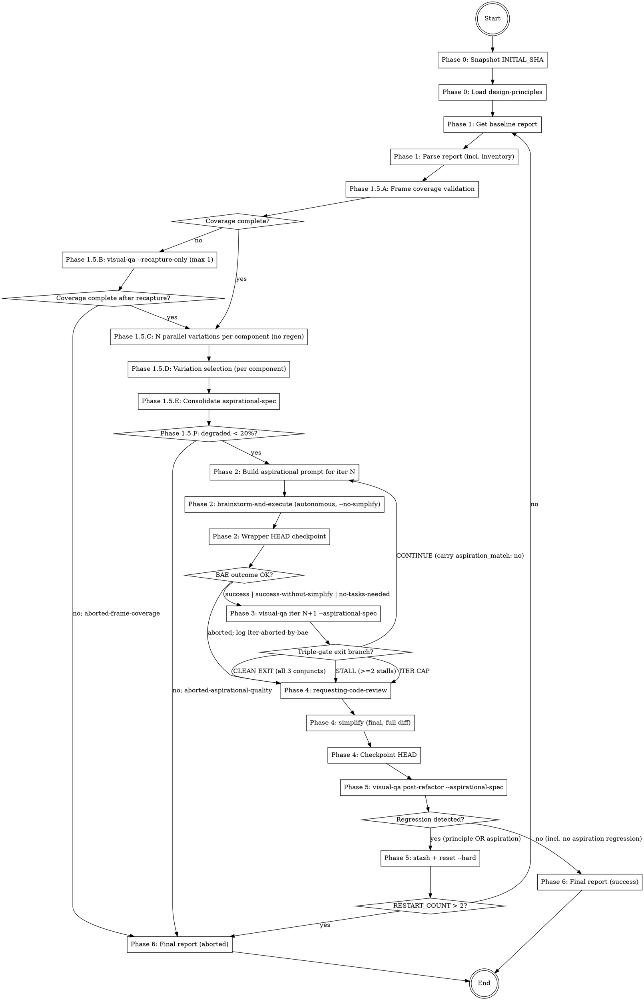

## Platform adaptation

If you are running on **Gemini CLI**, read `references/gemini-tools.md` to translate
tool names used in this skill to their Gemini equivalents before starting.

If you are running on **Codex**, read `references/codex-tools.md` for the same mapping.

<HARD-GATE>
This skill MUST NOT:
- Run `git commit`, `git add`, `git push`, `git commit --amend` during any phase.
- Declare `done` without a final `visual-qa` run that finds zero `critical` and zero `major` issues.
- Skip phases or reorder them.
- Exceed MAX_ITER = 5 loop iterations without transitioning to the documented abort path.
- Exceed MAX_RESTARTS = 2 regression restarts.
- Proceed past Phase 0 if `git rev-parse HEAD` cannot be read.
- Invoke `brainstorm-and-execute` without `--no-simplify`. Per-iteration simplify is forbidden; the only simplify pass runs in Phase 4 (final refactor) on the full cross-iteration diff.
- Invoke `brainstorm-and-execute` with `--spec` or `--plan` flags. `visual-refine` always passes a free-text idea so that the autonomous brainstorm phase runs and produces the spec from the visual-qa issue list. The whole point of this composition is to delegate spec generation, not just plan/execute.
- Skip Phase 1.5 (Aspirational Redesign). Phase 2 is never invoked before the aspirational-spec exists at the documented path under `docs/qa/<date>-visual-refine-<scope>-aspirational-spec.md`. Phase 1.5 is the source of the implementation target; without it, Phase 2's prompt has no aspirational anchor and the run reduces to the obsolete principle-only behavior.
- Exit Phase 3 on a single gate. The Phase 3 exit criterion is the triple gate `(critical == 0 AND major == 0) AND (every aspiration_match == "yes") AND (no transition with expected_animated == yes appears in inventory_coverage.instant_transitions)`. All three conjuncts MUST hold to exit cleanly; failing any one returns to Phase 2 (subject to STALL and ITER CAP).
- Exceed the recapture cap of 1 in Phase 1.5.B. Phase 1.5.C dispatches `N` (= `--variations`, default 3, range 1..5) parallel variations per component WITHOUT regeneration: a variation that fails its auto-honesty check is marked `aspirational_quality: degraded` and shipped as-is; sibling variations continue independently. After exceeding the recapture cap the skill MUST take the `aborted-frame-coverage` abort path; silent retries are forbidden. The Phase 1.5.F exit gate MUST fire `aborted-aspirational-quality` when `components_degraded` exceeds 20% of `components_total`, where a component is `degraded` only when ALL its variations are `degraded`.
- The skill MUST NOT pause for user confirmation, approval, review, or any other interactive input at any phase. Every decision is made autonomously per the documented protocol. Cost or duration warnings are informational only and do not block execution. The only legitimate halts are the documented abort outcomes (aborted-frame-coverage, aborted-aspirational-quality, aborted-gate-failure, budget-exhausted, etc.) which terminate the run cleanly without prompting the user.
</HARD-GATE>

# Visual Refine

Transform the scoped UI surface from its current state to one that scores at least 2 (ideally 3) on every rubric dimension of `references/design-principles.md` AND matches a per-component aspirational target the skill generates for itself, via autonomous (spec → plan → execute) iterations, followed by refactor and anti-regression verification. Per-iteration spec generation is delegated to `brainstorm-and-execute` so each iteration is one autonomous run instead of four manual phases. Leave the final working tree to the user; never commit.

## Inputs

- Free-text scope argument (conceptually required; if omitted, scope is "full app"). Examples: `visual-refine`, `visual-refine tela de login`, `visual-refine fluxo de registro`.
- Optional flag `--report <path>`: when provided and the file exists, `visual-refine` uses it as the initial baseline for Phase 1 instead of running `visual-qa` fresh.
- Optional flag `--iter-budget <minutes>` (default `60`): forwarded to each per-iteration `brainstorm-and-execute` invocation as its `--budget`. The default rose from 30 to 60 minutes because Phase 1.5 adds parallel mockup generation with self-honesty regeneration loops (estimated 15–25 min per iteration depending on component count). Worst-case wall-clock ceiling for a full `visual-refine` run is therefore `MAX_ITER × 60 + 25 ≈ 325 min` (the `+ 25` accounts for the Phase 1.5 generation cost and the final visual-qa runs in Phases 1, 3, and 5).
- Optional flag `--variations <N>` (default `3`, range `1..5`): number of distinct design variations to generate per component in Phase 1.5.C. Each variation is a separate parallel subagent dispatch with a pre-assigned design archetype (A/B/C/D/E). `N=1` disables exploration and is equivalent to the prior single-mockup behavior. `N=5` is the upper cap (cost vs. choice tradeoff). Values outside the `1..5` range abort immediately with status `aborted-invalid-input`.

## Outputs

- A consolidated report at `docs/qa/YYYY-MM-DD-visual-refine-<scope-slug>.md`.
- A Phase 1.5 aspirational-spec at `docs/qa/YYYY-MM-DD-visual-refine-<scope-slug>-aspirational-spec.md` with one section per inventoried component.
- A per-run mockup index at `docs/qa/aspirational/<scope-slug>/index.html` listing every component composite produced in this run with a small thumbnail iframe, the selected archetype + score, and a Copy-reference button per variation. This is the recommended entry point for browsing the run's artifacts.
- Per-component composite HTML at `docs/qa/aspirational/<scope-slug>/<component-id>.html` rendering ALL N variations side-by-side in a CSS-Grid layout via iframes, with archetype label, `rubric_self_score`, quality badge, a Selected marker on the auto-chosen winner, a `← Index` header link back to `index.html`, and a Copy-reference button per panel that puts the canonical citation form on the clipboard. The composite is the primary artifact for human inspection and side-by-side comparison.
- Per-component standalone HTML mockups under `docs/qa/aspirational/<scope-slug>/<component-id>/<variation-id>.html` (nested per-component directory; one HTML file per variation a-e). Each is openable in Chrome, self-contained, and serves as the iframe `src` for the composite. They remain on disk as audit/debug artifacts.
- All intermediate `visual-qa` iter reports kept in `docs/qa/`.
- Per-iteration `brainstorm-and-execute` artifacts: one rubric (`docs/superpowers/decisions/<bae-slug>/rubric.md`), one set of decision files (`docs/superpowers/decisions/<bae-slug>/NN-*.md`), one autonomously-generated spec (`docs/superpowers/specs/<bae-slug>-design.md`), one plan (`docs/superpowers/plans/<bae-slug>-plan.md`), and one run report (`docs/superpowers/runs/<bae-slug>-run.md`).
- Working tree with modifications applied, HEAD identical to `INITIAL_SHA`, no commits, no staged files beyond what was already staged at Phase 0.

## Required reading before you start

- `references/design-principles.md` — the 9-dimension rubric used to grade scope quality, plus the "On aspirational fidelity" appendix that explains how the aspiration_match layer composes with rubric scoring.
- `references/loop-mechanics.md` — checkpoint pattern, stall detection, regression restart, issue-identity matching rules, triple-gate exit precedence, and the aspiration-match cross-iteration handoff.
- `references/spec-template.md` — historical skeleton kept as advisory reading. The aspirational-spec generated in Phase 1.5 supersedes this template; `brainstorm-and-execute` writes the iteration spec autonomously and is not required to follow this skeleton. Read it only to understand what dimensions a good iter spec covers.
- `~/.claude/skills/visual-qa/references/report-schema.md` — authoritative schema for parsing visual-qa reports, including the `inventory`, `inventory_coverage`, and `aspiration_match` frontmatter fields.
- `~/.claude/skills/brainstorm-and-execute/SKILL.md` — the autonomous orchestrator invoked once per iteration. Read its `<HARD-GATE>` and the four hard invariants in its `references/invariants.md` so you understand what `brainstorm-and-execute` enforces on its own.

## Phase 0 — Setup

- [ ] 1. Snapshot `INITIAL_SHA=$(git rev-parse HEAD)` and `INITIAL_STATUS=$(git status --porcelain)`.
- [ ] 2. If working tree is dirty, prompt the user: "stash pre-existing changes or include them in scope?". If the skill is running non-interactively (no user at the prompt) or the user does not respond within the first message exchange, auto-stash immediately with message `visual-refine-pre-<timestamp>`. No timeout wait-loop.
- [ ] 3. `Read` `references/design-principles.md`.

## Phase 1 — Initial QA

- [ ] 4. Obtain the baseline report: if `--report <path>` was passed and the file exists, use it; otherwise invoke `visual-qa <scope>` via the `Skill` tool and wait for the report.
- [ ] 5. Parse report frontmatter. Validate schema. Extract issue list, plus the new `inventory` and `inventory_coverage` fields that seed Phase 1.5. If zero `critical` and zero `major` issues already AND `inventory_coverage.complete: true` AND no `aspirational-spec` is on disk yet for this scope, still proceed to Phase 1.5 — the aspirational layer must run on every full visual-refine session because principle-clean does not imply aspiration-clean.

## Phase 1.5 — Aspirational Redesign

This phase generates the implementation target before any code changes. It produces a per-component standalone HTML mockup and a consolidated aspirational-spec markdown that becomes the authoritative input to Phase 2.

### 1.5.A — Frame coverage validation

- [ ] 6. Read the `inventory_coverage` block from the iter-N report frontmatter. The gate-pass condition is:

    ```
    inventory_coverage.complete == true
    AND inventory_coverage.low_quality_frames is empty
    AND inventory_coverage.missing_states is empty
    AND inventory_coverage.missing_transitions is empty
    ```

    If all four hold, proceed to step 8 (1.5.C). Otherwise build the **gap list** by concatenating `missing_states`, `missing_transitions`, and `low_quality_frames` (in that order) and proceed to step 7 (1.5.B). `inventory_coverage.instant_transitions` is informational here and does NOT trigger recapture; it is consumed by Phase 3's triple-gate.

### 1.5.B — Recapture (CONDITIONAL, MAX 1)

- [ ] 7. Invoke `visual-qa --recapture-only <gap-list>` via the `Skill` tool. This is a NEW visual-qa internal mode that skips inventory enumeration and records ONLY the listed gaps, writing a supplemental report. Merge the supplemental coverage into the iter-N coverage view in memory. **Cap: 1 recapture per visual-refine run.** If after the merge any gap remains in `missing_states`, `missing_transitions`, or `low_quality_frames`, abort to Phase 6 with status `aborted-frame-coverage` and skip Phases 2–5; the final report enumerates the unresolved gaps and tells the user what to inspect.

### 1.5.C — Per-component parallel variations (N parallel subagents per component, NO regeneration)

- [ ] 8. For each component in `inventory.components`, dispatch `N` (default `3`, configurable via `--variations`, range `1..5`) parallel subagents via `superpowers:dispatching-parallel-agents`. The total parallel dispatch is `components × N` (e.g., 23 components at `N=3` → 69 parallel subagents in concurrency-capped batches). Each subagent receives:
    - The component's frame screenshots and DOM snapshots (paths) from the iter-N report.
    - The component's inventory entry (`{id, states, transitions}`).
    - `references/design-principles.md` (the rubric and the Part 3 anti-pattern blacklist).
    - The component-id slug and the `<scope-slug>` for output paths.
    - A unique **variation archetype** (A/B/C/D/E) assigned round-robin from the archetype list below. Each subagent's prompt explicitly forbids calling `AskUserQuestion`, `request_human_review`, or any other tool that pauses for user input — defense-in-depth for the autonomy HARD-GATE clause.

    The variation archetypes — exactly one is assigned to each subagent — are:

    - **Variation A — Minimal / Editorial.** References: Linear, Vercel, Stripe-Docs. Hallmarks: restrained palette, prominent type, generous whitespace, monoline icons, content-first hierarchy, motion limited to ease-out fades.
    - **Variation B — Expressive / Branded.** References: Stripe Dashboard, Conductor, Apple HIG, Notion. Hallmarks: bolder accent usage, gradient surfaces where they earn attention, signature micro-interactions, decorative-but-functional ornament, multi-stop motion curves.
    - **Variation C — Dense / Tooly.** References: Raycast, Arc, Linear Cmd, Sublime. Hallmarks: information-dense layout, command-bar aesthetic, hover-reveal affordances, tabular numerics, keyboard-first cues, snap motion (no overshoot).
    - **Variation D — Playful / Memorable** (used only when `N >= 4`). References: Loom, Replit, Vercel-marketing. Hallmarks: distinctive shapes, hand-drawn flourishes where appropriate, loose grids, surprising-but-coherent details.
    - **Variation E — Calm / Spatial** (used only when `N == 5`). References: Apple HIG, Things, IA Writer. Hallmarks: layered surfaces, large optical-rest areas, soft shadows that imply elevation, minimal chrome, breathing motion.

    Archetype assignment per `N`:
    - `N=1` → {A}
    - `N=2` → {A, B}
    - `N=3` → {A, B, C}
    - `N=4` → {A, B, C, D}
    - `N=5` → {A, B, C, D, E}

    Each subagent MUST execute these six steps and emit them as its return payload:

    1. **Current-state description.** One short line per applicable rubric dimension summarizing how the captured frames score against the rubric.
    2. **Aspirational description IN THE ASSIGNED ARCHETYPE — not free-form.** What the component should look like at 3/3 across applicable dimensions while honoring the archetype's named references, palette discipline, motion vocabulary, and density choices. Cite at least 2 of the archetype's named references with a one-line reason each (e.g., for Variation C: "Raycast: keyboard-first command palette with hairline divider hierarchy"; "Linear Cmd: tabular numerics with monospaced fallbacks"). Two subagents working on the same component MUST produce *visibly different* mockups by virtue of their archetypes; do not collapse to a generic look.
    3. **Standalone HTML mockup.** Write to `docs/qa/aspirational/<scope-slug>/<component-id>/<variation-id>.html` (lowercase variation id: `a`, `b`, `c`, `d`, or `e`). Note the per-component nested directory. Self-contained: CSS in `<style>`, no external runtime, no network fetches, viewport sized to the component's natural canvas. Render multiple states side-by-side when relevant (e.g., default + hover + active for a button; expanded + collapsed for a sidebar).
    4. **Auto-honesty pass.** Open the just-written mockup via Chrome MCP `new_page`/`navigate_page`, screenshot via `take_screenshot`, then score the screenshot against the rubric and the Part 3 anti-pattern blacklist. Record:
       - `rubric_self_score`: integer sum across applicable rubric dimensions for this variation.
       - `aspirational_quality`: `ok` if no Part 3 anti-pattern is violated (banned display fonts: Inter, Roboto, Arial, bare system-ui; `transition: all 0.3s ease`; purple-on-white gradient; default Tailwind shadow on its own; generic empty-state phrasing; AAA-contrast violation on a primary CTA); `degraded` otherwise.
       - `quality_notes`: when `degraded`, the verbatim list of anti-patterns violated (one line each); when `ok`, may be empty or contain incidental observations.
    5. **NO regeneration.** A failing variation is marked `degraded` and that variation is done. The cap-3 regeneration loop from the prior design is gone — exploration over pursuit. Other variations for the same component continue independently.
    6. **Concrete deltas list.** 5–10 specific code-level changes the implementation must make to move from the captured current state to *this* variation's aspirational mockup (e.g., "Replace topbar `border-bottom: 1px solid var(--border)` with conditional border that disappears on home", "Reduce sidebar dashboard label from 18px to 13px and align baseline with sibling rows", "Add hairline divider between density-card rows").

### 1.5.D — Variation selection (per component)

- [ ] 9. After all `N` variations for a component complete, the wrapper picks the **selected** variation per the following deterministic algorithm. No user input; this is fully automatic.

    ```
    1. Filter the component's variations to those with aspirational_quality == ok.
    2. If zero non-degraded variations remain → the component is degraded
       (this counts toward components_degraded for the Phase 1.5.F gate).
       Record selected_variation: null and alternates: [].
    3. Otherwise, among non-degraded variations, pick the one with the
       highest rubric_self_score.
    4. Tiebreaker A (equal rubric_self_score): smallest HTML byte size
       (simplicity proxy — `wc -c` on the mockup HTML file).
    5. Tiebreaker B (still tied): lexicographic variation id ascending
       (a < b < c < d < e).
    6. Record selected_variation: <id> and alternates: [<non-selected
       non-degraded ids>] in the component's spec section.
    ```

    The aspirational-spec markdown's per-component section now lists ALL variations (selected + alternates), each with: archetype name, mockup path, `rubric_self_score`, `aspirational_quality`, `quality_notes`, and the deltas list. The selected variation's deltas list is the implementation hint for Phase 2; alternates are documented for the user's later inspection and post-hoc swap.

### 1.5.D.1 — Composite assembly (per component)

- [ ] 9b. After the selection step, assemble a composite HTML at `docs/qa/aspirational/<scope-slug>/<component-id>.html` that renders ALL `N` variations side-by-side via iframes. The composite is the primary artifact for human inspection; per-variation standalone files at `<component-id>/<variation-id>.html` remain on disk and serve as the iframe `src`. The composite has:

    - Self-contained `<style>` block AND a tiny inline `<script>` (≤ 20 lines) that wires up Copy-reference buttons via `navigator.clipboard.writeText`. NO external CSS, NO external JS, NO non-system fonts. Use `system-ui, -apple-system, sans-serif`.
    - **Header bar** at the top of `<body>`, before the grid: `<a class="back-to-index" href="index.html">← Index</a>` (relative link to the per-run index assembled in 1.5.D.2) followed by `<h1>Mockup variations — <component-id></h1>`.
    - CSS Grid layout: `display: grid; grid-template-columns: repeat(auto-fit, minmax(420px, 1fr)); gap: 24px; padding: 32px;`. Neutral background (`#fafafa` light or `#0a0a0a` dark — match the variations' theme by sampling the first variation's `<body>` background).
    - One `<section class="panel">` per variation, in lexicographic id order (`a` first, then `b`, …):
      - `<header>` containing: archetype name (e.g., "A — Minimal / Editorial"), `<span class="score">` with `rubric_self_score`, `<span class="quality">` rendering `ok` (green dot) or `degraded` (red dot + violation summary), and a `<button class="copy-ref" data-ref="<absolute-path-to-composite>#variation-<id>">Copy reference</button>`. The button handler calls `navigator.clipboard.writeText(this.dataset.ref)` and momentarily flips its label to `Copied!` for 1.5 s.
      - The selected panel additionally includes `<span class="selected-badge">Selected</span>` and a 2px accent border (`box-shadow: inset 0 0 0 2px <accent>` works without Layout-affecting borders).
      - `<iframe src="<component-id>/<variation-id>.html" loading="lazy">` sized to the variation's natural canvas (default `width=1200 height=800`; if a variation's `<body>` declares an explicit `min-width`/`min-height`, use those).
      - **Footer line** in monospace listing the citation string verbatim — `<code><absolute-path-to-composite>#variation-<id></code>` — as a manual-copy fallback when `navigator.clipboard` is unavailable.
    - Anchors per panel: `id="variation-a"`, `id="variation-b"`, etc., so Phase 6 alternates table can deep-link.
    - `<title>` element: `"Mockup variations — <component-id>"`.
    - The composite is deterministic: same inputs → same bytes. No timestamps, no random ids.

    Open the composite in Chrome to verify it renders end-to-end (all iframes load, no `file://` cross-origin block since iframes are same-origin under the parent directory). The composite is referenced from the aspirational-spec markdown (1.5.E) as the primary mockup link per component.

    **Canonical reference format** (used by the Copy button's `data-ref` and the monospace footer): `<absolute-path-to-composite-html>#variation-<id>`. The absolute path is computed at write-time as `path.resolve(<REPO_ROOT>, "docs/qa/aspirational", <scope-slug>, <component-id> + ".html")`. The anchor is exactly `#variation-` followed by the lowercase variation id. No `file://` prefix, no quoting. This is the string the user pastes into a chat message to cite a specific variation.

### 1.5.D.2 — Index assembly (per run)

- [ ] 9c. After every component's composite is produced, write the per-run mockup index at `docs/qa/aspirational/<scope-slug>/index.html`. The index aggregates every component composite in one navigable page. It contains:

    - `<title>Mockup index — <scope-slug></title>` and a brief `<p>` intro naming the run scope and the iter-N report it derives from.
    - One row per component, in `inventory.components` order. Each row has:
      - `<h2><a href="<component-id>.html"><component-id></a></h2>` — clicking the heading opens the component's composite.
      - A small thumbnail container `<div class="thumb">` holding `<iframe src="<component-id>.html" loading="lazy">` styled with `transform: scale(0.25); transform-origin: 0 0;` inside a fixed-size box (~320×200 visible). No screenshot tooling; the thumbnail IS the composite, just shrunk.
      - A summary line: `Selected: <selected-variation-id> (<archetype>) · score <rubric_self_score> · alternates: <ids>`.
      - A row of Copy-reference buttons, one per variation, in lexicographic id order. Same `data-ref="<absolute-path-to-composite>#variation-<id>"` contract as in the composite. Same inline script handles both pages.
      - A direct `<a href="<component-id>.html">Open composite →</a>` link.
    - A footer line: `Generated by visual-refine on <YYYY-MM-DD>. Absolute paths in copy buttons are resolved against <REPO_ROOT> = <absolute-path-of-repo-root>.` This makes the citation strings auditable.
    - Self-contained: inline `<style>` + inline `<script>` (the same Copy-reference handler used in the composites; ≤ 20 lines, no external deps). Uses `system-ui, -apple-system, sans-serif`.

    The index is deterministic: same inputs → same bytes. No timestamps in machine-readable form (the `<YYYY-MM-DD>` line is the only date and matches the run's date stamp). The index is the recommended entry point the user opens after a run; the composites are reachable from the index, and per-variation standalone files are reachable from each composite.

### 1.5.E — Consolidation

- [ ] 10. Concatenate every subagent's output (grouped by component, with the selected variation surfaced first) into `docs/qa/<date>-visual-refine-<scope-slug>-aspirational-spec.md`. The file MUST start with this frontmatter:

    ```yaml
    ---
    skill: visual-refine
    phase: 1.5
    date: <YYYY-MM-DD>
    scope_slug: <scope-slug>
    iter_baseline: <absolute-path-to-iter-N-report>
    inventory_source: <iter-N-frontmatter-snippet>
    mockup_dir: docs/qa/aspirational/<scope-slug>/
    variations_per_component: <N>
    components_total: <int>
    components_with_mockup: <int>
    components_degraded: <int>
    ---
    ```

    Below the frontmatter, one section per component, in the order they appear in `inventory.components`. Each section header is `## <component-id>` and contains:

    - A `composite_mockup: docs/qa/aspirational/<scope-slug>/<component-id>.html` line — the primary artifact for human inspection (assembled in 1.5.D.1).
    - A `selected_variation: <id-or-null>` line.
    - An `alternates: [<id>, ...]` line.
    - A `aspirational_quality:` line marked `ok` (at least one variation is ok) or `degraded` (all variations are degraded).
    - One sub-block per variation (selected first, then alternates by lexicographic id) containing: archetype name, **standalone mockup path** (`<component-id>/<variation-id>.html`), `rubric_self_score`, `aspirational_quality`, `quality_notes`, current-state description, aspirational description, and concrete deltas list. Each sub-block also includes a deep-link `composite_anchor: <component-id>.html#variation-<id>` so cross-references resolve to the composite panel.

### 1.5.F — Phase 1.5 exit gate

- [ ] 11. Evaluate the gate. Pass requires:
    - `inventory_coverage.complete: true` (after 1.5.B recapture if any).
    - `components_degraded < 0.2 * components_total` (strict less-than). At exactly 20% the gate fires the abort path; the `< 20%` rule is intentional, not a rounding convention. **A component is `degraded` only when ALL of its `N` variations are `degraded`** — the aggregate is computed from variation-level outcomes per Phase 1.5.D step 2. A component with even one non-degraded variation is fine.
    - `docs/qa/<date>-visual-refine-<scope-slug>-aspirational-spec.md` exists with one section per component in `inventory.components`, each section listing all `N` variations.

    Failure modes:
    - `aborted-frame-coverage`: gaps remain after the 1 allowed recapture in 1.5.B.
    - `aborted-aspirational-quality`: too many components degraded in 1.5.C (component-level aggregate per the rule above).
    - `aborted-invalid-input`: `--variations <N>` was outside the `1..5` range; the run halts before any Phase 1.5 work begins.

    Both abort paths skip Phases 2–5 entirely and jump to Phase 6 with the corresponding status; the final report lists what failed and what the user should inspect (e.g., the inventory entry that produced an unreachable component, the recurring blacklist violation in fully-degraded components). On pass, proceed to Phase 2.

## Phase 2 — Iteration N: autonomous spec + execute

- [ ] 12. Build the prompt for `brainstorm-and-execute`. The prompt is a free-text idea (NOT a `--spec` path) that gives `brainstorm-and-execute` enough context to autonomously brainstorm, score decisions, and write its own spec — but now anchored on the aspirational-spec rather than the principle-only issue list. Construct it as:

    ```
    Implement the aspirational redesign for scope "<scope-slug>",
    iteration <N> of visual-refine.

    Aspirational spec: <absolute-path-to-aspirational-spec-md>
    Mockup directory: <absolute-path-to-docs/qa/aspirational/<scope-slug>/>
    Mockup index: <absolute-path-to-docs/qa/aspirational/<scope-slug>/index.html>  # open this first to browse all components
    Iter baseline report: <absolute-path-to-iter-N-report>

    Components to address (priority order, highest-delta first):
      1. <component-id-1> — see section + mockup
      2. <component-id-2> — see section + mockup
      3. <component-id-3> — see section + mockup
      ... (top N by rubric delta from iter-N; full list in the spec)

    For each component:
    - Open docs/qa/aspirational/<scope-slug>/<component>.html in Chrome:
      this composite renders ALL variations side-by-side via iframes,
      labelled by archetype with rubric scores; the panel marked "Selected"
      is the implementation target. Use the composite to compare archetypes
      at a glance.
    - The Selected panel's source is the standalone HTML at
      docs/qa/aspirational/<scope-slug>/<component>/<selected-variation-id>.html
      (also openable directly). Alternate variations live alongside it in
      the same per-component directory but are NOT the implementation
      target — they are kept for post-hoc swap by the user.
    - Do not deviate from the selected variation's mockup intent without
      justification recorded as a decision file under
      docs/superpowers/decisions/<bae-slug>/.
    - The "Concrete deltas" list under the selected variation in each spec
      section is the implementation hint.
    - Honor the 9-dimension rubric in
      ~/.claude/skills/visual-refine/references/design-principles.md.

    Lessons from previous attempt (if any):
    <quoted diagnostic note from regression restart, OR list of components
    that failed aspiration_match in the preceding iteration with the
    auditor's notes verbatim, OR "none">.

    Group fixes by component (not by dimension). The aspirational spec is
    authoritative; the iter-N issue list is informational baseline only.
    ```

    Save this prompt verbatim into the eventual final report so the user can audit what brainstorm-and-execute was asked to do.

- [ ] 13. Invoke `brainstorm-and-execute` via the `Skill` tool (or `/brainstorm-and-execute` slash command) with the prompt from step 12 plus these flags:
       - `--no-simplify` (HARD-GATE requirement; final refactor runs in Phase 4)
       - `--budget <iter-budget>` (default 60 minutes per iteration; configurable via `--iter-budget`)
       - Do NOT pass `--spec` or `--plan`. The autonomous brainstorm phase MUST run so that `brainstorm-and-execute` produces the iter spec from the aspirational-spec + visual-qa issue list itself, runs its own spec-review (3 cycles) and plan-review (2 cycles), and dispatches parallel-wave execution.
       Wait for the run to complete. Read its run report at `docs/superpowers/runs/YYYY-MM-DD-<bae-slug>-run.md` and capture the `outcome` field. Acceptable outcomes for this phase: `success`, `success-without-simplify`, `no-tasks-needed`. Any other outcome (`aborted-gate-failure`, `budget-exhausted`, `spec-review-exhausted`, `plan-review-exhausted`, `aborted-invariant-violation`) → log `iter-aborted-by-bae:<outcome>` in the eventual final report and break out of the loop early to Phase 4. Then verify the wrapper invariant: `git rev-parse HEAD` must equal `INITIAL_SHA` (it should, because `brainstorm-and-execute` enforces this internally). If it does not, `git reset --soft "$INITIAL_SHA"` and log `commit-undone-phase-2-iter<N>` in the final report. This wrapper checkpoint is defense-in-depth; the inner skill already enforces the invariant.

## Phase 3 — QA loop

- [ ] 14. Invoke `visual-qa <scope> --aspirational-spec <absolute-path-to-aspirational-spec-md>` via the `Skill` tool. The report is written with suffix `-iter<N+1>`. Passing `--aspirational-spec` causes visual-qa to populate the `aspiration_match` frontmatter array (one entry per component in the aspirational-spec) in addition to its standard frontmatter.
- [ ] 15. Compare iter `N` vs iter `N+1` against the **triple-gate exit** and evaluate branches in this exact order (this replaces the historical single-gate exit; see `references/loop-mechanics.md` §"Phase 3 loop exit precedence" for the canonical version):

    ```
    1. CLEAN EXIT — all four conditions must hold:
         iter_N+1.summary.critical == 0
         AND iter_N+1.summary.major == 0
         AND every aspiration_match.match == "yes"
         AND no transition where expected_animated == yes appears in
             iter_N+1.inventory_coverage.instant_transitions
       → exit loop, go to Phase 4.

    2. STALL — N+1 >= 2 AND
         avg_rubric_delta(iter_N → iter_N+1) == 0
         AND aspiration_match_delta(iter_N → iter_N+1) == 0
         (no rubric improvement AND no new aspiration_match: yes)
       → STALLED_COUNT += 1.
       If STALLED_COUNT >= 2 → exit loop to Phase 4 with `loop-stalled`.
       (Stall check requires at least two iterations of history; never
       fires at N=1.)

    3. ITER CAP — iteration_number >= MAX_ITER (= 5)
       → exit loop to Phase 4 with `iter-cap-hit`.

    4. CONTINUE — N += 1, return to Phase 2 with the new iter-N+1 report
       as baseline AND the verbatim list of components with
       aspiration_match: no in iter-N+1 included in the next prompt's
       "lessons from previous attempt" block. Each entry must carry the
       auditor's notes verbatim so the next iteration knows what concrete
       deltas remain.
    ```

## Phase 4 — Final refactor

- [ ] 16. Invoke `requesting-code-review` skill against the full uncommitted diff versus `INITIAL_SHA`. The diff under review now includes the aspirational-spec markdown and the per-component mockup HTML files; both are in scope of the review for completeness even though they are documentation artifacts.
- [ ] 17. Address review feedback inline (no new spec). These are technical refinements, not design changes.
- [ ] 18. Invoke the `simplify` skill on the uncommitted diff. Apply simplifications in place. This is the only simplify pass in the run — `brainstorm-and-execute` was invoked with `--no-simplify` per iteration precisely so the final simplify can operate on the entire cross-iteration diff in one pass. Then checkpoint: `git reset --soft $INITIAL_SHA` if HEAD changed. Log if so.

## Phase 5 — Anti-regression verification

- [ ] 19. Invoke `visual-qa <scope> --aspirational-spec <absolute-path-to-aspirational-spec-md>` one final time; report suffix `-post-refactor`. Passing `--aspirational-spec` ensures the post-refactor report carries `aspiration_match` so the regression check below can detect aspiration regression as well as principle regression.
- [ ] 20. Diff against the last green iter report from Phase 3:
  - **Principle regression**: any new issue id (by `(dimension, tag, title)` identity) that did not exist in the green iter report.
  - **Aspiration regression**: any component whose `aspiration_match` flipped from `yes` in the last green iter report to `no` in the post-refactor report. (Identity is keyed on `component_id`; see `references/loop-mechanics.md` §"Issue identity matching across reports".)
  - If neither principle regression nor aspiration regression is detected → done, go to Phase 6.
  - Otherwise regression detected:
    - a. Write diagnostic note to `/tmp/visual-refine-regression-<timestamp>.md` listing new issue ids, components that lost aspiration_match, and evidence.
    - b. `git stash push --include-untracked --message "visual-refine-regression-<scope-slug>-<timestamp>"`.
    - c. `git reset --hard $INITIAL_SHA`.
    - d. `RESTART_COUNT += 1`. If `RESTART_COUNT > 2`, abort and write final report with status `aborted-regression-loop`, listing preserved stashes.
    - e. Otherwise restart from Phase 1, injecting the diagnostic note (including the aspiration regressions verbatim) into the next spec's "lessons from previous attempt" section.

## Phase 6 — Final report

- [ ] 21. Write `docs/qa/YYYY-MM-DD-visual-refine-<scope-slug>.md` listing: all iter reports, every per-iteration `brainstorm-and-execute` run-report path and its `outcome`, issues resolved, issues remaining (if caps hit), commits undone (if any), regressions detected (if any), stashes preserved (if any). Include the verbatim Phase 2 prompt(s) so the user can audit what was asked.
- [ ] 22. Append the **Aspirational fidelity outcomes** section, one row per component:

    ```markdown
    ## Aspirational fidelity outcomes

    | Component | iter-final aspiration_match | notes |
    |---|---|---|
    | topbar | yes | matches mockup spacing + branch chip hierarchy |
    | sidebar-row | yes | hover state + menu-open state both match |
    | settings-appearance | no | density cards still missing wireframe content; carry to next iter |
    ```

    Each row's `iter-final aspiration_match` is taken from the last visual-qa report whose `--aspirational-spec` was set (post-refactor if Phase 5 ran cleanly; otherwise the last iter-N+1 from Phase 3). The `notes` column is the auditor's verbatim notes for that component in that report.

- [ ] 23. Append the **Variation alternates per component** sub-section. The first line of the sub-section MUST be a link to the per-run mockup index: `Index: [aspirational/<scope>/index.html](aspirational/<scope>/index.html)` so the reader has a single click to the gallery entry point. For every component that shipped with a non-trivial number of variations (i.e. `N >= 2`), list the selected variation in bold and the alternates available for post-hoc inspection. Component links point at the composite anchor so the reader lands on the right panel inside the side-by-side view:

    ```markdown
    ## Variation alternates per component

    Index: [aspirational/<scope>/index.html](aspirational/<scope>/index.html)

    For each component the run shipped with `N >= 2` variations, the row links
    to the composite mockup (all variations rendered side-by-side via
    iframes); the Selected column is the auto-chosen winner; the Alternates
    column lists the other archetypes available in the same composite. To
    request a swap, open the composite (or click a Copy-reference button to
    paste the citation into chat), decide which alternate you prefer, and
    either re-run visual-refine with a different `--variations` seed or
    hand-edit the `selected_variation` field in
    `docs/qa/<scope>-aspirational-spec.md` before re-running visual-refine.

    | Component | Composite | Selected | Alternates |
    |-----------|-----------|----------|------------|
    | topbar | [topbar.html](aspirational/<scope>/topbar.html) | **A (Minimal)** [`#variation-a`](aspirational/<scope>/topbar.html#variation-a) | B (Expressive) [`#variation-b`](aspirational/<scope>/topbar.html#variation-b), C (Dense) [`#variation-c`](aspirational/<scope>/topbar.html#variation-c) |
    | sidebar-row | [sidebar-row.html](aspirational/<scope>/sidebar-row.html) | **C (Dense)** [`#variation-c`](aspirational/<scope>/sidebar-row.html#variation-c) | A (Minimal) [`#variation-a`](aspirational/<scope>/sidebar-row.html#variation-a), B (Expressive) [`#variation-b`](aspirational/<scope>/sidebar-row.html#variation-b) |

    Direct standalone links (footnote, for the user who prefers to open one
    variation full-window):
    `aspirational/<scope>/<component>/<variation>.html` — same content as
    the composite panels' iframe `src`.
    ```

    Each row's `Selected` and `Alternates` cells are populated from the per-component `selected_variation` and `alternates` fields in the Phase 1.5.E aspirational-spec. The archetype name in parentheses is the human-readable label from Phase 1.5.C (Minimal, Expressive, Dense, Playful, Calm). When the run used `N=1`, omit this sub-section entirely (there are no alternates to surface).

- [ ] 24. Append the **Components with degraded aspirational mockups (from Phase 1.5)** section:

    ```markdown
    ## Components with degraded aspirational mockups (from Phase 1.5)

    (Empty when zero, OR list of components where ALL N variations were
    marked degraded by the auto-honesty pass — these are seeds for human
    review. A component with at least one non-degraded variation is NOT
    listed here.)
    ```

    Source: the per-component `aspirational_quality: degraded` lines in the consolidated aspirational-spec from Phase 1.5.E (component-level aggregate; a component is degraded only when every one of its variations is degraded). When zero components are degraded, write the literal "(none)" rather than omitting the section, so the absence is visible.

- [ ] 25. Final verify: `git rev-parse HEAD` must equal `INITIAL_SHA`. If not, write critical alert into the report and tell the user what to inspect.
- [ ] 26. Exit. The user decides when to commit the resulting changes.

## Flow diagram


```dot
digraph visual_refine {
    "Start" [shape=doublecircle];
    "Phase 0: Snapshot INITIAL_SHA" [shape=box];
    "Phase 0: Load design-principles" [shape=box];
    "Phase 1: Get baseline report" [shape=box];
    "Phase 1: Parse report (incl. inventory)" [shape=box];
    "Phase 1.5.A: Frame coverage validation" [shape=box];
    "Coverage complete?" [shape=diamond];
    "Phase 1.5.B: visual-qa --recapture-only (max 1)" [shape=box];
    "Coverage complete after recapture?" [shape=diamond];
    "Phase 1.5.C: N parallel variations per component (no regen)" [shape=box];
    "Phase 1.5.D: Variation selection (per component)" [shape=box];
    "Phase 1.5.E: Consolidate aspirational-spec" [shape=box];
    "Phase 1.5.F: degraded < 20%?" [shape=diamond];
    "Phase 2: Build aspirational prompt for iter N" [shape=box];
    "Phase 2: brainstorm-and-execute (autonomous, --no-simplify)" [shape=box];
    "Phase 2: Wrapper HEAD checkpoint" [shape=box];
    "BAE outcome OK?" [shape=diamond];
    "Phase 3: visual-qa iter N+1 --aspirational-spec" [shape=box];
    "Triple-gate exit branch?" [shape=diamond];
    "Phase 4: requesting-code-review" [shape=box];
    "Phase 4: simplify (final, full diff)" [shape=box];
    "Phase 4: Checkpoint HEAD" [shape=box];
    "Phase 5: visual-qa post-refactor --aspirational-spec" [shape=box];
    "Regression detected?" [shape=diamond];
    "Phase 5: stash + reset --hard" [shape=box];
    "RESTART_COUNT > 2?" [shape=diamond];
    "Phase 6: Final report (aborted)" [shape=box];
    "Phase 6: Final report (success)" [shape=box];
    "End" [shape=doublecircle];

    "Start" -> "Phase 0: Snapshot INITIAL_SHA" -> "Phase 0: Load design-principles" -> "Phase 1: Get baseline report" -> "Phase 1: Parse report (incl. inventory)" -> "Phase 1.5.A: Frame coverage validation" -> "Coverage complete?";
    "Coverage complete?" -> "Phase 1.5.C: N parallel variations per component (no regen)" [label="yes"];
    "Coverage complete?" -> "Phase 1.5.B: visual-qa --recapture-only (max 1)" [label="no"];
    "Phase 1.5.B: visual-qa --recapture-only (max 1)" -> "Coverage complete after recapture?";
    "Coverage complete after recapture?" -> "Phase 1.5.C: N parallel variations per component (no regen)" [label="yes"];
    "Coverage complete after recapture?" -> "Phase 6: Final report (aborted)" [label="no; aborted-frame-coverage"];
    "Phase 1.5.C: N parallel variations per component (no regen)" -> "Phase 1.5.D: Variation selection (per component)" -> "Phase 1.5.E: Consolidate aspirational-spec" -> "Phase 1.5.F: degraded < 20%?";
    "Phase 1.5.F: degraded < 20%?" -> "Phase 2: Build aspirational prompt for iter N" [label="yes"];
    "Phase 1.5.F: degraded < 20%?" -> "Phase 6: Final report (aborted)" [label="no; aborted-aspirational-quality"];
    "Phase 2: Build aspirational prompt for iter N" -> "Phase 2: brainstorm-and-execute (autonomous, --no-simplify)" -> "Phase 2: Wrapper HEAD checkpoint" -> "BAE outcome OK?";
    "BAE outcome OK?" -> "Phase 3: visual-qa iter N+1 --aspirational-spec" [label="success | success-without-simplify | no-tasks-needed"];
    "BAE outcome OK?" -> "Phase 4: requesting-code-review" [label="aborted; log iter-aborted-by-bae"];
    "Phase 3: visual-qa iter N+1 --aspirational-spec" -> "Triple-gate exit branch?";
    "Triple-gate exit branch?" -> "Phase 4: requesting-code-review" [label="CLEAN EXIT (all 3 conjuncts)"];
    "Triple-gate exit branch?" -> "Phase 4: requesting-code-review" [label="STALL (>=2 stalls)"];
    "Triple-gate exit branch?" -> "Phase 4: requesting-code-review" [label="ITER CAP"];
    "Triple-gate exit branch?" -> "Phase 2: Build aspirational prompt for iter N" [label="CONTINUE (carry aspiration_match: no)"];
    "Phase 4: requesting-code-review" -> "Phase 4: simplify (final, full diff)" -> "Phase 4: Checkpoint HEAD" -> "Phase 5: visual-qa post-refactor --aspirational-spec" -> "Regression detected?";
    "Regression detected?" -> "Phase 6: Final report (success)" [label="no (incl. no aspiration regression)"];
    "Regression detected?" -> "Phase 5: stash + reset --hard" [label="yes (principle OR aspiration)"];
    "Phase 5: stash + reset --hard" -> "RESTART_COUNT > 2?";
    "RESTART_COUNT > 2?" -> "Phase 6: Final report (aborted)" [label="yes"];
    "RESTART_COUNT > 2?" -> "Phase 1: Get baseline report" [label="no"];
    "Phase 6: Final report (success)" -> "End";
    "Phase 6: Final report (aborted)" -> "End";
}
```

## How this composes with other superpowers skills

| Phase | Skill invoked | Purpose |
|---|---|---|
| `visual-refine` Phase 1.5.C | `superpowers:dispatching-parallel-agents` | Dispatch `N` (default 3, range 1..5) parallel subagents per inventoried component to generate one aspirational HTML mockup per assigned design archetype (A/B/C/D/E). No regeneration; failed variations are marked degraded. |
| `visual-refine` Phase 2 | `brainstorm-and-execute` (autonomous; `--no-simplify --budget`; no `--spec`/`--plan`) | Autonomous brainstorm → spec → spec-review → plan → plan-review → parallel-wave execute → final HEAD checkpoint, all in one call. Spec is generated from the aspirational-spec + visual-qa issue list, not supplied by visual-refine. |
| `visual-refine` Phase 4 | `requesting-code-review` | Review uncommitted diff (full cross-iteration, including aspirational artifacts) |
| `visual-refine` Phase 4 | `simplify` | Clean up uncommitted diff (final pass; per-iteration simplify is suppressed via `brainstorm-and-execute --no-simplify`) |
| `visual-refine` Phases 1, 1.5.B, 3, 5 | `visual-qa` (skill) | Audit the scoped surface; Phases 3 and 5 pass `--aspirational-spec` so the report includes `aspiration_match`; Phase 1.5.B uses `--recapture-only` to fill coverage gaps |

`brainstorm-and-execute` internally invokes its own brainstorm protocol (decision files + rubric synthesis), `spec-document-reviewer`, `superpowers:writing-plans`, and `superpowers:subagent-driven-development`. `visual-refine` no longer dispatches any of those directly — every per-iteration brainstorm → spec → plan → execute concern is encapsulated by `brainstorm-and-execute`'s own gates and invariants. visual-refine's contribution is the visual-qa issue list, the aspirational-spec generated in Phase 1.5, the wrapper around looping/regression, and the final cross-iteration refactor.

Both skills reference `verification-before-completion` implicitly through their final invariants.

## On the relationship between the two skills' invariants

`brainstorm-and-execute` enforces its own four hard invariants (HEAD == INITIAL_SHA, gate-between-waves, wall-clock budget, bounded review retries). `visual-refine` adds more on top (no commits across the FULL run, MAX_ITER cap, MAX_RESTARTS cap, Phase 1.5 must run, triple-gate at Phase 3 exit, recapture cap = 1, no per-variation regeneration in Phase 1.5.C, component-degraded threshold = 20%, full-run autonomy / no user pause-points). The two skills' invariants compose cleanly:

- The per-iteration `brainstorm-and-execute` HEAD invariant guarantees that each iteration starts and ends at the same SHA. `visual-refine`'s wrapper checkpoint at step 13 is therefore expected to be a no-op; if it ever fires, something inside `brainstorm-and-execute` failed its own invariant and that should be logged.
- The per-iteration budget (`--budget`) caps the wall-clock cost of one iteration. `MAX_ITER` caps the number of iterations. The product (plus Phase 1.5 generation cost, ~25 min) is the worst-case total budget — `MAX_ITER × 60 + 25 ≈ 325 min` at the new defaults.
- `brainstorm-and-execute`'s internal review retries (3 spec, 2 plan) operate WITHIN one iteration. `MAX_RESTARTS` caps how many times the entire `visual-refine` run restarts after an anti-regression failure. Different scopes; no conflict.
- The recapture cap (1) is local to Phase 1.5.B and never multiplies into the per-iteration budget. Per-variation regeneration is forbidden in Phase 1.5.C (the cap-3 regeneration loop from the prior design has been replaced by N parallel variations); a failing variation is just marked degraded and exploration continues.
- The autonomy invariant (HARD-GATE) forbids any pause for user confirmation, approval, or review across the full run. Subagent prompts dispatched in Phase 1.5.C explicitly forbid `AskUserQuestion` and equivalent tools; cost or duration warnings are logged but do not block execution.

The HARD-GATE forbids invoking `brainstorm-and-execute` with `--spec` or `--plan` (which would skip the autonomous brainstorm phase that produces the iter spec from the aspirational-spec + visual-qa issue list) and without `--no-simplify` (which would simplify per-iteration and contaminate the final cross-iteration simplify pass). It also forbids skipping Phase 1.5 entirely or exiting Phase 3 on a single gate — both load-bearing for the aspirational-fidelity guarantee.
