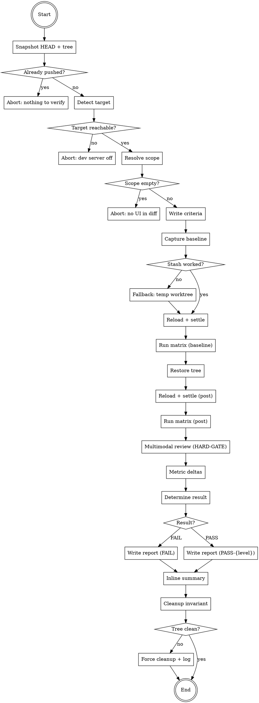

## Platform adaptation

If you are running on **Gemini CLI**, read `references/gemini-tools.md` to translate
tool names used in this skill to their Gemini equivalents before starting.

If you are running on **Codex**, read `references/codex-tools.md` for the same mapping.

<HARD-GATE>
This skill MUST NOT:

- Declare PASS without a baseline capture present (either git-stash captured
  or fallback reconstructed from a temp worktree at HEAD~N) AND a post-change
  capture for the SAME (surface × viewport × dpr × state) tuples. A unilateral
  post-only capture is FAIL by construction.

- Declare PASS without written measurable criteria captured BEFORE the
  change (in the report's `criteria:` frontmatter). "Looked good" is not
  a criterion. Each criterion MUST be a measurable assertion ("title
  font-size ≤ 50px at any DPR", "branch label ellipsizes when text-width
  > card-width", "no horizontal scrollbar at viewport ≥ 800px").

- Skip multimodal review for ANY captured PNG. Every PNG in the matrix —
  baseline AND post — must be read via the Read tool and described in
  concrete terms in the report ("title occupies 18% of viewport height,
  wraps to 2 lines, no overflow"). Vibe descriptions ("looks fine") are
  forbidden. The report's per-surface section must contain at least one
  multimodal-review block per (viewport × dpr × state) capture.

- Use `setProperty`, `setState`, or any direct-DOM/React shortcut to
  mutate state during capture. State mutation MUST go through the
  user-facing path (mouse drag for sliders, click for toggles, keyboard
  for shortcuts). Programmatic shortcuts test code paths the user never
  uses and produce false positives.

- Skip the dev-server reload between baseline (pre-stash) and post
  (post-stash-pop) captures. Stale CSS-module hashes from before the
  stash silently produce baselines that match the post-stash state.

- Declare confidence `strong` if any of the four conditions failed:
  full matrix completed, baseline_method == stash (not fallback),
  zero unexplained deltas, every written criterion PASS.

- Declare confidence `strong` without explicitly stating in the report
  the viewport, DPR, and surface list under which the verification was
  performed. The premises ARE the strength.

- Run on a working tree where `git log @{u}..HEAD` is empty AND the
  working tree is clean. In that state there is nothing left to verify.
  Abort with an instructive message.

- Edit a written criterion mid-run because the post capture failed it.
  Criteria are written BEFORE capture; if a criterion is wrong, FAIL
  the run, surface to the user, write new criteria, and re-run.

- Skip the cleanup step. The skill MUST `git stash pop` (or destroy
  the temp worktree from fallback) before exiting, EVEN on FAIL. The
  user's working tree must end with the change applied — no leftover
  stash, no leftover worktree.

- Pause for user confirmation, approval, or interactive review during
  the run. Cost or duration warnings are informational only. The skill
  produces a report; the user reads it after the run.
</HARD-GATE>

# Visual-verify

Run AFTER a UI change, BEFORE declaring "verified" or committing. The skill captures a real baseline of the surfaces the change affects via `git stash`, executes a fixed `viewport × DPR × state` matrix, performs obligatory multimodal review of every captured PNG, computes metric-level deltas baseline-vs-post, evaluates user-supplied measurable criteria, and produces a structured report whose final declaration is either FAIL or PASS-{strong, medium, weak} — confidence level explicitly tied to which strong-criteria conditions held.

This skill is the post-change verification gate. It is sibling to (but distinct from) `visual-qa` (audit) and `visual-refine` (polish loop). See `~/projects/skills/docs/superpowers/specs/2026-04-28-visual-verify-skill-design.md` for the full design rationale.

## Inputs

- `[scope-text]` — free-text scope hint, used as report slug; auto-derived scope is still computed in addition. Optional.
- `--scope <list>` — comma-separated explicit scope; replaces the auto-derived list.
- `--scope-add <list>` — comma-separated scope additions; unions onto the auto-derived list.
- `--full` — promote the matrix from 3 viewports × 3 DPRs × 3 states to 5 × 5 × 5.
- `--persist` — copy the final report from `/tmp/` to `docs/qa/<YYYY-MM-DD>-visual-verify-<slug>.md` and stage it (skill does not commit; user does).

## Outputs

1. A report file. Default `/tmp/visual-verify-<slug>-<timestamp>.md`. With `--persist`, copied to `docs/qa/<YYYY-MM-DD>-visual-verify-<slug>.md` and `git add`ed (not committed).
2. A frames directory at `/tmp/visual-verify-<slug>-<timestamp>/` containing `baseline/` and `post/` subdirectories of PNGs and parallel metrics JSON files.
3. The user's working tree containing exactly the change they had in flight when invoking the skill — no leftover stash, no leftover temp worktree, no spurious file changes (HARD-GATE 9: cleanup invariant).

## Required reading before you start

Before taking any action, `Read` all six reference files. Do not rely on memory.

- `references/baseline-capture.md` — git-stash protocol, fallback at HEAD~1, scope-derivation table, dev-server reload incantation.
- `references/viewport-matrix.md` — matrix dimensions (default and `--full`), capture-loop pseudocode, naming convention, mid-transition handling.
- `references/multimodal-review.md` — per-PNG review template; this is where the multimodal HARD-GATE expansion lives.
- `references/report-schema.md` — YAML frontmatter + body sections + inline-summary form, with a complete example.
- `references/codex-tools.md` — tool mapping for Codex.
- `references/gemini-tools.md` — tool mapping for Gemini CLI.

Also reachable from the sibling `visual-qa` skill: `~/projects/skills/visual-qa/references/recording-playbook.md` for CDP capture primitives. The skill REUSES (does not duplicate) those primitives.

## Checklist

Every item below becomes a TodoWrite task at runtime. The items must be executed in order and no item may be skipped. If an item cannot be completed, stop and report the obstruction rather than moving on.

```
1.  Snapshot HEAD + working-tree state. INITIAL_SHA = git rev-parse HEAD.
    Record dirty-or-clean. Abort if `git log @{u}..HEAD` empty AND tree
    clean (HARD-GATE 8: nothing to verify).

2.  Detect target. Probe http://localhost:9222/json/version. If
    unreachable, abort with explicit instruction to start dev server.

3.  Resolve scope.
    a. If --scope provided, use as-is.
    b. Else compute auto-derived scope from `git diff` (staged +
       unstaged) using the path-to-surface heuristic in
       references/baseline-capture.md.
    c. If --scope-add provided, union onto auto-derived.
    d. If final scope is empty, abort: "no UI surfaces in diff;
       visual-verify not applicable".

4.  Write criteria. BEFORE any capture: write one or more measurable
    criteria per scoped surface to the report's frontmatter under
    `criteria:`. Each criterion: id, surface, assertion, measurement.
    The skill MUST NOT proceed past this step until at least one
    criterion is written for each scoped surface (HARD-GATE 2).

5.  Capture baseline. Per references/baseline-capture.md:
    a. git stash push --include-untracked --message
       "visual-verify-baseline-${TS}".
    b. If stash is a no-op (clean tree + change is committed), enter
       fallback: create temp worktree at HEAD~1 (the commit IMMEDIATELY
       before HEAD — the canonical "pre-change" state for a single-
       commit fix). The fallback does NOT walk further back; if HEAD~1
       is not the right baseline (multi-commit feature already pushed
       and squashed), the agent must abort and instruct the user to
       supply the baseline ref explicitly via a future flag (out of
       scope for v1). Set `baseline_method: fallback` in the report.
       Confidence cap = medium.
    c. CDP Page.reload({ ignoreCache: true }) on the running app.
       Wait for Page.loadEventFired + 2× requestAnimationFrame settle.
    d. Run the matrix (3×3×3 default, 5×5×5 with --full). For each
       (surface × viewport × dpr × state) tuple:
         - Emulation.setDeviceMetricsOverride { width, height,
           deviceScaleFactor }.
         - Drive state via user-facing path only (mouse, keyboard).
         - Page.captureScreenshot → /tmp/.../baseline/...
         - Capture metrics JSON for each surface (font-size,
           offsetWidth, scrollWidth, top, left, dimensions of bounding
           rect, color string for primary text).

6.  Restore working tree. git stash pop, or destroy temp worktree
    (fallback). CDP Page.reload({ ignoreCache: true }) again. Same
    settle wait as step 5c.

7.  Capture post-change. Run the IDENTICAL matrix from step 5d. Same
    surface × viewport × dpr × state tuples, same naming convention,
    PNGs to /tmp/.../post/, parallel metrics JSON.

8.  Multimodal review of every PNG (HARD-GATE 3). For each tuple:
    a. Read the baseline PNG via the Read tool. Write a concrete
       description (template in references/multimodal-review.md):
       what fills the frame, text wraps, overflow, alignment, chrome
       positioning. No vibe descriptions.
    b. Read the post PNG. Same template.
    c. List observable deltas baseline → post.
    d. Mark each criterion from step 4 PASS/FAIL with PNG path
       evidence.

9.  Compute metrics deltas. Diff the baseline vs post metrics JSON
    arrays. Surface every numerical delta in the report. Cross-
    reference each metric delta with the multimodal description: do
    visual change and metric change tell the same story? Discrepancy
    → FAIL.

    Note for the digraph: the single "Determine result" node in the
    flow chart subsumes Steps 9 AND 10. Both checks happen inside
    the same evaluation phase — the digraph collapses them so the
    plan should not split them into two separate nodes.

10. Determine result.
    - FAIL if: any criterion FAIL, OR any non-target surface had an
      unexplained visual delta, OR multimodal review found a regression
      not present in baseline, OR JSON-vs-visual divergence in any
      tuple.
    - PASS-strong: full matrix ran AND baseline_method == stash AND
      zero unexplained deltas AND every criterion PASS.
    - PASS-medium: any one of the four strong conditions missed.
    - PASS-weak: any two of the four strong conditions missed.
    - More than two strong conditions missed → FAIL.

11. Write report. Default /tmp/visual-verify-<slug>-<TS>.md per
    references/report-schema.md. With --persist, copy to
    docs/qa/<YYYY-MM-DD>-visual-verify-<slug>.md and stage that file
    for commit (skill does not commit; user does).

12. Print inline summary. Five-line markdown block in the conversation.
    Always declares: result (PASS-{strong|medium|weak} or FAIL),
    matrix mode, agent window + DPR, criteria PASS count, report path.

13. Cleanup invariant (HARD-GATE 9). Verify working tree contains the
    user's change AND no leftover artifacts (no `visual-verify-*`
    stash entries, no temp worktrees from fallback). If discrepancy,
    log to report and clean. EVEN ON FAIL.
```

## Flow diagram



## Notes on the autonomy invariant

The skill MUST NOT pause for user confirmation, approval, or interactive review during the run. Cost or duration warnings are informational only. The skill produces a report; the user reads it after the run. This mirrors the autonomy invariant in `visual-qa` and `visual-refine`.

Likewise the cleanup invariant (HARD-GATE 9) runs even on FAIL: no leftover stash entries named `visual-verify-*`, no leftover temp worktrees from the fallback path. The single explicit exception is EC-4 (`git stash pop` conflict): in that case the user's manual resolution IS the cleanup; the skill stops touching the working tree and surfaces the conflict.
